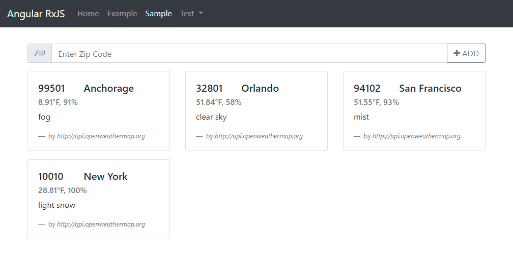

# RxJS

다음 사이트를 참고했습니다.  
* `http://reactivex.io/rxjs/manual/overview.html`
* `https://www.learnrxjs.io/`
* `https://xgrommx.github.io/rx-book/index.html`
* `https://blog.niallconnaughton.com/2015/08/12/rx-learning-resources/`
* `https://github.com/AdaptiveConsulting/ReactiveTraderCloud`
* `https://gist.github.com/staltz/868e7e9bc2a7b8c1f754`
* `https://medium.com/@benlesh/hot-vs-cold-observables-f8094ed53339`
* `https://hyunseob.github.io/2016/10/09/understanding-reactive-programming-and-rxjs/`
* `https://xgrommx.github.io/rx-book/content/observable/observable_instance_methods/subscribe.html`
* `https://gist.github.com/btroncone/d6cf141d6f2c00dc6b35`
* `https://rxjs-dev.firebaseapp.com/guide/overview`

## Introduction

RxJS는 마이크로소프트사의 Reactive Extensions 프로젝트에서 출발한 리액티브 프로그래밍을 지원하는 자바스크립트 라이브러리다. RxJS는 옵저버 패턴을 근간으로 한다. 옵저버 패턴은 옵저버들을 서브젝트 객체에 먼저 등록한다. 서브젝트 객체의 변화가 생기면 서브젝트에서 등록된 옵저버들의 메소드를 호출해서 변화를 전파한다. 비슷한 용어로 Publisher Subscriber 패턴이라는 용어도 사용한다. RxJS가 제공하는 모든 연산함수는 순수함수다. 순수함수는 파라미터로 받는 데이터에만 의존할 뿐 다른 외부 자원에 의존하지 않는다. 순수함수는 전달 받는 파라미터가 같은 경우 언제나 같은 결과를 반환함을 보장한다. 자바스크립트는 First Class 특성을 지원하기 때문에 함수를 변수에 담을 수 있으며 다른 함수에 파라미터로 전달할 수 있다. 이를 이용하여 함수를 다른 함수에 파라미터로 전달하여 함수를 합성할 수 있다. RxJS가 제공하는 함수는 이 처리방식을 근간으로 삼는다.

|      |  Single  |   Mutiple  |
|:----:|:--------:|:----------:|
| Pull | Function |  Iterator  |
| Push |  Promise | Observable |

**Observable**  

데이터가 연속적으로 변화할 때 이를 데이터 스트림이라고 부른다. 옵저버블은 데이터 스트림을 관리하는 객체다. 옵저버블은 이벤트 스트림을 관리할 수도 있다.
이벤트가 발생하는 것이 곧 우리가 관심있는 데이터의 변화를 의미하지는 않지만 대부분의 경우 이벤트가 발생하게 되면 이에 맞게 데이터를 가공한다. 따라서, 이벤트 스트림은 곧 데이터 스트림이라고 취급할 수 있다. 옵저버블은 데이터를 생산하는 Provider와 이를 소비하는 Consumer를 연결한다. 개발자가 명시적으로 Provider 로직을 제공하면 Provider와 옵저버블을 구분할 수 있지만 Provider 로직을 명시하지 않아도 자동으로 옵저버블이 처리해 주는 경우도 있으므로 이 경우, Provider 로직이 노출되지 않는다. 배열을 Iterator다. Iterator를 데이터 스트림으로 변환해주는 옵저버블이 제공하는 함수를 이용하면 Provider가 밖으로 노출되지 않는다. 옵저버블에게 옵저버가 구독신청을 하면 옵저버블을 통해서 데이터가 차례로 옵저버가 전달한 콜백함수의 파라미터로 전달된다. 옵저버블을 보관하는 변수를 쉽게 구분하기 위해서 관습적으로 변수명 끝에 `$` 기호를 붙인다. 옵저버블은 구독하지 않으면 실행되지 않는다. 즉, 옵저버블 객체는 어떤 일을 수행해야 하는지와 관련한 정보만을 갖고 있는 객체다. 이를 미리 만들어 놓고 나중에 필요할 때 사용할 수 있어서 편리하다.

**Observer**  

옵저버는 옵저버블에게 구독신청을 할 때 전달하는 콜백함수들을 갖고 있는 객체다. 이 객체는 next, error, complete 함수 세 걔를 멤버로 갖는다. 편의상 객체 대신 콜백함수를 하나만 전달할 수도 있다. 이 콜백함수는 next 함수에 해당한다. 정확하게 얘기하면 앵귤러의 컴포넌트는 옵저버가 아니다. 앵귤러 컴포넌트 클래스에서 옵저버블 객체를 획득하고 구독 함수를 호출하면서 건네주는 것이 옵저버다.

**Subscription**  

옵저버가 옵저버블에 구독을 신청하면 구독객체를 반환한다. 이 구독객체를 구독을 중지할 수 있다. 구독객체는 다른 구독객체를 다수 가질 수 있기 때문에 하나의 구독객체를 이용하여 다수의 구독을 취소할 수 있다.

**Operators**  

옵저버블은 데이터 스트림을 제어할 수 있는 다양한 연산함수들을 제공한다. 이러한 모습이 lodash와 비슷하기 때문에 RxJS를 비동기를 지원하는 lodash라고 부르는 이유다. lodash는 자바스크립트 세계에서 유명한 유틸리티 라이브러리 함수다. 연삼함수는 모두 순수함수다.

**Subject**  

서브젝트는 옵저버블이면서 옵저버의 역할도 수행할 수 있는 객체다. 서브젝트는 옵저버로써 옵저버블을 구독해서 데이터 스트림을 받는다. 서브젝트는 옵저버블로써 구독신청을 한 옵저버들에게 데이터를 전달한다. A 서브젝트는 다른 B 서브젝트에게 구독 신청을 할 수 있다. 이 때, A 서브젝트는 옵저버이고 B 서브젝트는 옵저버블의 역할을 수행하는 것이 된다. 옵저버블은 unicasting 방식이고 서브젝트는 multicasting 방식이다.

* unicasting: 옵저버가 구독한 순서대로 개별적으로 데이터 스트림을 제공한다.  
[1, 2] `====>` Observable `<==subscribe==` Observer A, Observer B  
1 &rArr; A  
2 &rArr; A  
1 &rArr; B  
2 &rArr; B  

* multicasting: 구독하는 옵저버들에게 하나의 공유된 데이터 스트림을 제공한다.  
[1, 2] `====>` Subject `<==subscribe==`  Observer A, Observer B  
1 &rArr; A  
1 &rArr; B  
2 &rArr; A  
2 &rArr; B  

**Schedulers**  

스케쥴러는 옵저버가 옵저버블을 구독할 때, 어떤 순서로 어떻게 실행할지와 관련한 실행 컨텍스트를 관리하는 역할의 자료구조로써 동시성을 제어하는 중앙화된 배포자다.

# 예제 프로젝트 1

## Installation

다음 사이트를 참고하세요.   
* `https://rxjs-dev.firebaseapp.com/guide/installation`

```bash
$ mkdir my-rxjs
$ cd my-rxjs
$ npm init -y
$ npm i rxjs
```

**package.json**

```json
{
  "name": "my-rxjs",
  "version": "1.0.0",
  "description": "",
  "main": "index.js",
  "scripts": {
    "test": "echo \"Error: no test specified\" && exit 1"
  },
  "keywords": [],
  "author": "",
  "license": "ISC",
  "dependencies": {
    "rxjs": "^6.3.3"
  }
}
```

## Vanilla Javascript

처음은 순수 자바스크립트에서 사용해 보겠습니다.

**src\begin\1.js**

```js
const rxjs = require('rxjs');
const { of } = require('rxjs'); // 생성함수
const { map } = require('rxjs/operators'); // 연산함수

var x = rxjs.of(1, 2, 3)

x.subscribe(data => {
  console.log(data);
})
// 1
// 2
// 3

var y = of (1, 2, 3).pipe(map(x => x * 10)); 

y.subscribe(data => {
  console.log(data);
})
// 10
// 20
// 30
```

## Typescript

에디터의 도움말 기능 및 코드 자동완성 기능을 이용하기 위해서 타입스크립트 환경에서 사용하는 방법을 살펴봅니다.

```bash
$ tsc --init
```

위 명령으로 생성된 파일의 내용을 지우고 아래처럼 변경합니다. 그냥 파일을 직접 생성하셔도 괜찮습니다.

**tsconfig.json**

```json
{
  "compilerOptions": {
    "target": "es5",
    "module": "commonjs",
    "emitDecoratorMetadata": true,
    "experimentalDecorators": true,
    "sourceMap": false,
    "suppressImplicitAnyIndexErrors": true
  },
  "compileOnSave": true,
  "buildOnSave": false,
  "exclude": [
    "node_modules"
  ],
  "filesGlob": [
    "app/**/*.ts",
    "typings/index.d.ts"
  ],
  "atom": {
    "rewriteTsconfig": false
  }
}
```

Atom 에디터에 `atom-typescript` 패키지를 설치합니다.

**src\app\begin\1.ts**

```ts
import * as Rx from 'rxjs';
import { of } from 'rxjs';
import { map } from 'rxjs/operators';

var x = Rx.of(1, 2, 3)

x.subscribe(data => {
  console.log(data);
})

var y = of(1, 2, 3).pipe(map(x => x * 10));

y.subscribe(data => {
  console.log(data);
})
```

코드 작성은 1.ts 파일에 하고 저장 시 생성되는 1.js 파일을 실행합니다.

# 예제 프로젝트 2

앵귤러 기반에서 RxJS 사용법을 살펴보겠습니다. RxJS는 앵귤러의 기반 기술입니다. 따라서, 새 프로젝트를 만들면 자동으로 디펜던시가 추가됩니다.

```bash
$ ng new my-ng-rxjs
? Would you like to add Angular routing? Yes
? Which stylesheet format would you like to use? SCSS
```

```bash
$ cd my-ng-rxjs
$ npm i jquery popper.js bootstrap
$ npm i @types/jquery --save-dev
$ npm i font-awesome
```

**angular.json**

```json
"styles": [
  "./node_modules/font-awesome/css/font-awesome.css",
  "./node_modules/bootstrap/dist/css/bootstrap.min.css",
  "src/styles.scss"
],
"scripts": [
  "./node_modules/jquery/dist/jquery.slim.min.js",
  "./node_modules/popper.js/dist/umd/popper.min.js",
  "./node_modules/bootstrap/dist/js/bootstrap.min.js"
]
```

```bash
$ ng g c layout/header
$ ng g c page/home
```

**src\app\layout\header\header.component.html**

```html
<nav class="navbar navbar-expand-lg navbar-dark bg-dark">

  <a class="navbar-brand" routerLink="/">Angular RxJS</a>

  <button class="navbar-toggler" type="button" data-toggle="collapse" data-target="#navbarSupportedContent" aria-controls="navbarSupportedContent" aria-expanded="false" aria-label="Toggle navigation">
    <span class="navbar-toggler-icon"></span>
  </button>

  <div class="collapse navbar-collapse" id="navbarSupportedContent">
    <ul class="navbar-nav mr-auto">
      <li class="nav-item" routerLinkActive="active">
        <a class="nav-link" routerLink="/home">
          Home <span class="sr-only">(current)</span>
        </a>
      </li>
      <li class="nav-item" routerLinkActive="active">
        <a class="nav-link" routerLink="/example">Example</a>
      </li>
      <li class="nav-item" routerLinkActive="active">
        <a class="nav-link" routerLink="/sample">Sample</a>
      </li>
      <li class="nav-item dropdown" routerLinkActive="active">
        <a class="nav-link dropdown-toggle" href="#" id="navbarDropdown" role="button" data-toggle="dropdown"
          aria-haspopup="true" aria-expanded="false">
          Test
        </a>
        <div class="dropdown-menu" aria-labelledby="navbarDropdown">
          <a class="dropdown-item" [routerLink]="'test'" routerLinkActive="active">Test</a>
          <a class="dropdown-item" [routerLink]="'test2'" routerLinkActive="active">Test 2</a>
          <a class="dropdown-item" [routerLink]="'test3'" routerLinkActive="active">Test 3</a>
          <a class="dropdown-item" [routerLink]="'test4'" routerLinkActive="active">Test 4</a>
          <a class="dropdown-item" [routerLink]="'test5'" routerLinkActive="active">Test 5</a>
          <div class="dropdown-divider"></div>
          <a class="dropdown-item" [routerLink]="'#'" routerLinkActive="active">Action</a>
        </div>
      </li>
    </ul>
  </div>

</nav>
```

간단하게 화면 틀을 만들어 보았습니다. home 컴포넌트는 사용하지 않습니다. 컴포넌트를 생성하면 루트 라우팅 모듈파일에 연동하는 코드를 추가하세요.

## 기본사용법

```bash
$ ng g c test
```

**src\app\test\test.component.ts**

```ts
import { Component, OnInit, ViewChild, ElementRef } from '@angular/core';
// 옵저버블 생성 도구(생성자, 생성함수)
import { Observable, Subject, from, fromEvent, of, interval, BehaviorSubject } from 'rxjs';
// 데이터 스트림 처리도구(연산함수)
import { max, map, filter, flatMap, take } from 'rxjs/operators';

class Producer {
  text: string;
  constructor(text: string = 'Hello') {
    this.text = text;
  }
}

@Component({
  selector: 'app-test',
  template: `
  <section>
    <p #p></p>
    <input type="text" name="" value="" #input>
  </section>
  `,
  styleUrls: ['./test.component.scss']
})
export class TestComponent implements OnInit {
  @ViewChild('input') input: ElementRef;
  @ViewChild('p') p: ElementRef;

  constructor() { }

  ngOnInit() {
    this.step1()
  }

  step1() {

  }

}
```

**step1()**

step1() 함수를 작성하고 내용을 살펴봅니다.

```ts
step1() {
  // 수동으로 데이터를 발행한다.
  var myObservable = Observable.create(function(observer) {
    console.log('START')
    // 옵저버의 next 함수를 사용하여 데이터를 옵저버에게 전달한다.
    observer.next(1);
    // next 함수를 연속해서 사용하면 수동으로 데이터 스트림을 전달하는 것이 된다.
    observer.next(2);
    observer.next(3);
    setTimeout(() => {
      observer.next(4);
      observer.complete();
    }, 2000);
  });

  console.log('----before subscribe');

  // 옵저버 객체를 옵저버블의 subscribe 함수를 통해서 전달한다.
  // 구독하지 않으면 옵저버블은 작동하지 않는다.
  myObservable.subscribe({
    next: x => console.log('success result: ' + x),
    error: err => console.error('fail error: ' + err),
    complete: () => console.log('finally done.'),
  });

  console.log('----after subscribe');
}
```

**step2()**

step1() 함수 대신 step2() 함수를 작성하고 사용하도록 변경합니다.

```ts
step2() {
  // 이벤트로부터 이벤트 스트림을 전달할 수 있는 옵저버블 객체를 획득한다.
  // Hot Observable: 이벤트 스트림은 모든 구독자들에게 
  // 같은 이벤트 정보가 전달되는 Multicast방식의 옵저버블이다.
  var clicks = fromEvent(document, 'click');
  clicks.subscribe(x => console.log(x));

  // 배열은 이터레이터다.
  // 이터레이터로부터 데이터 스트림을 전달할 수 있는 옵저버블 객체를 획득한다.
  var result = from([10, 20, 30]);
  result.subscribe(x => console.log(x));

  // 타입스크립트가 제공하는 fetch 함수는 프라미스를 리턴한다.
  // 프라미스로부터 데이터 스트림을 전달할 수 있는 옵저버블 객체를 획득한다.
  // work\part3\fake-server\db.json 파일을 json-server로 기동시킨 후 확인할 수 있다.
  var report = from(fetch('http://localhost:3000/employees'));

  // 옵저버 객체는 next, error, complete 메소드를 멤버로 가질 수 있다.
  // - next 함수만 이용하여 구독할 수 있다.
  report.subscribe(
    x => console.log('success result: ' + x)
  );
  // - next 함수와 error 함수만 이용하여 구독할 수 있다.
  report.subscribe(
    x => console.log('success result: ' + x),
    err => console.error('fail error: ' + err)
  );
  // next, error, complete 함수들을 멤버 메소드로 소유한 객체를 이용하여 구독할 수 있다.
  report.subscribe({
    next: x => console.log('success result: ' + x),
    error: err => console.error('fail error: ' + err),
    complete: () => console.log('finally done.')
  });
}
```

**step3()**

```ts
step3() {
  // 코드적인 변형 #1
  var observer1 = {
    next: x => console.log('success result: ' + x),
    error: err => console.error('fail error: ' + err),
    complete: () => console.log('finally done.')
  };

  var number$ = Observable.create(function(observer) {
    console.log('START')
    observer.next(1);
    observer.next(2);
    observer.next(3);
    setTimeout(() => {
      observer.next(4);
      observer.complete();
    }, 1000);
  });

  let subcription1 = number$.subscribe(observer1);

  // 코드적인 변형 #2
  var observer2 = (x) => {
    x => console.log('success result: ' + x)
  }

  var click$ = fromEvent(document, 'click');

  let subcription2 = click$.subscribe(observer2);

  // 구독객체는 다른 구독객체(주로 자식 구독객체)를 소유할 수 있다.
  subcription2.add(subcription1);
  // 구독객체 자신과 자신이 소유한 다른 구독객체 모두 구독을 취소한다.
  subcription2.unsubscribe();
}
```

**step4()**

```ts
step4() {
  // 방법 #1
  // 옵저버블을 인수로 받고 처리결과로 옵저버블을 리턴한다.
  // 이 함수는 옵저버블을 래핑하는 방법을 보여준다.
  function multiplyByTen(input: Observable<number>): Observable<number> {
    // Observable.create 함수대신 new 연산자를 이용할 수 있다.
    return new Observable<number>(function(observer) {
      input.subscribe({
        next: (v) => observer.next(10 * v),
        // error: (err) => observer.error(err),
        // complete: () => observer.complete()
      });
    });
  }

  var input = from([1, 2, 3]);
  var output = multiplyByTen(input);
  output.subscribe(x => console.log(x));

  // 방법 #2
  from([1, 2, 3]).pipe(
    // multiplyByTen 고차함수를 이용하는 것보다
    // 준비된 연산함수를 사용하는 것이 훨신 편하고 가독성도 향상된다.
    map(item => item * 10)
  ).subscribe(x => console.log(x));

  /*
   * Difference of map vs flatMap
   */
  from([1, 2, 3]).pipe(
    // 처리결과는 이차원 배열이다.
    map(function(item) {
      return [item, item + 1, item + 2];
    })
  ).subscribe(x => console.log(x));
  // [1, 2, 3]
  // [2, 3, 4]
  // [3, 4, 5]

  from([1, 2, 3]).pipe(
    // 처리결과는 일차원 배열이다.
    flatMap(function(item) {
      return [item, item + 1, item + 2];
    })
  ).subscribe(x => console.log(x));
  // 1, 2, 3, 2, 3, 4, 3, 4, 5
}
```

**step5()**

```ts
step5() {
  // of 함수를 사용하면 바로 낱개 상태인 데이터를 이용해서 옵저버블 객체를 획득할 수 있다.
  of(5, 4, 7, 2, 8).pipe(
    // 흘러가는 데이터 중에서 가장 큰 값을 구해서 그 값만 전달한다.
    max()
  ).subscribe(x => console.log(x));

  // 마우스를 클릭했을 때 x 좌표 값만을 전달한다.
  var clickStream = fromEvent<MouseEvent>(document, 'click');
  var positionStream = clickStream.pipe(
    map(ev => ev.clientX)
  );
  positionStream.subscribe(x => console.log(x));

  // 입력된 글자의 길이가 2 이상일 때만 전달한다.
  fromEvent<KeyboardEvent>(this.input.nativeElement, 'input').pipe(
    map(event => (<HTMLInputElement>event.target).value),
    filter(value => value.length >= 2)
  ).subscribe(value => {
    console.log(value)
  });
}
```

**step6()**

```ts
step6() {
  // ------------------------------------------------
  // Unicast: 구독자 우선
  // 앞서서 신청한 구독자에게 먼저 데이터를 모두 전달하고
  // 그 다음 구독자에게 데이터를 전달하는 것을 반복한다.
  var count$ = from([{ num: 1 }, { num: 2 }])
  var X, Y;

  count$.subscribe(x => {
    console.log('구독자 #1 x: ', x)
    X = x;
  })
  count$.subscribe(x => {
    console.log('구독자 #2 x: ', x)
    Y = x;
  })
  // 구독자 #1 x:  {num: 1}
  // 구독자 #1 x:  {num: 2}
  // 구독자 #2 x:  {num: 1}
  // 구독자 #2 x:  {num: 2}

  console.log(X === Y); // true

  // ------------------------------------------------
  // Multicast: 데이터 우선
  // 데이터를 하나씩 차례로 모든 구독자에게 전달하고
  // 그 다음 데이터를 전달하는 것을 반복한다.
  var number$ = from([{ num: 10 }, { num: 20 }])
  // 서브젝트를 이용하면 Multicast 방식을 이용할 수 있다.
  var subject = new Subject()
  var A, B;

  subject.subscribe(v => {
    console.log('구독자 #1 v: ', v)
    A = v;
  })
  subject.subscribe(v => {
    console.log('구독자 #2 v: ', v)
    B = v;
  })
  // 구독자 #1 v:  {num: 10}
  // 구독자 #2 v:  {num: 10}
  // 구독자 #1 v:  {num: 20}
  // 구독자 #2 v:  {num: 20}

  number$.subscribe(subject)

  console.log(A === B); // true

  // ------------------------------------------------
  // 이벤트 스트림은 Unicast 방식이다.
  var clickStream = fromEvent<MouseEvent>(document, 'click');
  var positionStream = clickStream.pipe(
    map(ev => ev.clientX)
  );

  positionStream.subscribe(x => console.log('구독자 #1 x: ', x));
  positionStream.subscribe(x => console.log('구독자 #2 x: ', x));
}
```

**step11()**

```ts
step11() {
  // COLD Observable:
  // 옵저버가 구독할 때 마다 새 Producer 객체를 만들어서 구독자들에게 전달하면 춥다고 표현한다.
  var cold = new Observable<Producer>((observer) => {
    var producer = new Producer();
    observer.next(producer);
  });

  cold.subscribe(p => {
    console.log('1: ', p.text); // Hello
    p.text = 'Hi';
  });
  cold.subscribe(p => console.log('2: ', p.text)); // Hello

  // HOT Observable:
  // 외부에서 만들어진 하나의 Producer 객체를 구독자들에게 전달하면 덥다고 표현한다.
  // 옵저버가 받는 데이터는 같은 것을 이용하는 것이므로 옵저버들 사이에서 공유된 자원이 된다.
  // "한 음식을 여럿이 같이 먹으면 따듯한 식사가 되고 음식을 각자 먹으면 추운 식사가 된다."
  var producer = new Producer();
  var hot = new Observable<Producer>((observer) => {
    observer.next(producer);
  });

  hot.subscribe(p => {
    console.log('1: ', p.text); // Hello
    p.text = 'Hi';
  });
  hot.subscribe(p => console.log('2: ', p.text)); // Hi
}
```

**step21()**

```ts
step21() {
  const interval$ = interval(1000).pipe(take(5));

  // 구독할 때 마다 새로운 실행 흐름이 생성된다.
  interval$.subscribe(num => console.log('#A: ', num));

  setTimeout(() => {
    interval$.subscribe(num => console.log('#B: ', num));
  }, 2000);

  // #A:  0
  // #A:  1
  // #A:  2
  // #B:  0
  // #A:  3
  // #B:  1
  // #A:  4
  // #B:  2
  // #B:  3
  // #B:  4
}
```

**step22()**

```ts
step22() {
  // 앞서서 살펴 본 예제를 클래식(옛스런)한 방법으로 다시 작성해 보았다.
  function interval(caller, second, take) {
    let count = 0;
    let timer = setInterval(() => {
      console.log(caller + ': ', count);
      count++;
      if (count >= take) {
        clearInterval(timer);
      }
    }, second);
  }

  interval('#A', 1000, 5);

  setTimeout(() => {
    interval('#B', 1000, 5);
  }, 2000);

  // 옵저버가 Plain 옵저버블을 구독하면 각각 독립적으로 수행된다는 것을 파악했다.
  // 만약, 두 번째 옵저버가 첫 번째 옵저버가 데이터(또는 이벤트)를 받을 때
  // 바로 같이 받고 싶은 경우 서브젝트를 사용하면 된다.
}
```

**step23()**

```ts
step23() {
  const interval$ = interval(1000).pipe(take(5));

  // const subject = new Subject();
  const subject = new BehaviorSubject(null);

  interval$.subscribe(subject);

  subject.subscribe(val => console.log(`First observer ${val}`));

  setTimeout(() => {
    subject.subscribe(val => console.log(`Second observer ${val}`))
  }, 3500);

  // ----------------------
  // Subject 사용결과
  // First observer 0
  // First observer 1
  // First observer 2
  // First observer 3
  // Second observer 3
  // First observer 4
  // Second observer 4

  // ----------------------
  // BehaviorSubject 사용결과
  // 초기 값부터 방출된다.
  // First observer null
  // First observer 0
  // First observer 1
  // First observer 2
  // Second observer 2
  // First observer 3
  // Second observer 3
  // First observer 4
  // Second observer 4
}
```

**step24()**

```ts
step24() {
  // 템플릿이 가진 엘리먼트에서 발생하는 이벤트로부터 옵저버블로 연동하는 방법
  const input = this.input.nativeElement;
  const p = this.p.nativeElement;

  const subject = new Subject();

  input.addEventListener('input', event => {
    subject.next(event.target.value);
  });

  subject.subscribe(val => {
    p.textContent = val;
  });
}
```

**step25()**

```ts
step25() {
  /*
   * Difference of Subject vs BehaviorSubject
   */
  const subject = new Subject();
  subject.next(1);
  // 발행을 먼저하고 나중에 구독하면 앞서서 발행된 데이터를 받지 못한다.
  subject.subscribe(x => console.log('Subject # x: ', x)); // 출력되지 않는다.

  // BehaviorSubject는 Subject의 확장입니다.
  // 초기 값을 설정할 수 있으며 최신 값을 보존합니다.
  // 이벤트가 방출된 다음 구독해도 값을 전달받을 수 있습니다.
  const behaviorSubject = new BehaviorSubject(null);
  // 초기값으로 null을 할당하면 최신 값은 null인 상태다.
  // 1을 발행하면 최신 값은 1인 상태가 된다.
  behaviorSubject.next(1);
  // 발행을 먼저하고 나중에 구독해도 보존하고 있는 최신 값을 받을 수 있다.
  behaviorSubject.subscribe(x => console.log('BehaviorSubject # x: ', x)); // 출력된다.

  // 값은 보존되며 보존된 값을 얻을 수 있습니다.
  console.log('value: ', behaviorSubject.getValue())
}
```

**step26()**

```ts
step26() {
  // BehaviorSubject 서브젝트는 초기 값을 설정할 수 있다.
  var behaviorSubject = new BehaviorSubject<{ num: number }>({ num: 0 });
  // BehaviorSubject 서브젝트가 가진 최신 값(현재는 초기 값)을 구할 수 있다.
  console.log(behaviorSubject.getValue()); // {num: 20}

  behaviorSubject.subscribe(v => {
    console.log('구독자 #A v: ', v.num)
  })

  from([{ num: 10 }, { num: 20 }]).subscribe(behaviorSubject);

  // subscribe 함수가 호출되는 즉시 옵저버블의 데이터가 BehaviorSubject에게 전달된다.
  // 이 순간 구독자는 #A 뿐이으므로 #A 구독자만 데이터를 받는다.
  // 구독자 #A v:  0
  // 구독자 #A v:  10
  // 구독자 #A v:  20

  // BehaviorSubject가 직접 방출하는 것이 아닌 배열로부터 파생된 옵저버블을 구독하게 되면
  // 데이터 스트림이 끝난 후 구독을 신청한 구독자 #B는 아무것도 받지 못한다.
  // 그런데 배열이 아닌 이벤트 스트림을 사용한다면
  // 나중에 사용자에 의해서 이벤트가 발생하게 될 때
  // 구독자 #B도 데이터를 받을 수 있다. (이벤트보다 구독이 앞섰으므로)
  behaviorSubject.subscribe(v => {
    console.log('구독자 #B v: ', v.num)
  })
}
```

대충 사용하는 방법을 파악했으니 좀 더 실전적인 예제를 살펴 볼 시간입니다.

다음을 참고했습니다.  
* `RxJS 프로그래밍 한빛미디어`

RxJS 기술의 넓이와 깊이가 생각보다 작지 않습니다. 평소 FRP에 관심을 가졌거나 lodash를 즐겨사용한 개발자이시라면 공식 API사이트만으로도 충분하시겠지만 그렇지 않으시다면 책의 일독도 권해드리고 싶습니다.

```bash
$ ng g c test2
```

**src\app\test2\test2.component.ts**

```ts
import { Component, OnInit, OnDestroy } from '@angular/core';
import { interval, Subscription } from 'rxjs';
import { tap } from 'rxjs/operators';

@Component({
  selector: 'app-test2',
  template: `
    <h3>count: {{count}}</h3>
  `,
  styleUrls: ['./test2.component.scss']
})
export class Test2Component implements OnInit, OnDestroy {
  count: number = 0;
  subscription: Subscription = null;

  constructor() { }

  ngOnInit() {
    // 컴포넌트가 파괴된 후에도 옵저버블은 살아서 계속 콘솔에 출력을 한다.
    this.subscription = interval(1000).pipe(tap(idx => console.log(idx))).subscribe(idx => {
      this.count = idx;
    })
  }

  ngOnDestroy() {
    // 명시적으로 컴포넌트가 파괴되기 전에 구독해제를 할 필요가 있다.
    // 다음 코드를 주석으로 처리할 때의 변화를 살펴보자.
    this.subscription.unsubscribe();
  }

}
```

ngOnDestroy() 함수에서 unsubscribe() 함수를 호출하지 않고 컴포넌트가 파괴되면 여전히 콘솔에 출력이 되는 것을 확인하시기 바랍니다.

```bash
$ ng g c test3
```

**src\app\test3\test3.component.ts**

```ts
import { Component, OnInit, OnDestroy } from '@angular/core';
import { interval } from 'rxjs';
import { tap } from 'rxjs/operators';

@Component({
  selector: 'app-test3',
  template: `
    <h3>count: {{count$ | async}}</h3>
  `,
  styleUrls: ['./test3.component.scss']
})
export class Test3Component implements OnInit, OnDestroy {
  count$ = interval(1000).pipe(tap(idx => console.log(idx)))

  constructor() { }

  ngOnInit() {
    // async 파이프를 사용하면 옵저버블 객체를 그대로 템플릿에서 사용할 수 있다.
  }

  ngOnDestroy() {
    // async 파이프를 사용하면 컴포넌트 파괴 시 자동으로 구독해제가 처리된다.
  }
}
```

async 파이프를 사용하면 옵저버블 unsubscribe를 명시적으로 수행하지 않아도 되는 편리함이 있습니다.

```bash
$ ng g c test4
```

**src\app\test4\test4.component.ts**

```ts
import { Component } from '@angular/core';
import { FormControl } from '@angular/forms';

// FormControl만 사용할 때는 name 속성은 없어도 된다.
// FormGroup으로 FormControl을 감싸는 경우에는 필요하다.
@Component({
  selector: 'app-test4',
  template: `
  <p>text: {{text$ | async}}</p>
  <input type="text" name="text" [formControl]="text">
  `,
  styleUrls: ['./test4.component.scss']
})
export class Test4Component {
  text: FormControl = new FormControl();
  // valueChanges 속성이 옵저버블을 반환한다.
  text$ = this.text.valueChanges;
}
```

FormControl을 사용하기 위해서 루트 모듈에서 ReactiveFormsModule을 임포트하셔야 합니다.

```bash
$ ng g c test5
```

**src\app\test5\test5.component.ts**

```ts
import { Component } from '@angular/core';
import { FormControl } from '@angular/forms';
import { Observable, of, combineLatest } from 'rxjs';
import { debounceTime } from 'rxjs/operators';

@Component({
  selector: 'app-test5',
  template: `
    <p>name: {{name$ | async}}</p>
    <input type="text" name="name" [formControl]="name">
    <div class="box">
      <ul>
        <li *ngFor="let user of users$ | async">
          {{user | uppercase}}
        </li>
      </ul>
    </div>
    <div class="box">
      <ul>
        <li *ngFor="let user of filteredUsers$ | async">
          {{user | titlecase}}
        </li>
      </ul>
    </div>
  `,
  styles: [
    `
    .box {
      margin-top: 1rem;
      border: 1px solid silver;
      padding: 1rem;
    }
    `
  ]
})
export class Test5Component {
  name: FormControl = new FormControl();
  name$: Observable<string> = this.name.valueChanges.pipe(debounceTime(500))
  users$: Observable<string[]> = of(['aaron', 'bob', 'charles', 'david', 'erick']);
  // combineLatest 함수는 옵저버블 생성함수로써 
  // this.name$ 값이 바뀔 때마다 콜백함수가 반환하는 결과를 발행한다.
  filteredUsers$: Observable<string[]> = combineLatest(this.users$, this.name$, (users, name) => {
    let loweredName = name.toLowerCase();
    return users.filter(item => item.toLowerCase().includes(loweredName));
  })
}
```

FormControl과 함께 Observable을 사용하면 코드도 짧아지고 가독성도 향상됩니다.

## 실전예제

장기간 API 서버와 대화하면서 데이터의 변화를 표시해주는 모니터링 화면을 구성해 보겠습니다.

```bash
$ ng g c page/example
```

이 컴포넌트에서 사용할 예제는 다음 사이트를 참고했습니다.  
1. `https://auth0.com/blog/understanding-reactive-programming-and-rxjs/`
2. `https://hyunseob.github.io/2016/10/09/understanding-reactive-programming-and-rxjs/`

**src\app\page\example\example.component.html**

```html
<div class="container-fluid">
  <div class="input-group mb-3">
    <div class="input-group-prepend">
      <span class="input-group-text">ZIP</span>
    </div>
    <input type="text" class="form-control" placeholder="Enter Zip Code" #input>
    <div class="input-group-append">
      <button class="btn btn-outline-secondary text-uppercase" type="button" #button>
        <i class="fa fa-plus"></i> Add Location
      </button>
    </div>
  </div>
</div>

<div class="container-fluid">
  <div class="row">
    <div class="col-md-4 mb-3" *ngFor="let temperature of temperatures">
      <div class="card">
        <div class="card-body">
          <div class="row">
            <h5 class="card-title col-md-4">{{temperature.zip}}</h5>
            <h5 class="card-title col-md-8">{{temperature.name}}</h5>
          </div>
          <h6 class="card-subtitle mb-2 text-muted">
            {{temperature.main.temp}}&deg;F, {{temperature.main.humidity}}%</h6>
          <p class="card-text">{{temperature.weather[0].description}}</p>
          <footer class="blockquote-footer">
            by <cite title="Source Title">http://api.openweathermap.org</cite>
          </footer>
        </div>
      </div>
    </div>
  </div>
</div>
```

다음 사이트를 방문해서 회원가입 후 API를 이용할 수 있는 개인 키를 발급 받습니다.  
`http://api.openweathermap.org`

소스에 있는 키를 사용하셔도 되지만 다수의 분들이 같은 키를 사용하는 경우 API 이용제한 때문에 응답받지 못할 수도 있으므로 되도록 개인 키를 발급 받아서 학습하시기 바랍니다.

### Step 1

**src\app\page\example\example.component.ts**

```ts
import { Component, OnInit, ViewChild, ElementRef } from '@angular/core';
import * as Rx from 'rxjs';
import { fromEvent, from, ReplaySubject, interval } from 'rxjs';
import { map, tap, filter, withLatestFrom, distinct, flatMap, switchMap } from 'rxjs/operators';

const KEY = '234cc7dc798fe309baa195d67ad5dcde';

class Weather {
  "id": number;
  "main": string;
  "description": string;
  "icon": string;
}

class Main {
  "temp": number;
  "pressure": number;
  "humidity": number;
  "temp_min": number;
  "temp_max": number;
}

class Temperature {
  "zip": string;
  "name": string;
  "main": Main;
  "weather": Weather[];
}

@Component({
  selector: 'app-example',
  templateUrl: './example.component.html',
  styleUrls: ['./example.component.scss']
})
export class ExampleComponent implements OnInit {
  @ViewChild('button') button: ElementRef;
  @ViewChild('input') input: ElementRef;
  temperatures: Temperature[] = [];

  constructor() { }

  ngOnInit() {
    this.existResource()
    this.step1()
  }

  existResource() {
    // rxjs 라이브러를 임포트할 수 있는지 확인한다.
    console.log('RxJS included?', !!Rx)
    // @ViewChild('button') 설정이 잘 처리되었는지 확인한다.
    console.log(this.button)
  }

  step1() {
    // pipe 함수는 공급된 데이터를 파이프에 등록한 첫 함수에 파라미터로 전달한다.
    // 각 함수가 받는 파라미터는 앞 함수가 반환한 값이다.
    // pipe 함수는 마지막 연산함수의 반환 값을 옵저버블로 포장하여 반환한다.
    const btnClickStream = fromEvent(this.button.nativeElement, 'click').pipe(
      tap(val => console.log('val: ', val)),
      map(() => true),
      tap(val => console.log('val: ', val)),
    )

    // Difference of subscribe vs forEach
    // - subscribe 또는 forEach 함수를 호출하여 구독을 신청해야 옵저버블이 작동을 시작한다.
    // - subscribe 함수는 Subscription 객체를 리턴한다. Subscription 객체로 구독을 취소할 수 있다.
    // 이벤트 발생주기를 모를 때 주로 사용한다.
    // - forEach 함수는 Promise 객체를 리턴한다. 프라미스 객체로는 구독을 취소할 수 없다.
    // - 일정기간이나 정해진 횟수 안에서 데이터를 모으거나 출력하고자 할 때 주로 사용한다.

    // let subscription = btnClickStream.subscribe(() => console.log('Clicked!'));
    let promise = btnClickStream.forEach(() => console.log('Clicked!'))
  }

}
```

처음은 RxJS를 사용하기 위한 환경구성이 제대로 됬는지를 체크하는 예제입니다. 이는 existResource 함수에서 확인합니다.

step1 단계로 버튼의 클릭 이벤트로부터 옵저버블객체를 획득하는 방법입니다.

이 데모의 목적은 날씨 정보를 제공하는 오픈 API로부터 정보를 받아서 temperatures 변수에 저장하고 이를 템플릿에서 화면으로 표시하는 것 입니다. RxJS의 사용법을 익혀가면서 점진적으로 완성해 나아갑니다.

existResource, step1 함수를 주석으로 처리하고 추가된 step2 함수를 호출하는 것로 변경합니다.

### Step 2

```ts
ngOnInit() {
  // this.existResource()
  // this.step1()
  this.step2()
}

step2() {
  // input 이벤트를 공급자로 삼는 옵저버블 객체를 획득한다.
  const zipInputStream = fromEvent(this.input.nativeElement, 'input').pipe(
    // input 이벤트로부터 타겟 엘리먼트의 입력된 문자열을 얻는다.
    map<any, string>(e => e.target.value),
    // fiter 함수가 true를 반환할 때에만 입력된 문자열이 구독자에게 전파된다.
    filter(zip => zip.length === 5)
  )
  zipInputStream.forEach(val => console.log('val: ', val))
}
```

타입스크립트를 사용하고 있기 때문에 map 함수에 지네릭을 추가하여 경고를 뜨지않도록 조치합니다. input 엘리먼트에 입력된 문자열의 길이가 5인 경우에만 filter 함수가 true를 반환하기 때문에 콘솔에 출력되는 문자열의 길이는 언제나 우편번호가 사용하는 길이가 됩니다. 앞으로 단계가 올라가면 이전 함수는 주석으로 처리하십시오.

### Step 3

```ts
step3() {
  // click 이벤트를 공급자로 삼는 옵저버블 객체를 획득한다.
  const btnClickStream = fromEvent(this.button.nativeElement, 'click')

  const zipInputStream = fromEvent(this.input.nativeElement, 'input').pipe(
    map<any, string>(e => e.target.value),
    filter(zip => zip.length === 5)
  )

  const zipcodeStream = btnClickStream.pipe(
    // 버튼 click 이벤트로 생성된 데이터(MouseEvent)에
    // zipInputStream 처리결과로 획득한 길이가 5인 문자열 데이터(zip)를 합친다.
    // 필요한 것은 zip 문자열뿐이므로 zip 문자열만 반환한다.
    withLatestFrom(zipInputStream, (click, zip) => zip),
    // 이미 전파한 데이터라면 전파하지 않고 한 번도 보내지 않은 데이터만 전파한다.
    distinct()
  )
  zipcodeStream.forEach(val => console.log('val: ', val))
}
```

button으로부터 click 이벤트가 발생하면 이를 처리할 수 있는 btnClickStream 옵저버블을 획득합니다. btnClickStream 옵저버블에 withLatestFrom 함수를 이용하여 zipInputStream 옵저버블이 반환하는 zip 문자열을 데이터 스트림에 추가합니다. 그러면 첫 번째 데이터는 버튼의 클릭 이벤트 객체가 되고 두 번째 데이터는 input 엘리먼트에 입력된 문자열 값이 됩니다.

### Step 4

```ts
step4() {
  // fetch: TS가 제공하는 HTTP 함수
  const getTemperature = zip =>
    fetch(`http://api.openweathermap.org/data/2.5/weather?q=${zip},us&units=imperial&appid=${KEY}`)
      .then(res => res.json());

  // 프라미스를 반환하는 getTemperature 함수를 from(구 fromPromise) 함수에 전달하여 옵저버블로 변환한다.
  // map 함수에 전달하는 함수 인수 자리에서 해체할당 문법을 중첩하여 사용하면
  // 원하는 정보만을 뽑아서 사용할 수 있다.
  const zipTemperatureStreamFactory = zip => {
    return from(getTemperature(zip)).pipe(
      map(({ main: { temp } }) => ({ temp, zip }))
    )
  }

  // 94102 문자열은 "San Francisco" 지역이다.
  zipTemperatureStreamFactory(94102).forEach(val => console.log('val: ', val))
}
```

**`{ main: { temp } }`**  
getTemperature 함수를 통해 반환되는 결과의 구조는 다음과 같습니다. 이 중 main.temp 프로퍼티에 정보만을 사용하기 위해서 해체할당 문법을 이용합니다.

```json
{
  "coord": {
    "lon": -122.42,
    "lat": 37.78
  },
  "weather": [
    {
      "id": 800,
      "main": "Clear",
      "description": "clear sky",
      "icon": "01n"
    }
  ],
  "base": "stations",
  "main": {
    "temp": 48.7,
    "pressure": 1014,
    "humidity": 93,
    "temp_min": 40.1,
    "temp_max": 57.92
  },
  "visibility": 16093,
  "wind": {
    "speed": 9.22,
    "deg": 123.501
  },
  "clouds": {
    "all": 1
  },
  "dt": 1547453700,
  "sys": {
    "type": 1,
    "id": 5903,
    "message": 0.0055,
    "country": "US",
    "sunrise": 1547479447,
    "sunset": 1547514834
  },
  "id": 5391959,
  "name": "San Francisco",
  "cod": 200
}
```

### Step 5

```ts
step5() {
  const btnClickStream = fromEvent(this.button.nativeElement, 'click')

  const zipInputStream = fromEvent(this.input.nativeElement, 'input').pipe(
    map<any, string>(e => e.target.value),
    filter(zip => zip.length === 5)
  )

  const zipcodeStream = btnClickStream.pipe(
    withLatestFrom(zipInputStream, (click, zip) => zip),
    distinct()
  )

  const getTemperature = zip =>
    fetch(`http://api.openweathermap.org/data/2.5/weather?q=${zip},us&units=imperial&appid=${KEY}`)
      .then(res => res.json());

  const zipTemperatureStreamFactory = zip => {
    return from(getTemperature(zip)).pipe(
      // 우편번호, 지역, 온도, 날씨정보를 새 객체로 포장해서 반환한다.
      map(({ weather, main, name }) => {
        return { zip, name, main, weather }
      })
    )
  }

  const displayStream = zipcodeStream.pipe(
    // 중첩된 옵저버블 객체라는 포장지를 벗기고 실제 데이터만을 획득한다.
    flatMap(zipTemperatureStreamFactory)
  )

  displayStream.forEach(({ zip, name, main, weather }) => {
    // 컴포넌트가 갖고 있는 배열에 정보를 보유한 객체를 추가한다.
    this.temperatures.push({ zip, name, main, weather })
  });
}
```

### Step 6

```ts
step6() {
  const btnClickStream = fromEvent(this.button.nativeElement, 'click')

  const zipInputStream = fromEvent(this.input.nativeElement, 'input').pipe(
    map<any, string>(e => e.target.value),
    filter(zip => zip.length === 5)
  )

  const zipcodeStream = btnClickStream.pipe(
    withLatestFrom(zipInputStream, (click, zip) => zip),
    distinct()
  )

  const getTemperature = zip =>
    fetch(`http://api.openweathermap.org/data/2.5/weather?q=${zip},us&units=imperial&appid=${KEY}`)
      .then(res => res.json());

  const zipTemperatureStreamFactory = zip => {
    return from(getTemperature(zip)).pipe(
      map(({ weather, main, name }) => {
        return { zip, name, main, weather }
      })
    )
  }

  const displayStream = zipcodeStream.pipe(
    flatMap(zipTemperatureStreamFactory)
  )

  displayStream.forEach(({ zip, name, main, weather }) => {
    this.temperatures.push({ zip, name, main, weather })
  });

  // 반복적으로 작업을 수행하기 위해서 ReplaySubject 서브젝트를 사용한다.
  const replayZipsStream = new ReplaySubject();
  // 새로운 ReplaySubject를 만들고 zipcodeStream을 구독한다.
  // zipcodeStream이 전달하는 우편번호를 ReplaySubject가 기억한다.
  zipcodeStream.subscribe(replayZipsStream);

  // flatMap 대신에 switchMap(구 flatMapLatest)을 사용하는 이유는
  // replayZipsStream이 단 하나의 구독자만 가지는 것을 보장하고 싶기 때문이다.
  // 그냥 flatMap을 사용했다면 같은 ReplaySubject에 여러 개의 구독자를 추가했을 것이고,
  // 그렇게 되면 날씨 API로 쓸데 없는 여러 개의 요청을 날리게 될 것이다.
  const displayReplayStream = interval(60000).pipe(
    switchMap(() => replayZipsStream),
    flatMap(zipTemperatureStreamFactory)
  )

  // 구독 시작
  displayReplayStream.forEach(({ zip, name, main, weather }) => {
    console.log('Updating!', zip, main.temp, main.humidity);

    this.temperatures.forEach(item => {
      if (item.zip === zip) {
          item.main.temp = main.temp
          item.main.humidity = main.humidity
      }
    })
  });
}
```

### Step 7: 리팩토링

앞에서 RxJS의 실전예제를 학습했습니다. 학습에 포커스를 주다보니 코드가 장황한 면이 없지 않게 있습니다. 이를 좀 더 앵귤러답게 사용하는 방식으로 리팩토링을 적용해 보겠습니다.

```bash
$ ng g class page/model/Weather
$ ng g class page/model/Main
$ ng g class page/model/Temperature
$ ng g c page/sample
```

**src\app\page\model\weather.ts**

```ts
export class Weather {
  id: number;
  main: string;
  description: string;
  icon: string;
}
```

**src\app\page\model\main.ts**

```ts
export class Main {
  temp: number;
  pressure: number;
  humidity: number;
  temp_min: number;
  temp_max: number;
}
```

**src\app\page\model\temperature.ts**

```ts
import { Main } from './main';
import { Weather } from './weather';
export * from './main';
export * from './weather';

export class Temperature {
  zip: string;
  name: string;
  main: Main;
  weather: Weather[];
}
```

**src\app\page\sample\sample.component.ts**

```ts
import { Component, OnInit, ViewChild, ElementRef, OnDestroy } from '@angular/core';
import { fromEvent, from, ReplaySubject, interval, Subject } from 'rxjs';
import {
  map, tap, filter, withLatestFrom, distinct,
  flatMap, switchMap, debounceTime, distinctUntilChanged
} from 'rxjs/operators';
import { Temperature } from 'src/app/page/model/temperature';

const KEY = '234cc7dc798fe309baa195d67ad5dcde';

@Component({
  selector: 'app-sample',
  templateUrl: './sample.component.html',
  styleUrls: ['./sample.component.scss']
})
export class SampleComponent implements OnInit, OnDestroy {
  @ViewChild('button') button: ElementRef;
  @ViewChild('input') input: ElementRef;
  // 초기에 사용할 우편번호들, 예비: 10010
  zipcodes: string[] = ['94102', '99501', '32801'];
  // 화면에 표시하기 위한 데이터
  temperatures: Temperature[] = [];
  replayZipsStream = new ReplaySubject();
  subject = new Subject()

  constructor() { }

  // Just for Test: input Event
  onInput(e) {
    // console.log(e.target.value)
  }

  ngOnInit() {
    /*
     * 이벤트 스트림
     */
    const zipInputStream = fromEvent(this.input.nativeElement, 'input').pipe(
      // tap<any>(e => console.log('input', e)),
      map<any, string>(e => e.target.value),
      filter(zip => zip.length === 5),
      // 1초에 한 번만 전파한다.
      debounceTime(1000),
      // 마지막으로 전파한 데이터와 달라야 전파된다.
      // 중복 메시지를 보여주기 위해서 사용하지 않는다.
      // distinctUntilChanged(),
    )

    // fromEvent 함수는 Hot Observable을 반환한다. 따라서 모든 구독자는 공유된 데이터를 전달받는다.
    // 구독자가 둘(1. HTTP 스트림, 2. 인터벌 스트림)이므로 두번 처리된다.
    const zipcodeStream = fromEvent(this.button.nativeElement, 'click').pipe(
      // tap<any>(e => console.log('click', e)),
      //  click 이벤트로 시작하지만 사용하고 싶은 데이터는 input 엘리먼트가 가진 값이다.
      withLatestFrom(zipInputStream, (_click, zip) => zip),
    )

    /*
     * HTTP 스트림
     */
    zipcodeStream.pipe(
      // 이벤트 스트림을 통하지 않고 화면이 뜰 때 Init Value 작업시 저장된 데이터와에 중복을 체크한다.
      filter(zip => {
        if (this.temperatures.find(item => item.zip === zip)) {
          alert('Already Exist!');
          this.input.nativeElement.focus();
          return false;
        } else {
          this.input.nativeElement.value = '';
          this.input.nativeElement.focus();
          return true;
        }
      }),
      flatMap(this.zipTemperatureStreamFactory.bind(this)),
    ).forEach(({ zip, name, main, weather }) => {
      this.temperatures.push({ zip, name, main, weather })
    });

    /*
     * 인터벌 스트림
     */
    zipcodeStream.pipe(
      filter(zip => {
        if(this.temperatures.find(item => item.zip === zip)){
          return false;
        }
        return true;
      }),
      tap(zip => console.log('zip: ', zip))
    ).subscribe(this.replayZipsStream);

    interval(10000).pipe(
      switchMap(() => this.replayZipsStream),
      flatMap(this.zipTemperatureStreamFactory.bind(this))
    ).forEach(({ zip, main, weather }) => {
      console.log('Updating!', zip, main.temp, main.humidity);

      this.temperatures.forEach(item => {
        if (item.zip === zip) {
          item.main.temp = main.temp;
          item.main.humidity = main.humidity;
          item.weather[0].description = weather[0].description;
        }
      })
    });

    /*
     * Init Value(초기값 설정):
     * 1. 최초 화면이 표시될 때 기본 정보를 이용하여 값을 구하고 화면에 표시한다.
     * 2. 일정주기를 갖고 데이터를 새로 구해서 화면을 갱신한다.
     */

    // 값이 할당되도 input 이벤트는 발생하지 않는다.
    // this.input.nativeElement.value = '94102';
    // click 이벤트는 발생한다.
    // click 이벤트로 시작하지만 이용해야 하는 데이터는 input 엘리먼트가 가진 값이므로
    // click 이벤트 스트림 시 zipInputStream 옵저버블을 통해 데이터를 받아야 한다.
    // zipInputStream는 input 이벤트로 촉발되는데 값을 코드적으로 직접 할당하면
    // input 이벤트가 발생하지 않아서 결국 아무것도 화면에 표시되지 않는다.
    // (<HTMLElement>this.button.nativeElement).click();

    // #1 해결책
    // - 다음 코드로 최초 화면이 표시될 때 기본 정보를 이용하여 값을 구하고 화면에 표시할 수 있다.
    // 그런데 ReplaySubject는 이 정보를 알지 못하므로 인터벌 시간 후 갱신되지 못한다.
    // 그러므로 ReplaySubject에게 정보를 전달하는 방법이 필요하다. #2를 참고하세요.
    this.zipcodes.forEach(zip => {
      this.zipTemperatureStreamFactory(zip).subscribe(({ zip, name, main, weather }) => {
        this.temperatures.push({ zip, name, main, weather })
      })
    })

    // #2 해결책
    // - Subject는 Observable이면서 Observer다.
    // Subject는 Observable이므로 ReplaySubject가 이를 구독하도록 조치한다.
    // - Subject는 Observer이므로 다른 Observable, Subject를 구독할 수 있다.
    // Subject는 Observer이므로 next, error, complete 메소드를 갖고 있다.
    // Subject의 next 메소드를 수동으로 호출하여 ReplaySubject에게 값을 전달한다.
    // 이 것이 수동으로 스트림에 데이터를 추가하는 방법이다.
    this.subject.subscribe(this.replayZipsStream)
    this.zipcodes.forEach(zip => {
      this.subject.next(zip)
    })
  }

  async getTemperature(zip: string): Promise<any> {
    const res = await fetch(`http://api.openweathermap.org/data/2.5/weather?q=${zip},us&units=imperial&appid=${KEY}`);
    return res.json();
  }

  zipTemperatureStreamFactory(zip: string) {
    return from(this.getTemperature(zip)).pipe(
      map(({ weather, main, name }) => {
        return { zip, name, main, weather }
      })
    )
  }

  ngOnDestroy() {
    this.subject.unsubscribe();
    this.replayZipsStream.unsubscribe();
  }

}
```

처음 화면이 뜰 때 초기값을 미리 설정하여 보여주고자 합니다. 머리에 떠오르는 대로 작성한 코드입니다. 결과를 살펴보면 문제가 있다는 것을 알아차릴 수 있습니다.

```ts
// 값이 할당되지만 input 이벤트는 발생하지 않는다.
this.input.nativeElement.value = '94102';
// click 이벤트는 발생한다.
// click 이벤트로 시작하지만 이용해야 하는 데이터는 input 엘리먼트가 가진 값이므로
// click 이벤트 스트림 시 zipInputStream 옵저버블을 통해 데이터를 받아야 한다.
// zipInputStream는 input 이벤트로 촉발되는데 값을 코드적으로 직접 할당하면
// input 이벤트가 발생하지 않아서 결국 아무것도 화면에 표시되지 않는다.
(<HTMLElement>this.button.nativeElement).click();
```

input 엘리먼트에 '94102' 문자열이 표시됩니다. 하지만 click() 함수를 호출해도 데이터를 가져오지 않습니다. click 이벤트는 발생하더라도 input 이벤트가 발생하지 않기 때문입니다. 

다음과 같이 코드를 개선하여 처리할 수 있습니다.

```ts
// #1 해결책
// - 다음 코드로 최초 화면이 표시될 때 기본 정보를 이용하여 값을 구하고 화면에 표시할 수 있다.
// 그런데 ReplaySubject는 이 정보를 알지 못하므로 인터벌 시간 후 갱신되지 못한다.
// 그러므로 ReplaySubject에게 정보를 전달하는 방법이 필요하다. 바로 다음 #2를 참고하세요.
this.zipcodes.forEach(zip => {
  this.zipTemperatureStreamFactory(zip).subscribe(({ zip, name, main, weather }) => {
    this.temperatures.push({ zip, name, main, weather })
  })
})
```

이벤트 스트림이 아니라 코드적으로 추가한 데이터를 사용하여 일정간격으로 데이터를 새로 구해서 화면을 갱신하는 로직은 다음과 같습니다.

```ts
// #2 해결책
// - Subject는 Observable이면서 Observer다.
// Subject는 Observable이므로 ReplaySubject가 이를 구독하도록 조치한다.
// - Subject는 Observer이므로 다른 Observable, Subject를 구독할 수 있다.
// Subject는 Observer이므로 next, error, complete 메소드를 갖고 있다.
// Subject의 next 메소드를 수동으로 호출하여 ReplaySubject에게 값을 전달한다.
// 이 것이 수동으로 스트림에 데이터를 추가하는 방법이다.
const subject = new Subject()
subject.subscribe(replayZipsStream)
this.zipcodes.forEach(zip => {
  subject.next(zip)
})
```

두 개의 filter 함수에서 외부자원 temperatures를 사용함으로 인해서 순수함이 오염되었습니다. 컴포넌트가 사용하는 데이터 temperatures를 갖고 있는 것은 자연스러운 모습입니다. 이미 갖고 있는 데이터인지 파악하기 위한 filter인데 filter 함수입장에서는 파라미터로 받은 자원이 아니므로 순수함이 잃어버리게 됩니다. 이 부분은 어쩔 수 없는 현실인 것 같습니다. 좀 더 좋은 생각이 떠오르기 전 까지는요.

**src\app\page\sample\sample.component.html**

```html
<div class="container-fluid">
  <div class="input-group mb-3">
    <div class="input-group-prepend">
      <span class="input-group-text">ZIP</span>
    </div>
    <input type="text" class="form-control" placeholder="Enter Zip Code" #input (input)="onInput($event)">
    <div class="input-group-append">
      <button class="btn btn-outline-secondary text-uppercase" type="button" #button>
        <i class="fa fa-plus"></i> Add
      </button>
    </div>
  </div>
</div>

<div class="container-fluid">
  <div class="row">
    <div class="col-md-4 mb-3" *ngFor="let temperature of temperatures">
      <div class="card">
        <div class="card-body">
          <div class="row">
            <h5 class="card-title col-md-4">{{temperature.zip}}</h5>
            <h5 class="card-title col-md-8">{{temperature.name}}</h5>
          </div>
          <h6 class="card-subtitle mb-2 text-muted">
            {{temperature.main.temp}}&deg;F, {{temperature.main.humidity}}%</h6>
          <p class="card-text">{{temperature.weather[0].description}}</p>
          <footer class="blockquote-footer">
            by <cite title="Source Title">http://api.openweathermap.org</cite>
          </footer>
        </div>
      </div>
    </div>
  </div>
</div>
```



공유해 주신 좋은 예제를 앵귤러 환경에서 작동하는 코드로 마이그레이션 한 결과가 되었습니다. 수고하셨습니다. 
