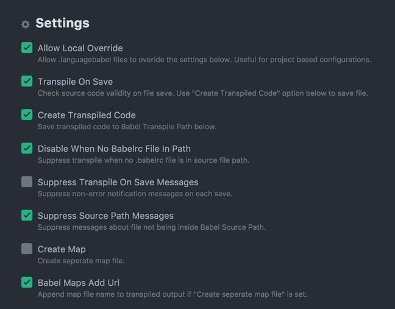

# Module System

옛날 옛적에 호랑이 담배피던 시절에는 자바스크립트 코드를 담고 있는 파일을 다른 자바스크립트 파일에서 사용할 수 없었다. 어처구니 없지만 사실이다! 하는 수 없이 HTML에 도움으로 결합해서 사용해야만 했다. 이러한 치명적인 결함을 해결하기 위해서 여러 모듈시스템 기술이 등장하기 시작했다.

HTML 파일에서 `.js` 확장자의 파일들을 임포트하면 파일들의 코드는 하나의 파일에서 작성한 것처럼 취급된다. 이 방법에 문제점은 파일이 많아지거나 여러 개발자들이 나누어서 개발한다면 자원의 충돌이 빈번하다는 점이다. 그래서 글로벌 스코프 변수를 사용하는 것은 금기가 되었고 스코프를 완벽하게 분리할 수 있는 방법이 필요해진다.

불편함을 느낀 많은 개발자들이 앞 다투어 자바스크립트의 치명적인 약점을 개선하고자 시도했다. 이에 따라서 코드를 여러 파일로 분리해서 개발하고 조립하여 사용해도 자원의 충돌이 발생하지 않는 모듈시스템 기술들이 속속 발표되었다. 

자바스크립트에게 홀로 설 수 있는 자유를 안겨 준 노드는 CommonJS 방식의 모듈시스템을 채택했다. 노드를 서버에서 사용하는 환경이라면 require 문법을 사용하는 것이 좋다.

한편 표준 단체인 ECMA는 ES6에서 `import ~ from`으로 대표되는 모듈시스템을 발표했다. 브라우저에서 사용하는 환경이라면 표준문법을 사용하는 것이 좋다.

문제는 클라이언트 사이드 개발인데 앵귤러, 리액트 모두 ECMA의 `import ~ from` 문법을 선호해서 발생한다. 왜냐하면 `import ~ from` 문법을 노드는 지원하지 않기 때문이다. 따라서 `Babel(구 6to5)`을 사용하여 트랜스파일링을 한 결과를 얻은 다음에야 노드 컴파일러를 통해서 코드를 실행할 수 있다. 

대부분의 자바스크립트 IDE 툴은 노드를 자바스크립트 코드의 실행도구로 사용하므로 불편하더라도 `import ~ from` 문법 사용 시 require 문법으로 바꾸는 작업을 선행해야 한다. 그러한 만큼 불편함이 발생한다. 환경설정을 통해 자동으로 트랜스파일링 작업이 수행되도록 IDE 도구를 셋팅해 놓으면 번거로움을 최소화 할 수 있다. 

## Node Module System

모든 자원이 자동으로 외부에 제공되지는 않는다. 선택적으로 공개한 자원만이 제공된다. 외부에 제공하고 싶은 자원을 노드가 제공하는 module.exports 객체에 등록한다. module.exports 객체를 가리키는 별칭인 exports를 통해서도 등록할 수 있다.

#### provider.js

```JavaScript
var a = 10;

function say() {
  console.log('Hello World!');
}

// 이 함수는 exports에 등록하지 않았으므로
// 다른 파일에서 사용할 수 없다.
function add(a, b) {
  return a + b;
}

// module.exports = {
//   a: a,
//   say: say
// }

// exports는 module.exports를 가리키는 별칭이다.
exports.a = a;
exports.say = say;
```

#### consumer.js

```JavaScript
const provider = require('./provider');
// provider.js에 있는 자원을 사용하고 싶다.
// 그럴 때 require 함수를 사용한다.

console.log(typeof provider, provider);
// object { a: 10, say: [Function: say] }

console.log(provider.a);
// 10
provider.say();
// Hello World!

const provider2 = require('./provider');

console.log(provider === provider2);
// true
// require 작업은 한 번만 처리된다.

const {a, say} = require('./provider');
// require 처리결과는 바로 provider.js에서 exports한 객체다.
// 따라서, 해체 할당 문법을 사용할 수 있다.

console.log(a);
// 10
say();
// Hello World!
```

* 위 코드에서 `./` 기호는 같은 폴더 내에 존재한다는 뜻으로 생략하면 노드의 빌트인 모듈이나 `node_modules` 폴더에 설치된 써드 파티 기술을 의미하게 된다.
* `provider`는 `provider.js` 파일을 가리킨다. 확장자는 생략할 수 있다.

## ECMA Module System

ECMA 협회가 제정한 표준 모듈기술이다. 하지만 컴파일 작업은 노드가 수행하는데 노드는 표준 모듈 기술을 지원하지 않는다. 따라서, 표준 문법으로 작성한 코드를 노드의 문법으로 바꾼 다음에 실행해야 한다.

### Transpiling 방법

트랜스파일링 작업은 다음 3가지 중에 하나를 사용한다. 편리함에서 차이가 있을 뿐 실제로 트랜스파일링을 수행하는 것은 Babel이라는 점은 변함이 없다.

#### 1. 콘솔을 이용하여 수행
Babel을 설치하고 개발자가 직접 콘솔에서 명령어를 사용하여 트랜스파일링 작업을 수행한다. 가장 번거로운 방식이다.

#### 2. IDE 툴을 이용하여 수행 
아톰에 language-babel 패키지를 설치한 후 트랜스파일링 작업을 수행시킨다.

#### 3. 앵귤러가 제공하는 CLI 도구를 이용하여 수행
트랜스파일링 작업뿐 아니라 번들링, 테스트 서버까지 제공하는 앵귤러의 CLI 도구를 사용하면 가장 편리하게 트랜스파일링 작업을 수행시킬 수 있다.

### Transpiling 처리순서

콘솔에서 babel 명령어를 사용하여 트랜스파일링을 수행할 수 있지만 조금 불편하다. 에디터를 사용하는 경우 에디터의 플러그인을 추가하고 환경설정을 통해서 대신 수행시키는 편이 보다 편리하다.

#### 1. language-babel 설치

아톰 설정에서 language-babel 패키지를 설치한다.

#### 2. language-babel 환경설정

다음 그림을 참고하여 language-babel 패키지의 설정을 조절한다.



또는 프로젝트별로 `.languagebabel` 파일을 두고 사용할 수도 있다.

##### .languagebabel

```
{
  "disableWhenNoBabelrcFileInPath": true,
  "projectRoot": true,
  "transpileOnSave": true,
  "createTargetDirectories": true,
  "createTranspiledCode": true,
  "babelSourcePath": "",
  "babelTranspilePath": "dist",
  "babelMapsPath": "dist",
  "suppressTranspileOnSaveMessages": false,
  "suppressSourcePathMessages": false,
  "createMap": false,
  "babelMapsAddUrl": false
}
```

#### 3. .babelrc 작성

Babel Runtime Configuration 설정파일을 만든다. `latest` 문자열은 `babel-preset-latest` 트랜스파일링 라이브러리를 지칭한다.

##### .babelrc

```
{
  "only": ["*.es6"],
  "presets": ["latest"],
  "plugins": [],
  "ignore": []
}
```

#### 4. package.json 파일 생성

`$ npm init -y`

#### 5. 트랜스파일링 라이브러리 설치

`$ npm install --save-dev babel-preset-latest`

#### 6. 파일을 작성하고 저장하여 트랜스파일링

##### provider.es6

```JavaScript
var a = 10;

function say() {
  console.log('Hello World!');
}

export function add(a, b) {
  return a + b;
}

// module.exports = {
//   a: a,
//   say: say
// }

// 함수 프로퍼티 축약 표현식을 사용하고 있다.
export {
  a,
  say
}
```

##### consumer.es6

```JavaScript
import * as provider from './provider';

console.log(provider.a);
provider.say();
console.log(provider.add(2, 3));

import {a, say} from './provider';

console.log(a);
say();
```

파일의 확장자를 `.js`로 바꾼다고 하더라도 실행할 수 없다. 왜냐하면 노드 컴파일러는 `import ~ from` 구문을 모르기 때문이다. 따라서 바벨을 사용하여 트랜스파일링을 수행하고 그 결과로 만들어진 `.js` 파일을 실행한다.

`provider.es6`, `consumer.es6` 파일에서 저장을 시도하면 트랜스파일링 작업이 이루어진다.

#### 7. 생성된 .js 파일을 실행

`consumer.js` 파일을 실행해 보자.

ECMA 모듈시스템은 사용방법이 노드의 모듈시스템보다 복잡하다. 자세한 사항은 다음 사이트를 참고하자.

* `https://developer.mozilla.org/ko/docs/Web/JavaScript/Reference/Statements/import`  
* `http://2ality.com/2014/09/es6-modules-final.html`

## IIFE

`Immediately Invoked Function Expression`은 즉시 실행 함수 표현식이라고 부른다. IIFE 방식을 사용하면 스코프를 완벽히 분리하여 자원의 충돌 및 손실을 막을 수 있다. 따라서, 소스코드를 복사해서 다른 자바스크립트 파일 어느 위치에나 끼어 넣어서 사용하거나 HTML을 통한 자바스크립트 파일들 결합 시 스코프 충돌에 대한 걱정을 덜 수 있다.

실무에서는 HTML에서 다수의 자바스크립트 파일들을 모두 인클루드하기 보다는 써드파티가 제공하는 번들러를 사용하여 다수의 파일을 하나의 파일로 묶은 후 사용하는 것을 선호한다. 처리방법은 다음과 같다.

1. 스코프를 분리하고자 하는 코드를 IIFE 표현식으로 감싼다.
2. 글로벌 객체에 고유한 네임스페이스를 추가한다.
3. IIFE 함수에 네임스페이스 객체를 전달한다.
4. 함수안에서 네임스페이스 객체에 외부에 제공할 자원을 등록한다.
5. IIFE 함수가 제공하는 자원은 네임스페이스 객체안에 있으므로 접근 패스를 사용하여 자원을 사용할 수 있다.

노드는 각각의 파일을 IIFE 표현식으로 감싸는 방식으로 처리하고 함수에게 module.exports 객체를 this로 전달한다. 직접 확인 해 보자.

##### a_provider.js

```JavaScript
window.GOOGLE = {};

(function(NS) {
  var a = 10;

  function say() {
    console.log('Hello World!');
  }

  NS.A = {
    a,
    say
  };
}(window.GOOGLE));
```

##### b_provider.js

```JavaScript
(function(NS) {
  var a = 20;

  function say() {
    console.log('Hello Angular!');
  }

  NS.B = {
    a,
    say
  };
}(window.GOOGLE));
```

##### consumer.js

```JavaScript
// a가 제공하는 자원을 사용하고 싶다.
console.log(window.GOOGLE.A.a);
window.GOOGLE.A.say();

// b가 제공하는 자원을 사용하고 싶다.
console.log(window.GOOGLE.B.a);
window.GOOGLE.B.say();
```

##### index.html

```html
<!DOCTYPE html>
<html lang="en" dir="ltr">
<head>
  <meta charset="utf-8">
  <title></title>
</head>
<body>
  <h1>콘솔을 확인하세요.</h1>
  <script src="./a_provider.js" charset="utf-8"></script>
  <script src="./b_provider.js" charset="utf-8"></script>
  <script src="./consumer.js" charset="utf-8"></script>
</body>
</html>
```

모듈이란 객체, 함수, 기타 컴포넌트의 묶음으로써 분리된 스코프를 갖는 객체다.

```JavaScript
(function(global) {
  var add = function(x, y) {
    return x + y;
  };

  var sub = function(x, y) {
    return x - y;
  };

  // calc는 모듈이다.
  var calc = {
    add: function(a, b) {
      return add(a, b);
    },
    sub: function(a, b) {
      return sub(a, b);
    }
  };

  global.calc = calc;
})(global);

console.log(global.calc.add(1, 2));
// 3
console.log(calc.sub(1, 2));
// -1
// global은 생략할 수 있다.
```