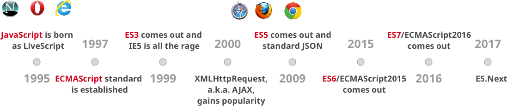

# ECMAScript Essence

ES6는 ECMAScript 6의 줄임말이다. ECMAScript 2015라고도 부른다. 따라서, ES7은 ECMAScript 2016이 된다. ECMA는 European Computer Manufacturers Association의 약자이다. ECMA인터내셔널은 정보와 통신 시스템을 위한 국제적인 회원국 기반의 비영리 표준화 기구이다.

아직까지 대부분의 브라우저는 최신 문법을 지원하지 않는다. 그럼에도 불구하고 많은 개발자들이 ES6, 7의 문법을 사용하여 개발할 수 있는 이유는 트랜스파일링 도구 덕분이다. 새 문법으로 작성된 코드를 트랜스파일링 작업을 통해 현 브라우저가 지원하는 ES5 문법으로 변경하여 배포한다. 인기있는 트랜스파일링 도구인 바벨(구 6to5)은 ES6 문법을 ES5 호환 JS 파일로 변환해 주는 대표적인 기술이다. 따라서, 최근에 인기있는 리액트, 앵귤러 등과 같은 프레임워크에서 ES6 문법을 사용하여 개발할 수 있다.

## ES6 브라우저 지원현황 

`https://kangax.github.io/compat-table/es6/`
