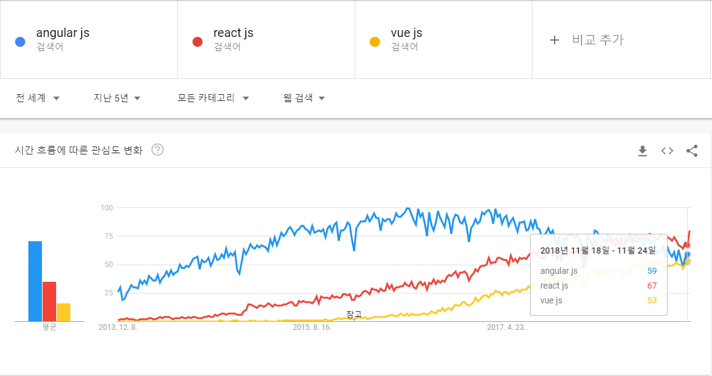
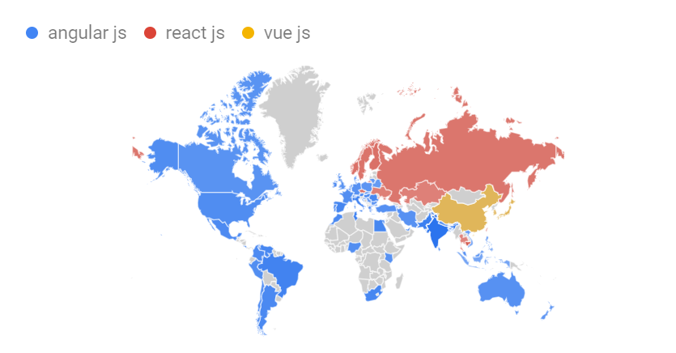

# Part Ⅱ. Angular Basic

앵귤러 구조를 파악한 후 간단한 예제를 통해 빠르게 개념을 확립합니다.
앵귤러의 핵심 구성요소인 컴포넌트, 서비스, 파이프, 디렉티브, 모듈을 앵귤러 CLI 툴과 같이 학습합니다.

## Angular

앵귤러는 구글에서 만든 자바스크립트 프레임워크다. 2010년 10월 정식버전을 발표하였다. 2016년 9월 앵귤러2 버전을 발표하였다. 앵귤러2는 이전 버전의 처리속도를 개선하기 위해서 여러 단계를 거쳐 호출해야 하는 복잡한 단계를 제거했다. 더불어 자바스크립트의 장점인 높은 자율도에 의해서 발생되는 단점인 디버깅에 어려움을 해결하기 위해서 타입스크립트를 도입했다. 타입스크립트는 마이크로소프트가 2012년 10월 출시했다.

구글 트랜드 검색으로 살펴본 결과입니다. 경쟁관계에 있는 3가지 기술로 검색했습니다.

## Angular를 사용해야 하는 이유

* 크로스 플랫폼 지원
* 처리속도
* 개발생산성

최근 들어 브라우저에서 동작하는 스크립트의 역할이 뷰에서 머물지 않고 컨트롤러까지 확대되었고 데이터를 자바스크립트 객체상태로 유지한다. 이에 따라 서버의 역할은 데이터를 제공하는 공급자 역할로 축소되고 있다.
