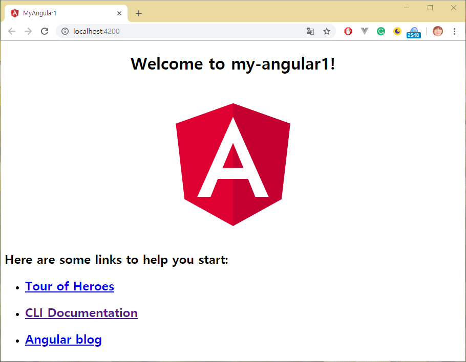
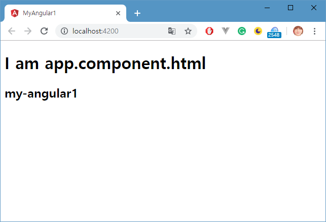
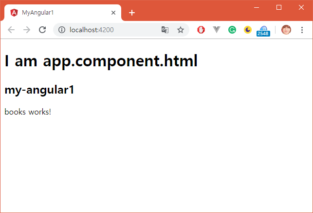
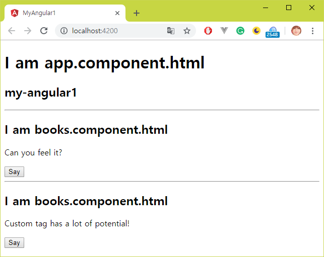
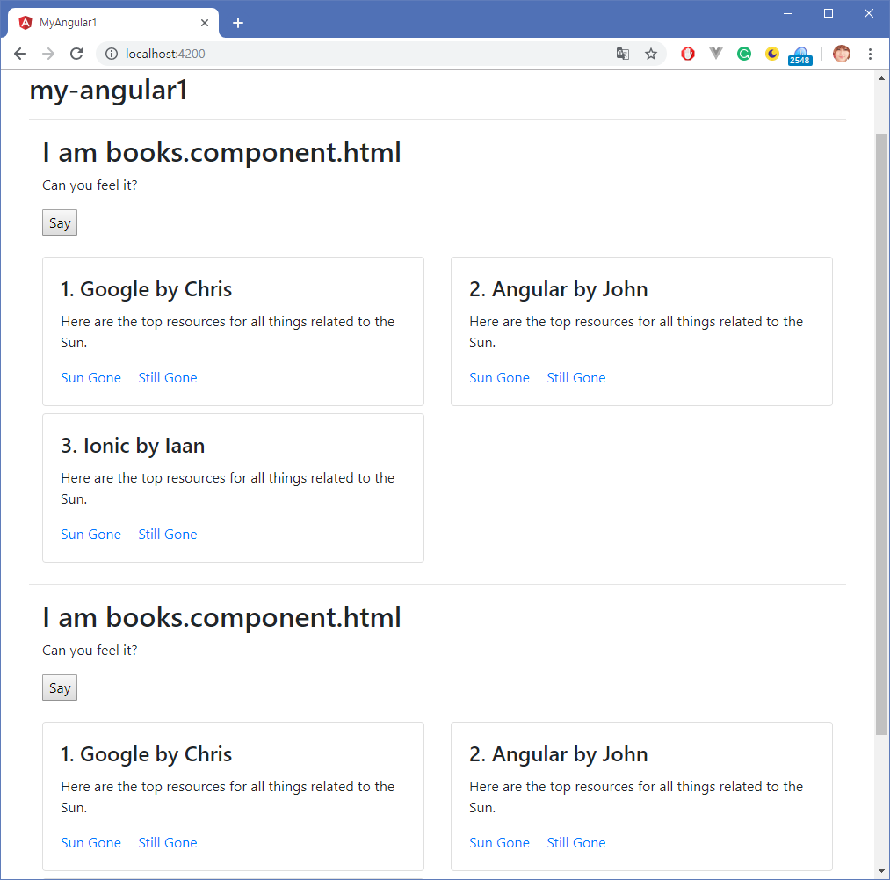
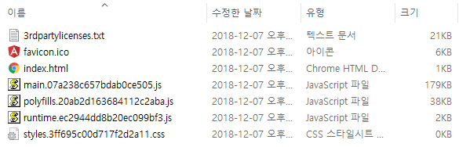

# Angular CLI

Angular CLI는 Angular 응용 프로그램을 초기화, 개발, 스캐 폴딩 및 유지 관리하는 데 사용하는 명령 줄 인터페이스 도구입니다. 도구를 콘솔에서 직접 사용하거나 Angular 콘솔과 같은 대화 형 UI를 통해 간접적으로 사용할 수 있습니다.

`Angular CLI를 위한 전용 도구가 나왔습니다. Angular 콘솔이라고 부릅니다. 수업은 기존 콘솔에서 진행하도록 하겠습니다. https://angularconsole.com/`

## 설치

노드의 NPM 도구를 사용하여 Angular CLI를 설치합니다.

```bash
$ npm install -g @angular/cli
```

버전을 확인합니다.

```bash
$ ng --version

     _                      _                 ____ _     ___
    / \   _ __   __ _ _   _| | __ _ _ __     / ___| |   |_ _|
   / △ \ | '_ \ / _` | | | | |/ _` | '__|   | |   | |    | |
  / ___ \| | | | (_| | |_| | | (_| | |      | |___| |___ | |
 /_/   \_\_| |_|\__, |\__,_|_|\__,_|_|       \____|_____|___|
                |___/


Angular CLI: 7.1.1
Node: 10.14.1
OS: win32 x64
Angular:
...

Package                      Version
------------------------------------------------------
@angular-devkit/architect    0.11.1
@angular-devkit/core         7.1.1
@angular-devkit/schematics   7.1.1
@schematics/angular          7.1.1
@schematics/update           0.11.1
rxjs                         6.3.3
typescript                   3.1.6
```

## 사용법

자주쓰는 필수적인 명령어를 살펴봅니다.

### ng new [project-name]

새 앵귤러 프로젝트를 생성합니다. 다음과 같은 작업이 이루어집니다.

* 개발에 필요한 폴더 및 환경설정 파일들이 생성됩니다.
* 루트 모듈 및 기동 컴포넌트가 기본으로 생성됩니다.
* package.json 파일에 디펜던시 내역에 따라서 라이브러리가 다운로드 됩니다.

프로젝트 생성 시 라우팅 모듈을 추가로 만들것인지 물어봅니다.  
`Would you like to add Angular routing? yes`

프로젝트 생성 시 CSS 기술로 무엇을 사용할 것인지 추가로 물어봅니다.  
`Which stylesheet format would you like to use? scss`

대답이 끝나면 프로젝트 생성작업을 시작합니다.

* `--minimal=true`  
creates a project without any testing frameworks.  
테스트와 관련한 jasmine, karma, protractor 등의 디펜던시를 제외합니다. 기동 컴포넌트인 AppComponent가 인라인템플릿, 인라인스타일 방식으로 생성됩니다. 새 컴포넌트를 생성하면 spec.ts 파일은 생성됩니다.   
`Default: false`  

**package.json**

```json
"dependencies": {
  "@angular/animations": "~7.1.0",
  "@angular/common": "~7.1.0",
  "@angular/compiler": "~7.1.0",
  "@angular/core": "~7.1.0",
  "@angular/forms": "~7.1.0",
  "@angular/platform-browser": "~7.1.0",
  "@angular/platform-browser-dynamic": "~7.1.0",
  "@angular/router": "~7.1.0",
  "core-js": "^2.5.4",
  "rxjs": "~6.3.3",
  "tslib": "^1.9.0",
  "zone.js": "~0.8.26"
},
"devDependencies": {
  "@angular-devkit/build-angular": "~0.11.0",
  "@angular/cli": "~7.1.1",
  "@angular/compiler-cli": "~7.1.0",
  "@angular/language-service": "~7.1.0",
  "@types/node": "~8.9.4",
  "ts-node": "~7.0.0",
  "tslint": "~5.11.0",
  "typescript": "~3.1.6"
}
```

* `--skipTests=true`  
When true, does not generate "spec.ts" test files for the new project.  
테스트와 관련한 jasmine, karma, protractor 등의 설정은 포함되나 angular.json 파일에 설정을 추가하여 spec.ts 파일의 생성을 막습니다. 관련하여 angular.json 파일에 설정되는 내용은 다음과 같습니다.  
`Default: false`  

**angular.json**

```json
"schematics": {
  "@schematics/angular:component": {
    "styleext": "scss",
    "spec": false
  },
  "@schematics/angular:class": {
    "spec": false
  },
  "@schematics/angular:directive": {
    "spec": false
  },
  "@schematics/angular:guard": {
    "spec": false
  },
  "@schematics/angular:module": {
    "spec": false
  },
  "@schematics/angular:pipe": {
    "spec": false
  },
  "@schematics/angular:service": {
    "spec": false
  }
},
```

* `--prefix=prefix`  
The prefix to apply to generated selectors for the initial project.  
컴포넌트의 selector 값에 자동으로 붙는 두문자를 변경합니다. 관련 설정은 angular.json 파일의 `"prefix": "app"` 항목에서 찾아 볼 수 있습니다.  
`Default: app`   

* `--skipInstall=true`  
When true, does not install dependency packages.  
프로젝트 스캐폴딩 작업 후 package.json 파일의 dependencies, devDependencies 설정에 따른 디펜던시 설치작업을 수행하지 않습니다. 나중에 직접 `npm install` 명령으로 설치할 수 있습니다. 무엇을 install 할 지 명시하지 않으면 자동으로 package.json 파일에 설정된 디펜던시들을 모두 설치합니다.   
`Default: false`  

* `--inlineTemplate=true`  
컴포넌트의 HTML 파일을 별도로 만들지 않고 class 파일에서 작업할 수 있도록 조치합니다.   
`Default: false`  

* `--inlineStyle=true`  
컴포넌트의 CSS 파일을 별도로 만들지 않고 class 파일에서 작업할 수 있도록 조치합니다. 관련하여 설정된 내용은 `angular.json` 파일에서 찾을 수 있습니다.   
`Default: false`  

**angular.json**

```json
"schematics": {
  "@schematics/angular:component": {
    "inlineTemplate": true,
    "inlineStyle": true,
    "styleext": "scss"
  }
},
```

**app.component.ts**

```ts
import { Component } from '@angular/core';

@Component({
  selector: 'app-root',
  template: `
    <!--The content below is only a placeholder and can be replaced.-->
    <div style="text-align:center">
      <h1>
        Welcome to {{title}}!
      </h1>
      <!-- 생략 -->
    <router-outlet></router-outlet>
  `,
  styles: []
})
export class AppComponent {
  title = 'small-project';
}
```

* `--skipGit=true`  
When true, does not initialize a git repository.  
`기본 값이 false라고 공식 사이트에 나와 있으나 옵션을 사용하지 않아도 깃 저장소는 생성되지 않습니다. 기본 값은 true라고 보는 것이 옳겠습니다.`   
하나의 워크 스페이스 폴더에 여러 앵귤러 프로젝트를 작업할 때는 개별 적으로 깃 저장소를 만들기 보다는 워크 스페이스 단위로 만드는 것을 선호할 수 있기 때문에 필요한 옵션이라 할 수 있습니다.

### 최소 사이즈 프로젝트 만들기

이것 저것 뺀 프로젝트를 다음 명령으로 만들어 봅시다. 프로젝트의 구성과 `package.json` 파일과 `angular.json` 파일의 설정부분을 살펴보세요.

`$ ng new small-project --inlineTemplate=true --inlineStyle=true --minimal=true --skipTests=true --skipGit=true --skipInstall=true`

### ng serve -o

프로젝트 루트 폴더에서 명령을 실행하면 앵귤러 프로젝트를 `빌드 및 번들링` 작업을 진행하고 `웹팩 테스트 서버`를 기동합니다. 더불어서 `-o` 옵션을 추가하면 브라우저가 실행되고 웹팩 테스트 서버에 접속하여 `index.html` 파일을 다운받아서 화면에 표시합니다.

### ng g c [component-name]

새 컴포넌트를 생성합니다. 컴포넌트 전용폴더가 생성됩니다. g 문자는 generate 문자열을 줄여서 쓴 것이고 c 문자는 component 문자열을 줄여서 쓴 것입니다.  

* `--module=app`  
컴포넌트를 등록할 대상 모듈을 지정합니다.   
  - `app` 문자열은 `AppModule` 클래스에서 `Module` 단어를 뺀 후 소문자로 사용합니다.  
  - 생략하면 루트 모듈에 등록됩니다.   
  - 컴포넌트 생성 시 특정 폴더 밑에 만들라고 한 경우, 해당 폴더에 모듈 파일이 존재한다고 할 때, 생략하면 해당 폴더에 존재하는 모듈에 등록됩니다.  

* `--selector=selector`  
컴포넌트의 selector 값을 지정합니다. 생략하면 컴포넌트명에 자동으로 지정됩니다.  

* `--prefix=my`  
컴포넌트의 selector 값에서 사용할 두문자를 지정합니다. 생략하면 `angular.json` 파일의 설정을 따릅니다.  

* `--inlineTemplate=true`  
HTML 파일을 별도로 만들지 않습니다. 생략하면 별도로 HTML 파일을 생성합니다.  

* `--inlineStyle=true`  
CSS 파일을 별도로 만들지 않습니다. 생략하면 별도로 CSS 파일을 생성합니다.  

* `--spec=false`  
`테스트 파일(~.spec.ts)`을 별도로 만들지 않습니다. 생략하면 별도로 테스트 파일을 생성합니다.  

* 보다 자세한 내용은 공식 사이트를 참고하세요.  
`https://angular.io/cli/generate#component`

### ng g s [service-name]

새 서비스를 생성합니다. s 문자는 service 문자열을 줄여서 쓴 것입니다.  
`https://angular.io/cli/generate#directive`

### ng g g [guard-name]

새 가드를 생성합니다. 가다는 서비스의 일종으로 라우팅 처리 시 작동하는 서비스입니다. 두 번째 g 문자는 guard 문자열을 줄여서 쓴 것입니다.  
`https://angular.io/cli/generate#guard`

### ng g p [pipe-name]

새 파이프를 생성합니다. p 문자는 pipe 문자열을 줄여서 쓴 것입니다.  
`https://angular.io/cli/generate#pipe`  

* `--export=true`
* `--module=module`
* `--spec=false`

### ng g d [directive-name]

새 디렉티브를 생성합니다. d 문자는 directive 문자열을 줄여서 쓴 것입니다.  
`https://angular.io/cli/generate#directive`  

* `--export=true`
* `--module=module`
* `--spec=false`

### ng g class [class-name]

새 클래스를 생성합니다. c 문자는 component 문자열을 의미하기 때문에 사용할 수 없습니다. 이럴 때는 줄여 쓰지 말고 그대로 class 라는 문자열을 사용하면 됩니다.    
`https://angular.io/cli/generate#class`

### ng g i [interface-name]

새 인터페이스를 생성합니다. i 문자는 interface 문자열을 줄여서 쓴 것입니다.  
`https://angular.io/cli/generate#interface`

### ng g m [module-name]

새 모듈을 생성합니다. 모듈 전용폴더가 생성됩니다. m 문자는 module 문자열을 줄여서 쓴 것입니다.  

* `--routing=true`
라우팅 정보를 별도의 파일로 취급할 수 있도록 라우팅 모듈 파일을 추가로 생성합니다. 생략하면 생성되지 않고 모듈파일만 생성됩니다.

* `--module=app`  
새 모듈을 루트 모듈에 등록하는 작업을 추가로 수행합니다.  

* 보다 자세한 내용은 공식 사이트를 참고하세요.  
`https://angular.io/cli/generate#module`

## Angular CLI 공식 사이트

기타 자세한 사용법은 공식 사이트를 참고하세요.  

* `https://angular.io/cli`
* `https://cli.angular.io/`

## 첫 프로젝트 만들기

실습을 통해서 앵귤러 CLI 사용법을 학습합니다. 적당한 폴더를 작업공간(워크 스페이스)으로 간주하고 콘솔에서 커서를 이동 시킵니다. `$` 기호는 프롬프트를 의미합니다. `$` 기호 다음 명령을 따라하세요.

```bash
$ ng new my-angular1
? Would you like to add Angular routing? No
? Which stylesheet format would you like to use? CSS
```

```bash
$ cd my-angular1
$ ng serve -o
** Angular Live Development Server is listening on localhost:4200, 
open your browser on http://localhost:4200/ **

Date: 2018-12-05T02:47:04.201Z
Hash: dc84e834c1cad91bd980
Time: 9772ms
chunk {main} main.js, main.js.map (main) 9.82 kB [initial] [rendered]
chunk {polyfills} polyfills.js, polyfills.js.map (polyfills) 223 kB [initial] [rendered]
chunk {runtime} runtime.js, runtime.js.map (runtime) 6.08 kB [entry] [rendered]
chunk {styles} styles.js, styles.js.map (styles) 16.3 kB [initial] [rendered]
chunk {vendor} vendor.js, vendor.js.map (vendor) 3.43 MB [initial] [rendered]
i ｢wdm｣: Compiled successfully.
```

로그를 살펴보면 `http://localhost:4200/` 주소로 웹 서비스가 시작된 것을 알 수 있습니다. `ng serve -o` 명령에서 `--open` 옵션을 주었기 때문에 바로 브라우저가 뜨고 다음과 같은 화면을 볼 수 있습니다.



브라우저에서 소스보기를 합니다. 소스의 내용은 다음과 같습니다.

```HTML
<!doctype html>
<html lang="en">
<head>
  <meta charset="utf-8">
  <title>MyAngular1</title>
  <base href="/">

  <meta name="viewport" content="width=device-width, initial-scale=1">
  <link rel="icon" type="image/x-icon" href="favicon.ico">
</head>
<body>
  <app-root></app-root>
  <script type="text/javascript" src="runtime.js"></script>
  <script type="text/javascript" src="polyfills.js"></script>
  <script type="text/javascript" src="styles.js"></script>
  <script type="text/javascript" src="vendor.js"></script>
  <script type="text/javascript" src="main.js"></script></body>
</html>
```

`ng serve -o` 명령 시 출력된 로그를 살펴 보면 웹 서버를 시작하기 전에 5개의 파일들로 번들링 작업이 진행되었음을 알 수 있습니다. 프로젝트 루트에서 src 폴더 밑에 존재하는 index.html 파일은 자바스크립트 파일을 임포트하는 코드가 없지만 동적으로 빌드하는 과정에서 index.html 파일에 추가가 된다고 이해하시면 되겠습니다.

* `runtime.js` : 웹 팩 서버관련 로직
* `polyfills.js` : 폴리필 라이브러리
* `styles.js` : CSS 처리 관련 로직
* `vendor.js` : 앵귤러 기술
* `main.js` : 개발자가 추가한 로직

개발 중 웹팩을 테스트 웹서버로 사용하는데 위 처리는 개발 중 빌드에 해당합니다. 개발 중 빌드, 배포 테스트 빌드, 실 서비스 빌드는 처리결과가 조금 씩 다릅니다. 이는 뒤에서 자세히 살펴보겠습니다.

### 처리흐름

1. `index.html` 파일이 브라우저에게 전달됩니다.
`index.html` 파일은 앵귤러 코드를 브라우저에게 전달하는 용도로 사용됩니다.

2. `main.ts` 파일이 앵귤러 코드의 진입점입니다.
이 설정은 `angular.json` 파일 내 `"main": "src/main.ts"` 설정에 따라 이루어집니다. 이 파일은 코드로 전역적인 환경설정을 하기위한 용도의 파일입니다.

3. `app.module.ts` 파일이 루트 모듈(시작 모듈)입니다.
이는 `main.ts` 파일 내 `platformBrowserDynamic().bootstrapModule(AppModule)` 코드에 따라 이루어집니다. 앵귤러 프로그램에서 루트모듈은 하나만 지정할 수 있습니다.

4. `app.component.ts` 파일이 시작 컴포넌트입니다.
이는 `app.module.ts` 파일 내 `bootstrap: [AppComponent]` 설정에 따라 이루어집니다. 기동 컴포넌트는 루트 모듈에 등록된 컴포넌트 중에 하나를 선택해서 등록합니다. 루트 모듈에게 임포트 된 모듈이 소유한 컴포넌트를 명시적으로 익스포트했다면 시작 컴포넌트로 사용할 수 있으나 일반적으로 이렇게 사용하지는 않습니다.

5. `app.component.html` 파일이 첫 화면을 구성하는 HTML 파일입니다.
이는 `app.component.ts` 파일 내 `templateUrl: './app.component.html'` 설정에 따라 이루어집니다. `app.component.ts` 파일 내 `styleUrls: ['./app.component.css']` 설정에 따라 HTML 파일에 디자인이 적용됩니다.

6. `AppComponent` 처리가 완료되면 `index.html` 파일 내 `<app-root></app-root>` 태그 사이에 처리된 내용을 추가합니다. 따라서, 앵귤러는 커스텀 태그 사용 시 마감 태그가 항시 존재해야만 하면 줄여서 사용할 수 없습니다. `app-roo` 문자열은 `app.component.ts` 파일에서 정의한 `selector: 'app-root'` 내용과 일치해야 합니다.

### 환경설정 살펴보기

#### package.json

노드가 제안하는 프로젝트 정보 및 디펜던시 설정파일입니다.

```JSON
{
  "name": "my-angular1",
  "version": "0.0.0",
  "scripts": {
    "ng": "ng",
    "start": "ng serve",
    "build": "ng build",
    "test": "ng test",
    "lint": "ng lint",
    "e2e": "ng e2e"
  },
  "private": true,
  "dependencies": {
    "@angular/animations": "~7.1.0",
    "@angular/common": "~7.1.0",
    "@angular/compiler": "~7.1.0",
    "@angular/core": "~7.1.0",
    "@angular/forms": "~7.1.0",
    "@angular/platform-browser": "~7.1.0",
    "@angular/platform-browser-dynamic": "~7.1.0",
    "@angular/router": "~7.1.0",
    "core-js": "^2.5.4",
    "rxjs": "~6.3.3",
    "tslib": "^1.9.0",
    "zone.js": "~0.8.26"
  },
  "devDependencies": {
    "@angular-devkit/build-angular": "~0.11.0",
    "@angular/cli": "~7.1.1",
    "@angular/compiler-cli": "~7.1.0",
    "@angular/language-service": "~7.1.0",
    "@types/node": "~8.9.4",
    "@types/jasmine": "~2.8.8",
    "@types/jasminewd2": "~2.0.3",
    "codelyzer": "~4.5.0",
    "jasmine-core": "~2.99.1",
    "jasmine-spec-reporter": "~4.2.1",
    "karma": "~3.1.1",
    "karma-chrome-launcher": "~2.2.0",
    "karma-coverage-istanbul-reporter": "~2.0.1",
    "karma-jasmine": "~1.1.2",
    "karma-jasmine-html-reporter": "^0.2.2",
    "protractor": "~5.4.0",
    "ts-node": "~7.0.0",
    "tslint": "~5.11.0",
    "typescript": "~3.1.6"
  }
}
```

* `scripts` 항목에는 앵귤러 CLI 명령의 별칭을 등록합니다. 자주 쓰는 명령이나 옵션이 많은 명령들을 등록해 놓고 사용하면 편리합니다.
* `dependencies` 항목에는 개발 및 서비스 중에 필요한 디펜던시들을 등록합니다.
* `devDependencies` 항목에는 개발 중에만 필요한 디펜던시들을 등록합니다.
* 필요한 대부분의 앵귤러 디펜던시는 설정이 되어 있으나 `@angular/http`는 빠져 있습니다. `@angular/http` 모듈에 대체 기술로써 인기 있는 `axios` 같은 기술을 사용하라는 배려인 것 같습니다.
* `core-js`는 폴리필 라이브러리입니다.
* `rxjs`는 MS가 만든 비동기 처리 기술입니다.
* `tslib`는 타입스크립트 런타입 라이브러리입니다.
* `zone.js`는 구글이 만든 변경감지 기술입니다.
* `jasmine`는 인기있는 자바스크립트 테스트 프레임워크입니다.
* `karma`는 테스트 런너입니다.
* `protractor`는 통합 테스트 기술입니다.
* `@types/jasmine` 타이핑 정의를 추가로 설치하면 IDE 툴 사용 시 자스민과 관련한 도움말 서비스를 받을 수 있습니다.

#### angular.json

앵귤러 버전에 따라 `angular.json` 파일의 내용이 변화가 있으니 참고 하시기 바랍니다. 여기 전체 내용을 기록하는 이유는 미래에 변경될 수도 있기 때문입니다.

```JSON
{
  "$schema": "./node_modules/@angular/cli/lib/config/schema.json",
  "version": 1,
  "newProjectRoot": "projects",
  "projects": {
    "my-angular1": {
      "root": "",
      "sourceRoot": "src",
      "projectType": "application",
      "prefix": "app",
      "schematics": {},
      "architect": {
        "build": {
          "builder": "@angular-devkit/build-angular:browser",
          "options": {
            "outputPath": "dist/my-angular1",
            "index": "src/index.html",
            "main": "src/main.ts",
            "polyfills": "src/polyfills.ts",
            "tsConfig": "src/tsconfig.app.json",
            "assets": [
              "src/favicon.ico",
              "src/assets"
            ],
            "styles": [
              "src/styles.css"
            ],
            "scripts": []
          },
          "configurations": {
            "production": {
              "fileReplacements": [{
                "replace": "src/environments/environment.ts",
                "with": "src/environments/environment.prod.ts"
              }],
              "optimization": true,
              "outputHashing": "all",
              "sourceMap": false,
              "extractCss": true,
              "namedChunks": false,
              "aot": true,
              "extractLicenses": true,
              "vendorChunk": false,
              "buildOptimizer": true,
              "budgets": [{
                "type": "initial",
                "maximumWarning": "2mb",
                "maximumError": "5mb"
              }]
            }
          }
        },
        "serve": {
          "builder": "@angular-devkit/build-angular:dev-server",
          "options": {
            "browserTarget": "my-angular1:build"
          },
          "configurations": {
            "production": {
              "browserTarget": "my-angular1:build:production"
            }
          }
        },
        "extract-i18n": {
          "builder": "@angular-devkit/build-angular:extract-i18n",
          "options": {
            "browserTarget": "my-angular1:build"
          }
        },
        "test": {
          "builder": "@angular-devkit/build-angular:karma",
          "options": {
            "main": "src/test.ts",
            "polyfills": "src/polyfills.ts",
            "tsConfig": "src/tsconfig.spec.json",
            "karmaConfig": "src/karma.conf.js",
            "styles": [
              "src/styles.css"
            ],
            "scripts": [],
            "assets": [
              "src/favicon.ico",
              "src/assets"
            ]
          }
        },
        "lint": {
          "builder": "@angular-devkit/build-angular:tslint",
          "options": {
            "tsConfig": [
              "src/tsconfig.app.json",
              "src/tsconfig.spec.json"
            ],
            "exclude": [
              "**/node_modules/**"
            ]
          }
        }
      }
    },
    "my-angular1-e2e": {
      "root": "e2e/",
      "projectType": "application",
      "prefix": "",
      "architect": {
        "e2e": {
          "builder": "@angular-devkit/build-angular:protractor",
          "options": {
            "protractorConfig": "e2e/protractor.conf.js",
            "devServerTarget": "my-angular1:serve"
          },
          "configurations": {
            "production": {
              "devServerTarget": "my-angular1:serve:production"
            }
          }
        },
        "lint": {
          "builder": "@angular-devkit/build-angular:tslint",
          "options": {
            "tsConfig": "e2e/tsconfig.e2e.json",
            "exclude": [
              "**/node_modules/**"
            ]
          }
        }
      }
    }
  },
  "defaultProject": "my-angular1"
}
```

* `"prefix": "app"`
컴포넌트를 생성할 때 컴포넌트를 가리키는 커스텀 태그명을 지정합니다. 이를 selector라고 부르는데 prefix는 셀렉터 문자열 앞에 자동으로 붙는 두문자를 가리킵니다. 예를 들어서, 자동으로 만들어진 `app.component.ts` 파일을 보면 `selector: 'app-root'`라고 하는 설정이 보이실 겁니다. 필요할 때 바꾸어서 사용하면 됩니다.
* `"outputPath": "dist/my-angular1"`
빌드결과 파일이 저장되는 위치입니다.
* `"index": "src/index.html"`
위 설정에 따라 index.html 파일이 앵귤러 코드를 임포트해서 브라우저에게 전달하는 역할을 수행합니다.
* `"main": "src/main.ts"`
위 설정에 따라 main.ts 파일이 개발자 로직의 시작점이 됩니다.
* `"polyfills": "src/polyfills.ts"`
폴리필 관련 설정파일입니다. IE 브라우저에서도 앵귤러 제대로 작동하기를 원한다면 `polyfills.ts` 파일에서 필요한 부분에 주석처리를 해제하면 됩니다.
* `"assets": ["src/favicon.ico","src/assets"]`
정적 리소스를 등록하는 위치와 관련한 설정입니다. 따라서, 이미지 파일은 `assets` 폴더 밑에 배치하면 됩니다.
* `"styles": ["src/styles.css"]`
`index.html` 파일의 `<head>` 태그 사이에 CSS 설정을 해도 되지만 `styles.css` 파일에 하면 보다 깔끔하게 `index.html` 파일을 관리할 수 있습니다.
* `"scripts": []`
빌드 시 포함될 전역 자바스크립트 파일을 등록합니다.

기타 자세한 내용은 다음 사이트를 참고하시기 바랍니다.
* `https://github.com/angular/angular-cli/wiki/angular-cli`
* `https://github.com/angular/angular-cli/wiki/angular-workspace`
* `https://nitayneeman.com/posts/understanding-the-angular-cli-workspace-file/`

### Component 추가하기

이제부터 컴포넌트를 추가해보면서 학습해 보도록 하겠습니다. 다음 명령을 프로젝트 루트 밑에서 실행하세요. `ng serve` 명령을 수행하고 있는 콘솔창은 그대로 두시고 별도의 콘솔창을 이용합니다. 

```bash
$ ng g c books --module=app
CREATE src/app/books/books.component.html (24 bytes)
CREATE src/app/books/books.component.spec.ts (621 bytes)
CREATE src/app/books/books.component.ts (265 bytes)
CREATE src/app/books/books.component.css (0 bytes)
UPDATE src/app/app.module.ts (392 bytes)
```

books라는 이름으로 컴포넌트를 생성하라고 명령하면 컴포넌트와 관련한 4개의 파일이 생성됩니다.

* `src/app` 폴더 밑으로 컴포넌트를 위한 폴더 `books`가 생성됩니다.
* `books.component.html` 파일은 컴포넌트 전용 HTML 파일입니다.
* `books.component.spec.ts` 파일은 테스트를 위한 파일입니다. 자스민 테스트 프레임워크 테스트 코드를 작성하는 용도입니다. `--spec=false` 옵션을 추가하면 이 파일의 생성을 막을 수 있습니다.
* `books.component.ts` 파일은 컴포넌트 자바스크립트 클래스 파일입니다.
* `books.component.css` 파일은 컴포넌트 전용 CSS 파일입니다.
* `app.module.ts` 파일에 새로 생성된 컴포넌트가 등록되는 코드가 추가되어 UPDATE 되었다고 표시되었습니다.

```bash
$ ng g c books/book
CREATE src/app/books/book/book.component.html (23 bytes)
CREATE src/app/books/book/book.component.spec.ts (614 bytes)
CREATE src/app/books/book/book.component.ts (261 bytes)
CREATE src/app/books/book/book.component.css (0 bytes)
UPDATE src/app/app.module.ts (472 bytes)
```

* `--module=app` 옵션을 생략하면 새 컴포넌트는 루트 모듈에 등록됩니다.
* `books/book` 처럼 사용하면 `/` 앞에 문자열은 폴더로 취급됩니다. 해당 폴더가 존재하지 않으면 폴더가 자동으로 생성되고 이미 존재하면 생성되지 않습니다. `book` 이라는 이름의 새 컴포넌트는 books 폴더 밑으로 전용 폴더 `book`을 만든 후 그 밑으로 컴포넌트 관련 파일을 생성합니다.

### Component 화면에 표시하기

컴포넌트가 만들어졌다고 바로 화면에 표시되지는 않습니다. 어떻게 화면에 배치할 수 있는지 알아보도록 하겠습니다.

기동 컴포넌트인 `AppComponent`가 사용하는 `app.component.html` 파일을 열어서 다음처럼 변경합니다.

```HTML
<h1>I am app.component.html</h1>
<h2>{{title}}</h2>
```

* `{{title}}`
더블 중괄호는 인터폴레이션 표현식으로 안쪽에 간단한 자바스크립트 코드를 작성할 수 있습니다. `title`에 문자열 기호가 없으므로 변수를 의미합니다. 컴포넌트 클래스가 갖고 있는 값이 치환되어 배치됩니다. 인터폴레이션 표현식은 태그도 문자열처럼 취급합니다.

브라우저 화면의 변화를 확인하세요.



`ng serve` 명령을 수행한 콘솔창을 확인하세요.

```bash
Date: 2018-12-05T07:05:25.266Z - Hash: 0d918a5704ebff4207f1 - Time: 3709ms
4 unchanged chunks
chunk {main} main.js, main.js.map (main) 13.8 kB [initial] [rendered]
i ｢wdm｣: Compiled successfully.
```

앵귤러는 파일이 저장될 때 자동으로 재 빌드작업을 수행합니다. 개발자가 작성한 코드는 `main.js`에 포함되므로 해당 파일만 재 번들링 되었다는 것을 알 수 있습니다. 개발 시 매번 테스트 웹서버를 재 기동하지 않아도 바로 적용되기 때문에 매우 편리합니다.

`app.component.html` 파일을 다음처럼 수정합니다.

```HTML
<h1>I am app.component.html</h1>
<h2>{{title}}</h2>
<app-books></app-books>
```



* `<app-books></app-books>`
app.component.html 파일에서 books 컴포넌트에 selector 문자열을 커스텀 태그처럼 사용하면 화면에 books 컴포넌트가 가진 HTML 내용이 표시됩니다. 앵귤러는 HTML5에서 도입한 커스텀 태그를 그 보다도 앞서서 지원한 멋진 기술입니다. 

커스텀 태그의 능력은 실로 막강합니다. 이를 느껴보기 위해서 `books.component.html` 파일을 다음처럼 수정합니다.

```HTML
<h2>I am books.component.html</h2>
<p #target>Custom tag has a lot of potential!</p>
<button type="button" (click)="target.innerText='Can you feel it?'">Say</button>
```

* `Say` 버튼을 클릭하면 `p` 태그안에 문자열이 변경됩니다.
* 반복적으로 사용하는 HTML 엘리먼트들을 컴포넌트화 한 후 간단히 커스텀 태그로 이를 원하는 곳에 적용할 수 있습니다. 엘리먼트들이 복잡하면 할 수록 이는 빛을 발합니다.
* `#target`
`#변수` 설정으로 간단히 엘리먼트 참조 객체를 생성합니다.
* `(click)="자바스크립트 코드"`
버튼에 클릭 이벤트가 발생하면 오른쪽에 배치된 자바스크립트 코드가 실행됩니다. `target`이라는 엘리먼트 참조를 통해서 `p` 태그에 접근하고 `target.innerText` 속성으로 `p` 태그 안에 문자열을 변경합니다.

`app.component.html` 파일을 다음처럼 수정합니다.

```HTML
<h1>I am app.component.html</h1>
<h2>{{title}}</h2>
<hr>
<app-books></app-books>
<hr>
<app-books></app-books>
```



* `<app-books></app-books>` 커스텀 태그를 두 번 사용했습니다. 첫 번째 `BooksComponent` 컴포넌트의 `Say` 버튼을 클릭했습니다. 두 번째 컴포넌트의 화면 내용은 그대로 인걸 보시죠. 컴포넌트는 화면에 배치될 때 매번 새로 만들어 집니다. 따라서, 초기 화면 내용은 같을지라도 컴포넌트 객체는 따로 존재하는 것이며 이벤트에 의해서 화면내용이 바뀌어도 다른 컴포넌트에 영향을 주지 않습니다.

### Component 안에 다른 Component 배치하기

`AppComponent` 컴포넌트는 기동 컴포넌트로써 전체화면을 담당하는 컴포넌트입니다. 그래서 기동 컴포넌트는 상세한 화면내용을 구성하기 보다는 전체 화면의 구조만을 처리하는 역할로 사용하는 것이 좋습니다. 

우리는 앞서서 `AppComponent` 컴포넌의 HTML 파일에서 `BooksComponent` 컴포넌트의 `selector`를 커스텀 태그로 사용하여 `AppComponent` 컴포넌트 화면에 일부를 `BooksComponent` 컴포넌트로 채웠습니다. 이 경우, `AppComponent` 컴포넌트는 부모 컴포너트가 되면 `BooksComponent` 컴포넌트는 자식 컴포넌트라고 부릅니다. 이러한 관계는 컴포넌트 생성 시 결정되는 것이 아니라 사용 시 결정됩니다.

`BookComponent` 컴포넌트 파일들을 의도적으로 `books` 폴더 밑에 만들었습니다. 왜냐하면 `BookComponent` 컴포넌트는 항상 `BooksComponent` 컴포넌트만 자식 컴포넌트로 사용할 예정이기 때문입니다. 그렇기 때문에 관리 목정 상 `books` 폴더 밑에 `BookComponent` 컴포넌트 파일들을 만드는 것이 좋습니다.

이제 `BooksComponent` 컴포넌트가 `BookComponent` 컴포넌트를 자식 컴포넌트로 사용하도록 해보죠.

우선 `books.component.ts` 파일을 수정합니다.

```TypeScript
import { Component, OnInit } from '@angular/core';

export class Book {
  public id: number;
  public title: string;
  public author: string;
  constructor(id: number, title: string, author: string) {
    this.id = id;
    this.title = title;
    this.author = author;
  }
}

@Component({
  selector: 'app-books',
  templateUrl: './books.component.html',
  styleUrls: ['./books.component.css']
})
export class BooksComponent implements OnInit {
  books: Array<Book> = [];

  constructor() { }

  ngOnInit() {
    this.books.push(new Book(1, 'Google', 'Chris'));
    this.books.push(new Book(2, 'Angular', 'John'));
    this.books.push(new Book(3, 'Ionic', 'Iaan'));
  }
}
```

* `class Book`
객체 모델로 `Book` 클래스를 사용합니다. 타입스크립트를 사용하는 즐거움을 포기할 수 없습니다.
* `books: Array<Book>`
테스트를 위한 배열입니다. `Book` 자료형의 객체를 요소로 갖습니다.
* `ngOnInit()`
컴포넌트 라이프 사이클 메소드 중에 하나입니다. implements OnInit 한 다음 구현해서 로직을 배치합니다. 객체가 생성된 직 후(즉, constructor() 처리가 된 후) 기동합니다.

`books.component.html` 파일을 수정합니다.

```HTML
<div class="container">
  <h2>I am books.component.html</h2>
  <p #target>Custom tag has a lot of potential!</p>
  <button type="button" (click)="target.innerText='Can you feel it?'">Say</button>
</div>
<br>
<div class="container-fluid">
  <div class="row">
    <div class="col-sm-6 mb-2" *ngFor="let b of books">
      <app-book [book]="b"></app-book>
    </div>
  </div>
</div>
```

* `class="container"`, `class="container-fluid"`
* `class="row"`, `class="col-sm-6"`
Bootstrap 디자인을 적용하기 위해서 CSS 클래스들을 추가했습니다.

* `*ngFor="let b of books"`
`ngFor`는 앵귤러 제공하는 빌트인 디렉티브입니다. 반복 처리 시 사용합니다. `books` 배열의 길이만큼 수행되며 임시 변수 `b`에 배열의 요소를 할당합니다. `ngFor`가 설정된 `div` 엘리먼트가 반복적으로 생성됩니다.

* `<app-book [book]="b"></app-book>`
변수 `b`에 담긴 객체를 자식 컴포넌트인 `app-book`에게 `book` 이라는 키로 전달합니다. `[book]="b"` 설정은 커스텀 속성을 사용하는 것이라고 볼 수 있습니다. 주의사항이 있는데 앵귤러는 커스텀 속성을 사용할 때 부모 컴포넌트에서만 작업을 수행한 상태라면 에러가 발생합니다. 자식 컴포넌트에서 `[book]="b"` 설정에 대응하는 작업이 이루어져야만 에러가 발생하지 않습니다. 즉, 부모가 자식에게 데이터를 전달하려면 부모 컴포넌트에서 준다는 설정을 해야하고 자식 컴포넌트에서 받는다는 설정이 동시에 이루어져야 한다는 의미입니다.

`book.component.ts` 파일을 수정합니다.

```TypeScript
import { Component, OnInit, Input } from '@angular/core';
import { Book } from '../books.component';

@Component({
  selector: 'app-book',
  templateUrl: './book.component.html',
  styleUrls: ['./book.component.css']
})
export class BookComponent implements OnInit {
  @Input('book') book: Book;

  constructor() { }

  ngOnInit() { }
}
```

* `Input`
대부분의 데코레이터는 `@angular/core` 모듈에 있습니다.
* `@Input('book') book`
부모 컴포넌트가 `book`이라는 키로 데이터를 전달할 때 그 키 값을 `@Input('book')`처럼 설정합니다. 변수명이 키 값과 일치한다면 키 설정은 생략하여 `@Input()`처럼 설정할 수 있습니다. 부모 컴포넌트가 `book`이라는 키로 데이터를 주지않아도 에러는 발생하지 않습니다.

`book.component.html` 파일을 수정합니다.

```HTML
<div class="card">
  <div class="card-body">
    <h4 class="card-title">
      {{book.id + '. ' + book.title}} by {{book.author}}
    </h4>
    <p class="card-text">
      Here are the top resources for all things related to the Sun.
    </p>
    <a href="#" class="card-link">Sun Gone</a>
    <a href="#" class="card-link">Still Gone</a>
  </div>
</div>
```

* `class="card"`, `class="card-body"` 등등
Bootstrap 4 카드 디자인을 적용하기 위해서 사용합니다.
* `{{book.id + '. ' + book.title}} by {{book.author}}`
인터폴레이션 표현식안에서 간단한 자바스크립트 코드를 사용할 수 있습니다. 띄어쓰기를 처리하는 방법에 차이를 살펴보세요.

`index.html` 파일을 수정합니다. 이는 Bootstrap 4 CSS 라이브러리를 임포트 하기 위합입니다. 다음 사이트를 참고했습니다.

`https://getbootstrap.com/docs/4.1/getting-started/introduction/`

```HTML
<!doctype html>
<html lang="en">

<head>
  <meta charset="utf-8">
  <title>MyAngular1</title>
  <base href="/">

  <meta name="viewport" content="width=device-width, initial-scale=1">
  <link rel="icon" type="image/x-icon" href="favicon.ico">

  <link
    rel="stylesheet"
    href="https://stackpath.bootstrapcdn.com/bootstrap/4.1.3/css/bootstrap.min.css"
    integrity="sha384-MCw98/SFnGE8fJT3GXwEOngsV7Zt27NXFoaoApmYm81iuXoPkFOJwJ8ERdknLPMO"
    crossorigin="anonymous">
  <style media="screen">
    body {
      margin-top: 20px;
      margin-bottom: 20px;
    }
  </style>
</head>

<body>
  <app-root></app-root>
</body>

</html>
```

작업결과를 브라우저에서 확인합니다.



화면이 복잡해 졌습니다. 하지만 `app.component.html` 파일을 보면 여전히 `<app-books></app-books>`라고 하는 설정만으로 복잡한 `BooksComponent`를 사용할 수 있습니다.

컴포넌트는 재활용이 가능한 화면의 처리단위입니다. 컴포넌트를 어느 정도로 복잡하게 만들어야 하는지에 대한 가이드라인은 없습니다. 중요한 것은 재 활용하기 용이하느냐 아니냐로 판단하는 것입니다. 쇼핑몰처럼 복잡한 화면을 몇개에 컴포넌트로 나누면 좋을지 팀원들과 논의해 보세요. 권장하고 싶은 판단기준은 이렇습니다. A 프로젝트 수행결과로써 얻은 다수의 컴포넌트들이 B 프로젝트에서 재 사용하기에 편리해야 합니다.

## 빌드하기

개발이 끝나면 빌드과정을 통해서 배포파일을 생성합니다. 개발 중에는 파일은 역할에 따라 로직에 따라 다수의 파일로 나누어서 개발하는 것이 편리하지만 실 사용자에게 서비스할 때는 다운로드 속도를 염두에 두어 하나의 파일로 묶어서 제공하는 것이 유리합니다. 이러한 작업을 번들링이라고 부릅니다. 앵귤러는 웹팩을 사용하여 번들링 작업을 수행합니다. 추가로 자바스크립트 코드는 압축과정을 통해 사이즈가 급격하게 줄어들게 됩니다.

앵귤러 CLI 도구가 제공되지 않았을 때는 걸프, 그런트 같은 기술을 필수로 사용했어야 했습니다. 그러다가 웹팩이라는 걸출한 도구가 출현하여 그 지위를 이어받았습니다. 그 후에, 앵귤러 CLI가 서비스되었는데 이 도구는 웹팩을 철저히 포장하여 겉으로는 웹팩의 존재유무도 알 수 없는 정도입니다. `node_modules` 폴더를 보시면 `webpack` 관련 기술의 존재를 확인할 수 있습니다.

앵귤러가 제공하는 빌드는 2가지가 있습니다.

* 배포 테스트를 위한 빌드
* 실 서비스를 위한 빌드

### 배포 테스트를 위한 빌드

일반적으로 개발자 PC에서는 단위테스트를 진행합니다. 개발자들의 개발내역을 모아서 테스트 서버에 올리고 통합테스트를 수행합니다. 추가로 사용자를 분석하여 페르소나를 설립하고 사용자의 행동을 예상하여 진행하는 테스트가 있습니다. 이 테스트를 위한 빌드가 `배포 테스트를 위한 빌드`가 되겠습니다. 테스트 시 실제 브라우저를 이용한다는 점이 단위테스트, 통합테스트와 다른 점이라 하겠습니다. 단위테스트, 통합테스트는 코드적으로 처리하여 자동으로 처리하고 사용자에 빙의한 테스트는 수동으로 진행합니다.

다음 명령으로 배포 테스트를 위한 빌드를 수행합니다.

```bash
$ ng build

Date: 2018-12-07T03:27:52.735Z
Hash: 8c93d80bd782a0b7c788
Time: 9858ms
chunk {main} main.js, main.js.map (main) 14.3 kB [initial] [rendered]
chunk {polyfills} polyfills.js, polyfills.js.map (polyfills) 223 kB [initial] [rendered]
chunk {runtime} runtime.js, runtime.js.map (runtime) 6.08 kB [entry] [rendered]
chunk {styles} styles.js, styles.js.map (styles) 16.3 kB [initial] [rendered]
chunk {vendor} vendor.js, vendor.js.map (vendor) 3.11 MB [initial] [rendered]
```

* `dist` 폴더가 생성되고 밑으로 프로젝트명 폴더가 생성됩니다.
* map 파일은 웹 브라우저 테스트 시 발생하는 에러의 위치를 `.ts` 파일의 위치를 연결하기 위한 매핑 목정의 파일입니다.
* 테스트 시 코드 추적을 위해서 자바스크립트 파일은 압축이 된 상태가 아닙니다. 배포 빌드에서는 압축이 적용되어 사이즈가 크게 줄어듭니다.
* `index.html` 파일을 파일경로로 브라우저에 열면 패스 문제로 작동하지 않습니다.

#### http-server 사용하기

웹 브라우저에서 테스트하기 위해서는 빌드 결과를 웹 서버가 배포 서비스를 해주어야 합니다. 이를 위해서 간단하게 사용할 수 있는 `http-server` 기술을 소개합니다.

`http-server`를 설치합니다.

```
$ npm i -g http-server
$ http-server dist/my-angular1
Starting up http-server, serving dist/my-angular1
Available on:
  http://192.168.0.54:8080
  http://127.0.0.1:8080
Hit CTRL-C to stop the server
```

`http://127.0.0.1:8080` 주소로 브라우저를 사용하여 접속하고 테스트를 진행하세요.

### 실 서비스를 위한 빌드

```bash
ng build --prod

Date: 2018-12-07T04:21:35.631Z
Hash: bd09008c2b3627ecf9b4
Time: 15784ms
chunk {0} runtime.ec2944dd8b20ec099bf3.js (runtime) 1.41 kB [entry] [rendered]
chunk {1} main.07a238c657bdab0ce505.js (main) 179 kB [initial] [rendered]
chunk {2} polyfills.20ab2d163684112c2aba.js (polyfills) 37.5 kB [initial] [rendered]
chunk {3} styles.3ff695c00d717f2d2a11.css (styles) 0 bytes [initial] [rendered]
```

* 배포 빌드 결과로 생긴 파일들의 크기를 살펴봅니다. 앵귤러 프레임워크 코드와 개발자가 작성한 코드는 `main.난수값.js` 파일에 들어 있습니다. 이 파일의 사이즈는 179KB 정도로써 이는 매우 작다고 할 수 있습니다. 



* 놀라운 점은 파일의 크기가 Angular CLI 버전이 올라갈 수록 점점 작아지고 있다는 사실입니다. 비슷한 코드를 React로 짜고 빌드 했을 때 약 150KB 정도의 크기를 갖습니다. 이제 크기로 앵귤러를 비난하는 Vue.js 옹호자들의 얘기는 크게 와닿지 않게 되었습니다.
* 앵귤러가 자랑하는 Tree Shaking 처리로 개발자가 실제로 사용하는 라이브러리 기능만이 포함됩니다.
* 자바스크립트 파일은 압축이 적용되어 파일을 열어보시면 읽을 수 있는 상태라는 것을 알 수 있습니다.
* 배포 파일을 웹 서버의 정적 리소스 서비스 폴더에 배치해서 브라우저에 요청 시 HTML 파일을 전달합니다. 브라우저가 HTML 파일을 처리하는 도중에 앵귤러의 자바스크립트 코드가 기동하여 서비스가 시작됩니다.
* 자바스크립트 파일명 중에 사용된 난수값은 파일 이름 충돌을 예방하는 차원의 서비스입니다. 배포 시 index.html 파일명은 변경하여 사용할 수 있습니다.
* 정상작동 여부는 앞에서 사용해 본 `http-server`를 이용하세요.
