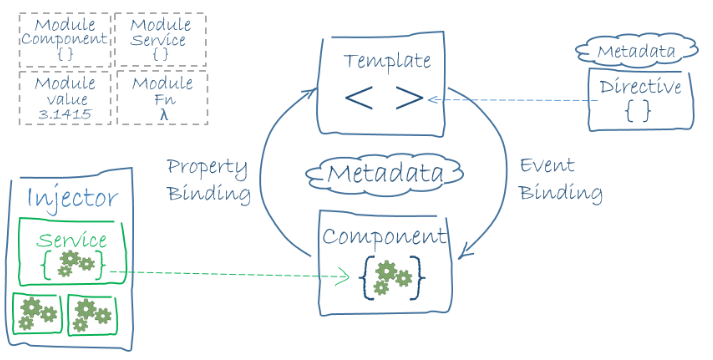

# Architecture

* **Module**	
화면의 구성요소를 묶어서 처리하는 앵귤러의 모듈시스템의 기본 단위이다. 
* **Component**	
스타일이 적용된 템플릿과 바인딩으로 연결되어 상태정보와 이벤트함수를 제공하는 객체로 구성된 독립해서 정의하는 화면의 기본 단위이다. 
* **Service**	
재사용하기 위해서 독립해서 정의하는 컴포넌트를 위한 처리 로직이다.
* **Directive**	
재사용하기 위해서 독립해서 정의하는 엘리먼트를 위한 처리 로직이다.
* **Pipe**	
재사용하기 위해서 독립해서 정의하는 데이터를 위한 처리 로직이다.

Angular는 HTML과 JavaScript 또는 JavaScript로 컴파일되는 TypeScript와 같은 언어로 클라이언트 응용 프로그램을 작성하기위한 프레임 워크입니다. 프레임 워크는 몇 개의 라이브러리로 구성되며, 일부 라이브러리는 코어 라이브러리이고 일부 라이브러리는 선택적 라이브러리입니다.
커스텀 태그를 사용하여 HTML 템플릿을 작성하고, 이 템플릿을 관리하기위한 컴포넌트 클래스를 작성하고, 서비스에서 로직을 공유해서 사용하고, 모듈로 컴포넌트 및 서비스를 묶어서 프로그램을 작성합니다. 모듈은 재 활용성에 촛점을 두고 비슷한 성격의 구성요소를 모듈로 묶는 것이 좋습니다. 다수의 모듈 중에 하나를 선택해서 루트 모듈로 지정하고 앱을 실행합니다. 

## 컴포넌트의 3가지 구성요소

하나의 독립적인 화면이 제대로 작동하기 위해서 다음 3가지 구성요가 필요합니다.

* **Class**
class 문법으로 작성된 자바스크립트 생성자 함수로써 개발자가 정의하지만 객체 생성은 앵귤러 프레임워크가 담당한다.
* **Template**
화면에 엘리먼트를 어떻게 배치할 것인지 정의하는 틀로써의 도구다. HTML 파일이 담당한다.
* **Style**
템플릿으로 구성한 엘리먼트들의 디자인을 담당한다. CSS 파일이 담당한다.
