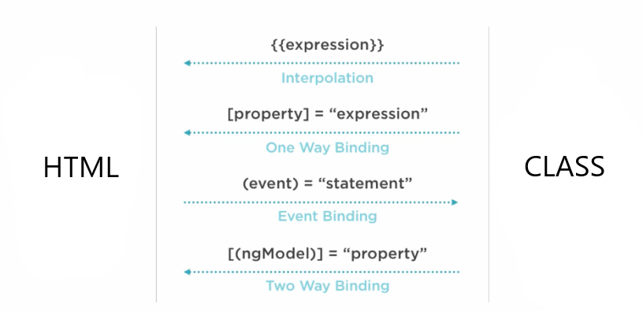

# Component

앵귤러는 `@Component` 데코레이터가 설정된 클래스를 컴포넌트로 인식합니다. `@Component` 데코레이터는 컴포너트로써 필요한 설정 객체를 파라미티로 받아서 컴포넌트로써 역할을 수행하기 위해서 필요한 작업을 처리합니다. 데코레이터의 역할은 자바의 애노테이션의 역할과 비슷합니다. 

컴포넌트는 다음 3가지로 구성됩니다.

1. Class : 변수, 이벤트 함수 등을 가지고 있는 자바스크립트 객체입니다.
2. HTML : HTML 엘리먼트를 사용하여 화면의 구조를 구성합니다.
3. CSS : HTML 엘리먼트의 디자인을 담당합니다.

컴포넌트는 앵귤러에서 화면의 최소 단위가 됩니다. 컴포넌트의 화면구성은 관리 및 재 활용성을 염두에 두고 그 규모를 결정하는 것이 좋습니다.

다음은 주로 사용하는 `@Component` 설정 객체의 속성입니다.

* `selector: '커스텀 태그 문자열'`  
선택기(selector)는 일종의 커스텀 태그입니다. 부모 HTML에 커스텀 태그가 가리키는 컴포넌트의 인스턴스를 만들고 삽입하도록 앵귤러에게 요청하는 선택기입니다. 예를 들어 HTML에 `<hero-list></hero-list>`가 포함되어 있으면 앵귤러는 해당 태그 사이에 `hero-list`가 설정된 `HeroListComponent` 클래스의 인스턴스를 생성하여 처리된 결과를 삽입합니다.

* `templateUrl: 'HTML 파일 패스 문자열'`  
컴포넌트의 HTML 템플릿 파일의 위치를 설정합니다.

* `styleUrls: ['CSS 파일 패스 문자열']`  
컴포넌트의 CSS 파일의 위치를 설정합니다.

* `providers: [서비스 객체 자료형]`  
컴포넌트가 필요한 서비스 객체를 공급하는 공급자 배열입니다. 예를 들어 컴포넌트의 생성자에 HeroService 자료형의 파라미터를 설정하면 컴포넌트는 해당 객체가 필요하다고 인식하고 컴포넌트 레벨의 컨테이너를 구성하여 객체를 생성 한 다음 컴포넌트에 생성자에게 의존성 주입(Dependency Injection) 작업을 수행합니다. 

앵귤러 공식 문서에는 컨테이너라는 용어 대신 Provider가 공급하고 Injector가 주입한다고 설명합니다. 하지만 서비스 객체를 보관하고 자식 컴포넌트에서 이를 이용할 수 있다는 측면에서 생성된 서비스 객체를 보관하는 컬렉션이 존재한다고 볼 수 있으면 이러한 컬렉션을 컨테이너라고 부르는 것이 일반적이기 때문에 이해를 돕기위해서 컨테이너라는 용어를 사용하겠습니다.

* `template: 'HTML 코드'`  
`templateUrl` 속성 대신 사용할 수 있습니다. HTML의 작성 내용이 작을 때 별도의 파일을 만들지 않고 하나의 컴포넌트 `.ts` 파일에 작성하고자 할 때 사용합니다.

* `styles: ['CSS 코드']`
`styleUrls` 속성 대신 사용할 수 있습니다. CSS의 작성 내용이 작을 때 별도의 파일을 만들지 않고 하나의 컴포넌트 `.ts` 파일에 작성하고자 할 때 사용합니다.

## Binding

컴포넌트 클래스가 가진 상태정보를 HTML 엘리먼트의 속성 또는 사이에 배치할 수 있습니다. 그리고 사용자가 작성한 데이터를 클래스가 가진 변수의 저장할 수 있습니다. 이러한 연동작업을 바인딩이라고 부릅니다.



### Property Binding

클래스가 가진 상태 값을 HTML 영역에 표시하는 방법입니다. 엘리먼트의 기존 속성을 이용하여 출력할 수도 있고 앵귤러가 지원하는 디렉티브를 이용하여 설정할 수도 있습니다.

설정 기호로 `[]` 대괄호를 사용합니다.

* `<input type="text" [value]="apple">`  
input 엘리먼트의 value 속성을 이용합니다. `[value]` 처럼 대괄호를 설정하면 오른쪽은 자바스크립트 코드로 인식합니다. 따라서 `apple`은 변수를 의미합니다.

* `<input type="text" [value]="'apple'">`  
오른쪽은 자바스크립트로 인식하지만 `'apple'` 처럼 문자열 기호를 설정했으므로 `apple`은 변수가 아니라 단순한 문자열을 의미합니다.

* `<p [innerText]="'Hello <em>World</em>'"></p>`  
p 태그 사이에 문자열을 배치합니다. 모두 문자열로 취급되어 HTML 태그는 처리되지 않고 그대로 출력됩니다.

* `<p [innerHTML]="'Hello <em>World</em>'"></p>`  
p 태그 사이에 문자열을 배치합니다. HTML 태그가 처리된다는 점이 innerText 와의 차이점입니다.

### Interpolation

일종의 Property Binding 으로써 편의성을 목적으로 추가된 방법입니다. 인터폴레이션 표현식은 엘리먼트의 속성의 값을 설정할 때 사용할 수 있으며 시작 태그와 마감 태그 사이의 설정할 수도 있습니다. 인터폴레이션 표현식은 문자열로 취급됩니다. 따라서 문자열이 태그인 경우 처리되지 않고 그대로 표시됩니다.

설정 기호로 `{{}}` 더블 중괄호를 사용합니다. innerText 처럼 모두 문자열로 취급되어 HTML 태그는 처리되지 않고 그대로 출력됩니다.

* `<h1>{{title}}</h1>`  
컴포넌트 클래스의 title 변수의 값을 출력합니다.

* `<p>{{i+1}}</p>`  
i 변수의 값에 1을 더한 후 출력합니다. 간단한 산술연산을 사용할 수 있습니다.

* `<p>{{gender==="male" ? "남자" : "여자"}}</p>`  
gender 변수의 값이 "male" 문자열과 일치하면 "남자"를 출력하고 그렇지 않으면 "여자"를 출력합니다. 조건문(if, for, while, switch)을 인터폴레이션 표현식에서 사용할 수 없으나 삼항연산자는 사용할 수 있습니다.

### Event Binding

사용자의 행동으로 촉발하는 이벤트에 따라서 자바스크립트 코드를 수행하는 방법입니다. HTML 5 표준 이벤트 속성을 지원합니다. 추가로 앵귤러가 지원하는 디렉티브를 사용하여 자바스크립트 코드를 수행할 수 있습니다.

설정 기호로 `()` 소괄호를 사용합니다.

* `<button (click)="popup()">Send</button>`  
button을 클릭하면 컴포넌트 클래스의 popup() 함수를 호출합니다.

* `<button (click)="show=!show">Send</button>`  
button을 클릭하면 컴포넌트 클래스의 show 변수의 값을 부정연산자로 값을 뒤집어 저장합니다.

### Two-way Binding

`Property Binding`과 `Event Binding`을 동시에 설정하는 방법입니다. `[(ngModel)]` 이라는 디렉티브를 사용합니다.

설정 기호로 `[()]` 대괄호안에 소괄호를 사용합니다.

* `FormsModule`  
ngModel을 제공하는 FormsModule을 루트 모듈에서 임포트한 후 사용해야 합니다.

* `Banana in the Box Expression` 이라고 재미있게 부르기도 합니다.

# 컴포넌트 연습 프로젝트

## 도구 버전 체크

```bash
$ ng --version
Angular CLI: 7.1.1
Node: 10.14.1
```

## 새 프로젝트

```bash
$ ng new your-component
? Would you like to add Angular routing? Yes
? Which stylesheet format would you like to use? SCSS
```

## 디자인 디펜던시

```bash
$ cd your-component
$ npm i jquery popper.js bootstrap
$ npm i @types/jquery --save-dev
$ npm i font-awesome
```

**package.json**

```json
{
  "name": "your-component",
  "version": "0.0.0",
  "scripts": {
    "ng": "ng",
    "start": "ng serve",
    "build": "ng build",
    "test": "ng test",
    "lint": "ng lint",
    "e2e": "ng e2e"
  },
  "private": true,
  "dependencies": {
    "@angular/animations": "~7.1.0",
    "@angular/common": "~7.1.0",
    "@angular/compiler": "~7.1.0",
    "@angular/core": "~7.1.0",
    "@angular/forms": "~7.1.0",
    "@angular/platform-browser": "~7.1.0",
    "@angular/platform-browser-dynamic": "~7.1.0",
    "@angular/router": "~7.1.0",
    "bootstrap": "^4.1.3",
    "core-js": "^2.5.4",
    "font-awesome": "^4.7.0",
    "jquery": "^3.3.1",
    "popper.js": "^1.14.6",
    "rxjs": "~6.3.3",
    "tslib": "^1.9.0",
    "zone.js": "~0.8.26"
  },
  "devDependencies": {
    "@angular-devkit/build-angular": "~0.11.0",
    "@angular/cli": "~7.1.1",
    "@angular/compiler-cli": "~7.1.0",
    "@angular/language-service": "~7.1.0",
    "@types/jasmine": "~2.8.8",
    "@types/jasminewd2": "~2.0.3",
    "@types/jquery": "^3.3.27",
    "@types/node": "~8.9.4",
    "codelyzer": "~4.5.0",
    "jasmine-core": "~2.99.1",
    "jasmine-spec-reporter": "~4.2.1",
    "karma": "~3.1.1",
    "karma-chrome-launcher": "~2.2.0",
    "karma-coverage-istanbul-reporter": "~2.0.1",
    "karma-jasmine": "~1.1.2",
    "karma-jasmine-html-reporter": "^0.2.2",
    "protractor": "~5.4.0",
    "ts-node": "~7.0.0",
    "tslint": "~5.11.0",
    "typescript": "~3.1.6"
  }
}
```

**angular.json**

```json
"styles": [
  "./node_modules/font-awesome/css/font-awesome.css",
  "./node_modules/bootstrap/dist/css/bootstrap.min.css",
  "src/styles.scss"
],
"scripts": [
  "./node_modules/jquery/dist/jquery.slim.min.js",
  "./node_modules/popper.js/dist/umd/popper.min.js",
  "./node_modules/bootstrap/dist/js/bootstrap.min.js"
]
```

## 디자인 CSS 전역설정

**src/styles.scss**

```scss
@import url('https://fonts.googleapis.com/css?family=Roboto');

* {
  font-family: "Roboto";
}

html {
  // https://stackoverflow.com/questions/21933356/
  // sticky-bootstrap-footer-overlapping-content-of-page
  position: relative;
  min-height: 100%;
}

body {
  // Margin bottom by footer height
  margin-bottom: 80px;
}

.container {
  margin-top: 2rem;
}
```

## Component

```bash
$ ng g c layout/header --module=app
$ ng g c layout/footer --module=app
$ ng g c layout/layout --module=app --flat=true
$ ng g c root/home --module=app
```

## 화면 레이아웃 구성

**layout.component.html**

```html
<app-header></app-header>
<ng-content></ng-content>
<app-footer></app-footer>
```

`<ng-content></ng-content>` 태그를 사용하면, `<app-header>` 태그를 사용하는 측에서 `<app-header>` 태그 사이에 추가한 엘리먼트들이 `<ng-content></ng-content>` 위치로 추가됩니다.

즉, `<app-header></app-header>`와 `<app-footer></app-footer>` 부분은 고정으로 사용하지만 가운데 `<ng-content></ng-content>` 영역은 LayoutComponent 컴포넌트를 사용하는 측에서 결정하는 방식입니다.

## 화면 상단 구성

**header.component.html**

```html
<nav class="navbar navbar-expand-lg navbar-dark bg-dark">

  <a class="navbar-brand" routerLink="/">Angular School</a>

  <button class="navbar-toggler" type="button" data-toggle="collapse"
    data-target="#navbarSupportedContent" aria-controls="navbarSupportedContent"
    aria-expanded="false" aria-label="Toggle navigation">
    <span class="navbar-toggler-icon"></span>
  </button>

  <div class="collapse navbar-collapse" id="navbarSupportedContent">
    <ul class="navbar-nav mr-auto">
      <li class="nav-item" routerLinkActive="active">
        <a class="nav-link" routerLink="/home">Home <span class="sr-only">(current)</span></a>
      </li>
      <li class="nav-item dropdown" routerLinkActive="active">
        <a class="nav-link dropdown-toggle" href="#" id="navbarDropdown"
          role="button" data-toggle="dropdown" aria-haspopup="true" aria-expanded="false">
          Binding
        </a>
        <div class="dropdown-menu" aria-labelledby="navbarDropdown">
          <a class="dropdown-item" routerLink="bind/interpolation">Interpolation</a>
          <a class="dropdown-item" [routerLink]="['bind', 'property']">Property</a>
          <a class="dropdown-item" [routerLink]="['/bind', 'event']">Event</a>
          <div class="dropdown-divider"></div>
          <a class="dropdown-item" [routerLink]="'bind/twoway'">Two-way</a>
        </div>
      </li>
      <li class="nav-item dropdown" routerLinkActive="active">
        <a class="nav-link dropdown-toggle" href="#" id="navbarDropdown"
          role="button" data-toggle="dropdown" aria-haspopup="true" aria-expanded="false">
          Directive
        </a>
        <div class="dropdown-menu" aria-labelledby="navbarDropdown">
          <a class="dropdown-item" routerLink="directive/ng-class">ngClass</a>
          <div class="dropdown-divider"></div>
          <a class="dropdown-item" routerLink="directive/ng-if">ngIf</a>
          <a class="dropdown-item" routerLink="directive/ng-for">ngFor</a>
          <a class="dropdown-item" routerLink="directive/ng-switch">ngSwitch</a>
          <div class="dropdown-divider"></div>
          <a class="dropdown-item" routerLink="directive/ref">ref</a>
          <div class="dropdown-divider"></div>
          <a class="dropdown-item" routerLink="directive/custom">Custom</a>
        </div>
      </li>
      <li class="nav-item dropdown" routerLinkActive="active">
        <a class="nav-link dropdown-toggle" href="#" id="navbarDropdown"
          role="button" data-toggle="dropdown" aria-haspopup="true" aria-expanded="false">
          Service
        </a>
        <div class="dropdown-menu" aria-labelledby="navbarDropdown">
          <a class="dropdown-item" routerLink="service/data-holder">Data Holder</a>
        </div>
      </li>
      <li class="nav-item dropdown" routerLinkActive="active">
        <a class="nav-link dropdown-toggle" href="#" id="navbarDropdown"
          role="button" data-toggle="dropdown" aria-haspopup="true" aria-expanded="false">
          Pipe
        </a>
        <div class="dropdown-menu" aria-labelledby="navbarDropdown">
          <a class="dropdown-item" routerLink="pipe/built-in">Built-in</a>
          <div class="dropdown-divider"></div>
          <a class="dropdown-item" routerLink="pipe/built-in" fragment="custom">Custom Pipe</a>
        </div>
      </li>
    </ul>

    <ul class="navbar-nav ml-auto">
      <li class="nav-item">
        <a class="nav-link" href="#" target="_blank"><i class="fa fa-github"></i></a>
      </li>
      <li class="nav-item">
        <a class="nav-link" href="#" target="_blank"><i class="fa fa-twitter"></i></a>
      </li>
      <li class="nav-item mr-2">
        <a class="nav-link" href="#" target="_blank"><i class="fa fa-medium"></i></a>
      </li>
    </ul>

    <form class="form-inline my-2 my-lg-0">
      <input class="form-control mr-sm-2" type="search" placeholder="Search" aria-label="Search">
      <button class="btn btn-outline-success my-2 my-sm-0" type="submit">Search</button>
    </form>
  </div>

</nav>
```

자세한 부트스트랩 navigation 관련 설명은 다음 사이트를 참고하세요.  
`https://getbootstrap.com/docs/4.1/components/navbar/`

## 화면 하단 구성

**footer.component.scss**

```scss
footer {
  // https://stackoverflow.com/questions/21933356/
  // sticky-bootstrap-footer-overlapping-content-of-page
  position: absolute;
  bottom: 0;
  width: 100%;
}
```

**footer.component.html**

```html
<footer>
  <nav class="navbar navbar-light bg-light mt-5">
    <div class="navbar-expand m-auto navbar-text">
      <small>Made with <i class="fa fa-heart"></i></small>
    </div>
  </nav>
</footer>
```

## 루트 모듈

**app.component.ts**

```ts
import { FormsModule } from '@angular/forms';

@NgModule({
  imports: [
    BrowserModule,
    AppRoutingModule,
    FormsModule
  ],
})
```

앵귤러가 자랑하는 바인딩 처리를 이용하기 위해서는 FormsModule 모듈의 임포트가 필요합니다. 그리고 앵귤러가 미리 만들어서 제공하는 빌트인 구조 디렉티브, 속성 디렉티브를 이용하기 위해서는 CommonModule 모듈의 임포트가 필요합니다. CommonModule 모듈의 임포틑 선언은 BrowserModule 모듈의 임포트가 정의되어 있는 경우 생략할 수 있습니다.

## 기동 컴포넌트

**app.component.html**

```html
<app-layout>
  <router-outlet></router-outlet>
</app-layout>
```

## 테스트

브라우저에서 작업결과를 확인하세요.

## 필요한 파일 추가

수업에 필요한 파일들을 미리 만들어 놓고 진행하겠습니다. 한 줄씩 수행하면서 옵션의 의미를 되새기고 결과를 예상해 보시기 바랍니다.

### Binding

```bash
$ ng g c binding/interpolation --spec=false --inlineTemplate=true --inlineStyle=true
$ ng g c binding/property --module=app
$ ng g c binding/event --module=app
$ ng g c binding/twoway --module=app
```

### Directive

```bash
$ ng g c directive/built-in/ng-class
$ ng g c directive/built-in/ng-if
$ ng g c directive/built-in/ng-for
$ ng g c directive/built-in/ng-switch
$ ng g c directive/built-in/ref

$ ng g c directive/custom/highlight
$ ng g d directive/highlight
```

### Service

```bash
$ ng g c service/data-holder
$ ng g s service/data-holder --spec=false
```

서비스의 주 사용처는 아무래도 HTTP 통신과 라우팅 가드 기능이 되겠습니다. 이는 후에 별도의 시간을 가지고 자세히 살펴보도록 하고 여기서는 간단한 서비스 개념과 이용방법만을 살펴봅니다.

### Pipe

```bash
$ ng g c pipe/built-in
$ ng g p pipe/str-date
```

## 라우팅 설정

**app-routing.module.ts**

```ts
import { NgModule } from '@angular/core';
import { Routes, RouterModule } from '@angular/router';

import { HomeComponent } from './root/home/home.component';

import { InterpolationComponent } from './binding/interpolation/interpolation.component';
import { PropertyComponent } from './binding/property/property.component';
import { EventComponent } from './binding/event/event.component';
import { TwowayComponent } from './binding/twoway/twoway.component';

import { NgClassComponent } from './directive/built-in/ng-class/ng-class.component';
import { NgIfComponent } from './directive/built-in/ng-if/ng-if.component';
import { NgForComponent } from './directive/built-in/ng-for/ng-for.component';
import { NgSwitchComponent } from './directive/built-in/ng-switch/ng-switch.component';
import { RefComponent } from './directive/built-in/ref/ref.component';

import { HighlightComponent } from './directive/custom/highlight/highlight.component';

import { DataHolderComponent } from './service/data-holder/data-holder.component';
import { BuiltInComponent } from './pipe/built-in/built-in.component';

const routes: Routes = [
  { path: '', redirectTo: '/home', pathMatch: 'full' },
  { path: 'home', component: HomeComponent },
  // { path: 'bind/interpolation', component: InterpolationComponent },
  // { path: 'bind/property', component: PropertyComponent },
  // { path: 'bind/event', component: EventComponent },
  // { path: 'bind/twoway', component: TwowayComponent },
  {
    path: 'bind',
    children: [
      { path: 'interpolation', component: InterpolationComponent },
      { path: 'property', component: PropertyComponent },
      { path: 'event', component: EventComponent },
      { path: 'twoway', component: TwowayComponent },
    ]
  },
  {
    path: 'directive',
    children: [
      { path: 'ng-class', component: NgClassComponent },
      { path: 'ng-if', component: NgIfComponent },
      { path: 'ng-for', component: NgForComponent },
      { path: 'ng-switch', component: NgSwitchComponent },
      { path: 'ref', component: RefComponent },
      { path: 'custom', component: HighlightComponent },
    ]
  },
  {
    path: 'service',
    children: [
      { path: 'data-holder', component: DataHolderComponent },
    ]
  },
  {
    path: 'pipe',
    children: [
      { path: 'built-in', component: BuiltInComponent },
    ]
  },
];

@NgModule({
  imports: [RouterModule.forRoot(routes)],
  exports: [RouterModule]
})
export class AppRoutingModule { }
```

소스에서 주석으로 처리한 부분과 그 아랫부분은 결과적으로 같습니다. 어떤 방식의 설정이 편리한지 생각해 보세요.

## 첫 화면 꾸미기

**home.component.ts**

```ts
<div class="jumbotron jumbotron-fluid">
  <div class="container">
    <h1 class="display-4">Angular School</h1>
    <p class="lead">In this tutorial you learn how to use Angular.</p>
  </div>
</div>

<div class="container">
  <h2>home</h2>
</div>
```

앵귤러 학습 사이트를 만들어 본다고 생각하면서 학습하면 보다 재미있게 학습하시지 않을까 합니다. 컴포넌트는 하나의 화면 처리단위입니다. 컴포넌트의 화면 크기는 개발자가 마음대로 정하시면 됩니다. 단, 재 사용성 및 관리성에 촛점을 맞추고 크기를 정하시는 것이 좋을 듯 합니다.
