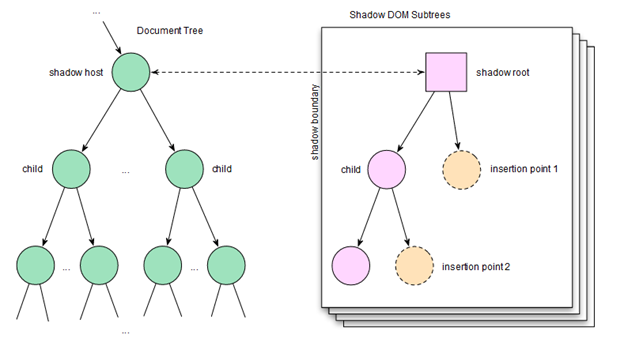
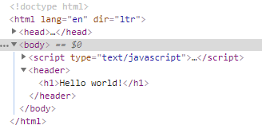
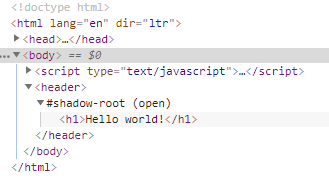

# CSS in Angular

이번 시간에는 앵귤러에서 CSS를 설정하고 사용하는 방법을 살펴보겠습니다. 크게 전역적으로 CSS를 적용하는 것과 컴포넌트 별로 적용하는 방법으로 나눌 수 있습니다.

안내: 일부 내용은 다음 사이트를 참고해서 작성되었습니다. 지면 관계상 일부 내용은 제외되었으니 직접 사이트를 방문해 보시기 바랍니다.  
`https://developers.google.com/web/fundamentals/web-components/shadowdom?hl=ko`

## Shadow DOM

`Shadow DOM`은 돔의 구조를 가지고 있으나 외부에는 노출되지 않은 돔을 말하며 돔의 구조를 캡슐화할 때 사용합니다. 기본적으로 외부의 CSS 설정은 적용되지 않습니다. `Shadow DOM`은 웹 앱의 CSS 취약성을 제거합니다. 취약성을 해결하기 위해서 사용하던 `!important` 스타일 속성은 성능을 저하시키는 문제가 있었습니다. `Shadow DOM`은 범위가 격리된 대상에 스타일을 적용하는 새로운 기술입니다. 



왼쪽은 일반적인 돔 트리이며 오른쪽은 Shadow DOM 트리입니다.

기본적으로 페이지의 구조를 이해하기 위해 브라우저가 HTML 문법으로 작성된 정적 텍스트 문자을 데이터 모델(객체 노드)로 파싱합니다. 브라우저는 해당 노드의 트리를 만들어 HTML 계층을 보존합니다. DOM은 페이지를 라이브로 표시한다는 장점이 있습니다. 우리가 작성하는 정적 HTML과는 달리 브라우저가 생성한 노드는 속성과 메서드를 포함하며 프로그램으로 조작할 수 있다는 특별한 장점이 있습니다. 따라서 자바스크립트를 사용하여 DOM 엘리먼트를 직접 만들 수 있습니다.

```html
<body>
  <script type="text/javascript">
    const h1 = document.createElement('h1');
    h1.textContent = 'Hello world!';

    const header = document.createElement('header');
    header.appendChild(h1);

    document.body.appendChild(header);
  </script>
</body>
```

위 코드는 다음과 같은 HTML 마크업을 생성합니다.



**Shadow Host**

`Shadow DOM`은 `생성/사용 방법` 및 페이지의 `나머지와 관련한 작동 방식` 등 두 가지 측면에서 일반 돔과 차이점이 있습니다. 일반적으로 돔 노드를 만든 후 다른 엘리먼트의 자식으로 추가합니다. `Shadow DOM`의 경우 엘리먼트에 연결하지만 실제 자식과는 독립된 범위가 지정된 DOM 트리를 만듭니다. 이와 같은 범위가 지정된 하위 트리를 `Shadow Tree`라고 합니다. 연결된 엘리먼트는 `Shadow Host`입니다. 


`image from: https://girliemac.com/`

**Shadow DOM 만들기**

쉐도우 루트는 '호스트' 엘리먼트에 연결된 문서 조각입니다. 쉐도우 루트를 연결하는 작업은 엘리먼트가 Shadow DOM을 획득하는 방법입니다. 엘리먼트에 대한 Shadow DOM을 만들려면 `element.attachShadow()`를 호출합니다.

```html
<body>
  <script type="text/javascript">
    const h1 = document.createElement('h1');
    h1.textContent = 'Hello world!';

    const header = document.createElement('header');
    // 이번에는 돔 엘리먼트에 직접 추가하지 않는다.
    // header.appendChild(h1);

    // header를 Shadow Host로 삼고 Shadow Root 객체를 얻는다.
    const shadowRoot = header.attachShadow({mode: 'open'});
    // Shadow Root에 원하는 엘리먼트를 추가한다.
    // 이러면 격리된 상태로 엘리먼트를 장착하는 것이다.
    // shadowRoot.innerHTML = '<h1>Hello</h1>'; 방식도 가능하다.
    shadowRoot.appendChild(h1);

    // Shadow Host는 Shadow Root의 Host를 지칭한다.
    // header가 Shadow Host이다.
    console.log(shadowRoot.host === header);
    // Shadow Root는 Shadow Host와 연결된 돔 조각이다.
    console.log(shadowRoot === header.shadowRoot);

    document.body.appendChild(header);
  </script>
</body>
```

위 코드는 다음과 같은 HTML 마크업을 생성합니다.



**격리된 컴포넌트 Shadow DOM**

```html
<!DOCTYPE html>
<html lang="en" dir="ltr">

<head>
  <meta charset="utf-8">
  <title></title>
  <style media="screen">
    h1 {
      color: red;
    }
  </style>
</head>

<body>
  <h1>Red Color Title</h1>
  <header></header>
  <h1>Red Color Title</h1>

  <script type="text/javascript">
    const header = document.querySelector('header');
    const shadowRoot = header.attachShadow({mode: 'open'});
    shadowRoot.innerHTML = `
      <style>
        h1 {
          color: blue;
        }
      </style>
      <h1>Blue Color Title</h1>
    `;
  </script>
</body>

</html>
```

쉐도우 호스트 `<header>`가 가진 `<h1>` 태그의 글자만이 파란색으로 표시됩니다.

**컴포지션 및 슬롯**

컴포지션은 잘 알려지지 않은 Shadow DOM 기능이지만 가장 중요합니다. 웹 개발의 세계에서 컴포지션은 선언적으로 HTML에서 앱을 구성하는 방법입니다. 서로 다른 빌딩 블록(`<div>`, `<header>`, `<form>`, `<input>`)이 함께 모여 앱을 만듭니다. 이러한 태그 중 일부는 서로 상호작용합니다. 컴포지션은 `<select>`, `<details>`, `<form>` 및 `<video>`와 같은 기본 엘리먼트가 융통성이 크기 때문에 가능합니다. **해당 각 태그는 특정 HTML을 자식으로 수용하여 특별한 작업을 수행합니다.** 예를 들어, `<select>`는 `<option>` 및 `<optgroup>`을 드롭다운 및 다중 선택 위젯으로 렌더링하는 방법을 알고 있습니다. `<details>` 엘리먼트는 `<summary>`를 확장 가능한 화살로 렌더링합니다. `<video>`도 특정 자식을 처리하는 방법을 알고 있습니다. `<source>` 엘리먼트는 렌더링되지 않지만 비디오의 동작에 영향을 미칩니다. 멋진 마술과 같습니다!

**Light DOM**

컴포넌트 사용자가 추가적으로 작성하는 마크업입니다. `Light DOM`은 컴포넌트의 `Shadow DOM` 외부에서 사용됩니다. `Light DOM`은 해당 엘리먼트의 실제 자식이 됩니다.

```html
<button is="better-button">
  <!-- the image and span are better-button's light DOM -->
  
  <span>Settings</span>
</button>
```

**Shadow DOM**

컴포넌트 작성자가 사용하는 DOM입니다. `Shadow DOM`은 컴포넌트의 로컬이며 내부 구조, 범위가 지정된 CSS를 정의하며 구현 된 세부정보를 캡슐화합니다. 또한 `Shadow DOM`은 컴포넌트 소비자가 작성한 `Light DOM`의 마크업을 렌더링하는 방법을 정의할 수 있습니다.

```html
#shadow-root
<style></style>
<slot name="icon"></slot>
<span id="wrapper">
  <slot>Button</slot>
</span>
```

**평면화 된 DOM 트리**

평면화 된 DOM은 브라우저가 개발자의 `Light DOM`을 `Shadow DOM`으로 배포한 결과이며 최종 렌더링에서 사용한 상태를 의미합니다. 평면화 된 DOM은 DevTools에서 궁극적으로 보여지는 결과입니다.

```html
<button is="better-button">
  #shadow-root
  <style></style>
  <slot name="icon">
    
  </slot>
  <slot>
    <span>Settings</span>
  </slot>
</button>
```

**`<slot>` 엘리먼트**

`Shadow DOM`은 `<slot>` 엘리먼트를 사용하여 여러 DOM 트리를 함께 구성합니다. 슬롯은 개발자가 자신의 마크업을 사용하여 채울 수 있는 컴포넌트 내부의 자리표시자입니다. 슬롯을 한 개 이상 정의하여 외부 마크업을 초대하여 컴포넌트의 `Shadow DOM`에 렌더링합니다. 기본적으로 '개발자의 마크업을 여기에 렌더링 해라'라고 말하는 것과 같습니다.

참고: 슬롯은 웹 컴포넌트에 대한 '선언적 API'를 만드는 방법입니다. 슬롯은 사용자의 DOM을 혼합하여 전체 컴포넌트를 렌더링하는 데 도움을 주므로 여러 DOM 트리를 함께 구성합니다.

**`<slot>`이 엘리먼트를 초대할 때 `Shadow DOM` 경계를 `교차`할 수 있습니다. 이와 같은 엘리먼트를 분산 노드라고 합니다.** 개념상 분산 노드는 다소 기이하게 보일 수 있습니다. **슬롯은 DOM을 물리적으로 이동하지 않고 Shadow DOM 내부 위치에 렌더링합니다.**

컴포넌트는 `Shadow DOM`에서 슬롯을 0개 이상 정의할 수 있습니다. 슬롯은 비어 있거나 대체 콘텐츠를 제공할 수 있습니다. `Light DOM` 콘텐츠를 제공하지 않는 경우 슬롯은 대체 콘텐츠를 렌더링합니다.

```html
<!-- Default slot. If there's more than one default slot, the first is used. -->
<slot></slot>

<!-- default slot with fallback content -->
<slot>Fancy button</slot>

<slot>
  <!-- default slot entire DOM tree as fallback -->
  <h2>Title</h2>
  <summary>Description text</summary>
</slot>
```

또한 명명된 슬롯을 만들 수도 있습니다. 명명된 슬롯은 Shadow DOM에서 사용자가 이름으로 참조하는 특정 구멍입니다.

예: <fancy-tabs>의 Shadow DOM에서 명명된 슬롯

```html
#shadow-root
<div id="tabs">
  <slot id="tabsSlot" name="title"></slot>
</div>
<div id="panels">
  <slot id="panelsSlot"></slot>
</div>
```

컴포넌트 사용자는 다음과 같이 `<fancy-tabs>`를 선언한다고 가정합니다.

```html
<fancy-tabs>
  <button slot="title">Title</button>
  <button slot="title" selected>Title 2</button>
  <button slot="title">Title 3</button>
  <section>content panel 1</section>
  <section>content panel 2</section>
  <section>content panel 3</section>
</fancy-tabs>
```

그리고 평면화 된 트리의 모습은 다음과 같습니다. 컴포넌트가 여러 구성을 처리할 수 있지만 평면화된 DOM 트리는 동일한 상태를 유지합니다. 또한 `<button>`에서 `<h2>`로 전환할 수도 있습니다. 이 컴포넌트는 `<select>`와 마찬가지로 여러 유형의 자식을 처리하기 위해 작성되었습니다.

```html
<fancy-tabs>
  #shadow-root
  <div id="tabs">
    <slot id="tabsSlot" name="title">
      <button slot="title">Title</button>
      <button slot="title" selected>Title 2</button>
      <button slot="title">Title 3</button>
    </slot>
  </div>
  <div id="panels">
    <slot id="panelsSlot">
      <section>content panel 1</section>
      <section>content panel 2</section>
      <section>content panel 3</section>
    </slot>
  </div>
</fancy-tabs>
```

## 스타일 지정

**컴포넌트 자체 스타일 지정**

```scss
:host {
  display: block; /* by default, custom elements are display: inline */
  contain: content; /* CSS containment FTW. */
}
```

`:host`는 부모 페이지의 규칙이 엘리먼트에 정의된 `:host` 규칙보다 훨씬 높다는 특징을 지닌다는 문제가 있습니다. 즉, 외부 스타일이 적용됩니다. 이로써 개발자는 상단 레벨 스타일 지정을 재정의할 수 있습니다. `:host`는 쉐도우 루트 컨텍스트에서만 작동하므로 `Shadow DOM` 외부에서 사용할 수 없습니다.

일반적으로 웹 컴포넌트의 레이아웃/스타일/그리기는 완전히 임베디드됩니다. 완벽하게 우선 적용하려면 `:host`에 `contain: content`을 사용합니다. 이 속성의 자세한 설명은 다음 사이트를 참고하세요.

`https://termvader.github.io/css-contain/`

```scss
:host {
  opacity: 0.4;
  will-change: opacity;
  transition: opacity 300ms ease-in-out;
}
:host(:hover) {
  opacity: 1;
}
:host([disabled]) { /* style when host has disabled attribute. */
  background: grey;
  pointer-events: none;
  opacity: 0.4;
}
:host(.blue) {
  color: blue; /* color host when it has class="blue" */
}
:host(.pink) > #tabs {
  color: pink; /* color internal #tabs node when host has class="pink". */
}
```

`:host(<selector>)`의 기능적 형태가 `<selector>`와 일치하는 경우 해당 형태를 사용하여 대상 호스트를 지정할 수 있습니다. 이 방법은 컴포넌트가 상호작용 또는 상태에 응답하거나 호스트 기반 내부 노드의 스타일을 지정하는 동작을 캡슐화하는 데 유용합니다.

**컨텍스트 기반 스타일 지정**

```html
<body class="darktheme">
  <fancy-tabs>
    ...
  </fancy-tabs>
</body>
```

`:host-context(<selector>)`는 그 자신 및 상위 항목이 `<selector>`와 일치하는 경우 해당 컴포넌트와 일치합니다. 이에 대한 일반적인 용도는 컴포넌트의 주변에 기반한 테마 설정입니다. 예를 들어, 대부분의 사람들은 클래스를 `<html>` 또는 `<body>`에 적용하여 테마를 설정합니다.

```scss
:host-context(.darktheme) {
  color: white;
  background: black;
}
```

**분산 노드 스타일 지정**

::slotted(<compound-selector>)는 <slot>으로 분산된 노드와 일치합니다. `<name-badge>` 컴포넌트를 만들었다고 가정합시다.

```html
<name-badge>
  <h2>Eric Bidelman</h2>
  <span class="title">
    Digital Jedi, <span class="company">Google</span>
  </span>
</name-badge>
```

해당 컴포넌트의 `Shadow DOM`은 개발자의 `<h2>` 및 `.title` 스타일을 지정할 수 있습니다.

```scss
::slotted(h2) {
  margin: 0;
  font-weight: 300;
  color: red;
}
::slotted(.title) {
   color: orange;
}
/* DOESN'T WORK (can only select top-level nodes).
::slotted(.company),
::slotted(.title .company) {
  text-transform: uppercase;
}
*/
```

위에서 언급했듯이 `<slot>`은 개발자의 `Light DOM`을 이동하지 않습니다. 노드가 `<slot>`에 분산되면 `<slot>`은 `DOM`을 렌더링하지만 노드는 물리적으로 그대로 있습니다. **분산 전에 적용된 스타일은 분산 후에도 계속 적용됩니다.** 그러나 `Light DOM`은 분산될 때 추가 스타일(`Shadow DOM`이 정의한 스타일)을 사용할 수 있습니다.

**외부에서 컴포넌트 스타일 지정**

외부에서 컴포넌트의 스타일을 지정하는 몇몇 방법이 있습니다. 가장 쉬운 방법은 `태그 이름(selector)`을 선택기로 사용하는 것입니다.

```scss
fancy-tabs {
  width: 500px;
  color: red; /* Note: inheritable CSS properties pierce the shadow DOM boundary. */
}
fancy-tabs:hover {
  box-shadow: 0 3px 3px #ccc;
}
```

**외부 스타일은 `Shadow DOM`에 정의한 스타일보다 우선합니다.** 예를 들어, 개발자가 선택기 `fancy-tabs { width: 500px; }`를 작성하는 경우 해당 규칙이 컴포넌트의 규칙 `:host { width: 650px;}` 보다 우선합니다.

지금까지 컴포넌트 자체 스타일 지정에 대해서만 알아봤습니다. 그러나 컴포넌트 내부의 스타일을 지정하려면 어떻게 해야 할까요? 이를 위해서는 CSS 설정 속성이 필요합니다.

**CSS 설정 속성을 사용하여 후크 만들기**

컴포넌트 작성자가 CSS 설정 속성을 사용하여 후크 스타일을 지정하는 경우 내부 스타일을 조정할 수 있습니다. 개념상 이 아이디어는 `<slot>`과 유사합니다. 개발자가 재 정의하는 스타일 `자리표시자`를 만듭니다.

`<fancy-tabs>`를 사용하여 개발자가 컴포넌트 외부에서 배경색을 재 정의할 수 있습니다.

```html
<style>
  fancy-tabs {
    margin-bottom: 32px;
    --fancy-tabs-bg: black;
  }
</style>
<fancy-tabs background>...</fancy-tabs>
```

Shadow DOM 내부:

```scss
:host([background]) {
  background: var(--fancy-tabs-bg, #9E9E9E);
  border-radius: 10px;
  padding: 10px;
}
```

이 예에서는 컴포넌트는 개발자가 제공한 대로 `black`을 배경 값으로 사용합니다. 그렇지 않으면 `#9E9E9E`를 기본값으로 설정합니다.

참고: 컴포넌트 작성자는 개발자에게 그들이 사용할 수 있는 CSS 설정 속성을 알려줘야 합니다. 해당 속성을 컴포넌트의 공용 인터페이스의 일부라고 생각하면 됩니다. 스타일 지정 후크를 문서화하세요!

**Shadow DOM 이벤트 모델**

이벤트가 `Shadow DOM`에서 발생하면 그 대상을 조정하여 `Shadow DOM`이 제공하는 캡슐화를 유지합니다. 즉, 이벤트가 `Shadow DOM` 내에서 내부 엘리먼트보다 컴포넌트에서 온 것처럼 보이도록 이벤트의 대상을 다시 지정합니다. **일부 이벤트는 심지어 `Shadow DOM`에서 전파되지도 않습니다.**

쉐도우 경계를 교차하는 이벤트는 다음과 같습니다.

* 포커스 이벤트: blur, focus, focusin, focusout
* 마우스 이벤트: click, dblclick, mousedown, mouseenter, mousemove 등
* 휠 이벤트: wheel
* 입력 이벤트: beforeinput, input
* 키보드 이벤트: keydown, keyup
* 컴포지션 이벤트: compositionstart, compositionupdate, compositionend
* 끌기 이벤트: dragstart, drag, dragend, drop 등

**상속 가능한 스타일 재설정**

상속 가능한 스타일(background, color, font, line-height 등)은 `Shadow DOM`에서 계속 상속됩니다. 즉, **상속 가능한 스타일은 기본적으로 `Shadow DOM` 경계를 관통합니다.** 새 슬레이트를 사용하여 시작하려면 쉐도우 경계를 교차할 때 `all: initial;`을 사용하여 상속 가능한 스타일을 초기 값으로 재설정합니다.

**`<template>`에서 엘리먼트 만들기**

`.innerHTML`을 사용하여 쉐도우 루트를 채우는 대신에 선언적 `<template>`을 사용할 수 있습니다. 템플릿은 웹 컴포넌트의 구조를 선언하는 이상적인 자리표시자입니다.

`https://developers.google.com/web/fundamentals/getting-started/primers/customelements?hl=ko`

정리하자면 적당한 CSS 범위 지정, DOM 범위 지정을 수행하고 진정한 컴포지션을 가진 API 원본을 이번에 처음으로 보유하게 되었습니다. `Shadow DOM`은 사용자 설정 엘리먼트와 같은 다른 웹 컴포넌트 API와 결합하여 해킹하지 않고 또는 `<iframe>`과 같은 구식 기술을 사용하지 않고 적절하게 캡슐화된 컴포넌트를 작성하는 방법을 제공합니다.

## Encapsulation

앵귤러는 Encapsulation 설정으로 CSS를 적용하는 방법을 결정합니다. Encapsulation 모드는 다음과 같은 종류가 있습니다.

**ViewEncapsulation.ShadowDom**

엘리먼트를 격리하여 CSS를 적용한 후 그 결과를 DOM에 적용하는 기술입니다. 일부 브라우저(크롬)가 지원하며 이 방식을 채택하면 HTML 파일에 설정한 전역적인 CSS는 격리된 엘리먼트에 영향을 주지 않습니다. 대부분의 자바스크립트 라이브러리는 개별적으로 CSS를 갖고 있습니다. 이러한 라이브러리들을 동시에 사용할 경우 CSS의 충돌현상이 발생할 수 있으며 그 결과로 CSS에 의한 디자인이 깨지는 현상이 발생할 수 있습니다. Shadow DOM은 이러한 현상을 격리 후 적용이라는 컨셉으로 원천봉쇄하는 기술입니다. 다만, 모든 브라우저가 지원하고 있지 않기 때문에 앵귤러의 기본 기술로 채택하지 못하고 있습니다. 컴포넌트 데코레이터의 환경설정 객체의 속성으로 설정하여 바꿀 수 있습니다.

**ViewEncapsulation.Emulated**

최대한 Shadow DOM과 비슷하게 작동하도록 만드는 기술입니다. 모든 브라우저가 아직까지 Shadow DOM을 지원하지 못하므로 Emulated가 기본값으로 설정되어 있습니다. 컴포넌트에서 명시적으로 설정하지 않으면 이 방식이 적용됩니다. 모바일 앱 개발 시 개발자가 특정 브라우저를 지정할 수 있으므로 Shadow DOM을 기본 기술로 채택하여 적용해도 문제가 되지 않습니다. 데스크탑 웹 개발 시는 기본 옵션으로 개발하는 것을 권장합니다.

이 방식을 사용하면 `_nghost-*`, `_ngcontent-*` 등에 속서을 설정하여 CSS 효력범위를 제한합니다. 이렇게 적용이 되면 Shadow DOM에 버금가게 CSS 설정을 컴포넌트별로 구분하여 적용할 수 있게 되지만 완벽히 Shadow DOM과 같지는 않습니다.

**ViewEncapsulation.Native**

브라우저의 기본 정책을 따릅니다. 좀 더 정확히 말하자면 브라우저에 따라 Shadow DOM v1이 적용된다고 할 수 있습니다. 브라우저 마다 상이할 수 있으므로 관리하기 어렵고 그렇기 때문에 많이 사용되지 않습니다. 다음 사이트를 참고하여 브라우저 별 CSS 정책을 확인하실 수 있습니다.

`https://caniuse.com/#feat=shadowdomv1`

**ViewEncapsulation.None**

전통적인 HTML의 CSS 적용방식을 따릅니다. 앞에서 설명한 대로 이렇게 되면 전역 CSS 설정 하나 뿐이 되며 다양한 라이브러리 사용 시 CSS의 충돌현상이 발생할 수 있습니다. 이 방식은 컴포넌트의 캡슐화를 모두 비활성화 합니다. 이 방식을 사용하면 앵귤러는 정의 된 스타일을 `<head>` 태그에 추가하므로 이 캡슐화를 사용하여 CSS 설정을 컴포넌트 간에 공유 할 수 있습니다.

# 예제 프로젝트

최종 결과만을 보면 이해에 어려움이 예상됩니다. 단계별로 작업하시고 결과를 바로 확인해 주시기 바랍니다.

```bash
$ ng new my-css
? Would you like to add Angular routing? Yes
? Which stylesheet format would you like to use? SCSS
```

```bash
$ cd my-css
$ ng g c parent
$ ng g c parent/child1
$ ng g c parent/child2
$ ng g c parent/child3
```

## Step 1. styles.scss

**index.html**

```html
<head>
  <style media="screen">
    p {
      color: red;
    }
  </style>
</head>
```

**app.component.html**

```html
<p>app.component</p>
```

화면을 확인합니다. `p` 태그안에 글자는 빨간색입니다. `index.html` 파일의 `<head>` 태그안에 작성한 CSS 설정이 적용된 결과입니다.

**styles.scss**

```scss
p {
  color: orange;
}
```

`styles.scss` 파일에서 색을 변경해 봅니다. 다시 화면을 확인합니다. `p` 태그안에 글자는 이제 orange 색입니다. 어찌된 영문인지 `index.html` 파일의 상단 부분을 브라우저 개발자 모드에서 확인해 봅니다.

**index.html**

```html
<style media="screen">
  /* index.html에 설정한 내용 */
  p {
    color: red; 
  }
</style>
<style type="text/css">
  /* styles.scss에 설정한 내용 */
  p {
    color: orange; 
  }
</style>
```

`styles.scss`에 설정한 내용이 `index.html`에 설정한 내용 밑에 배치된 것을 확인할 수 있습니다. 위에서 적용한 red 색이 바로 밑에서 orange 색으로 변경되었습니다. 결론적으로 `styles.scss` 파일은 스타일 설정을 `index.html`에 하지 않고 외부 파일에 하기 위해서 존재한다는 것을 알 수 있습니다.

## Step 2. ViewEncapsulation.Emulated

**app.component.scss**

```scss
p {
  color: yellow;
}
```

이번에는 `app.component.scss` 파일에서 색을 yellow 색으로 변경합니다. 이제 글자는 yellow 색입니다. 스타일의 적용은 일반적으로 엘리먼트에 가까울 수록 적용 순위가 높습니다. 그런 의미만 있는 걸까요? `index.html`에 상단 부분을 다시 살펴 봅니다.

**index.html**

```html
<head>
  <style media="screen">
    /* index.html에 설정한 내용 */
    p {
      color: red; 
    }
  </style>
  <style type="text/css">
    /* styles.scss에 설정한 내용 */
    p {
      color: orange; 
    }
  </style>
  <style>
    /* app.component.scss에 설정한 내용 */
    p[_ngcontent-c0] {
      color: yellow; 
    }
  </style>
</head>

<body data-gr-c-s-loaded="true">
  <app-root _nghost-c0="" ng-version="7.1.4"> <!-- Shadow Host -->
    <!-- Emulated Shadow Root -->
    <p _ngcontent-c0="">app.component</p>
  </app-root>
</body>
```

앵귤러는 호스트에는 `_nghost-*`에 속석을 추가하고 템플릿의 엘리먼트들에게는 `_ngcontent-*` 속성을 붙여서 해당 컴포넌트의 스타일 설정은 해당 컴포넌트의 템플릿의 엘리먼트들에게만 적용되도록 조치합니다. 

`<app-root>` 태그는 `Shadow Host` 입니다. `Emulated Shadow DOM`의 영역은 그 안쪽입니다. `app.component` 문자열을 감싸고 있는 `<p>` 태그의 `_ngcontent-c0` 속성이 추가되었고 이 컴포넌트의 스타일에도 `p[_ngcontent-c0]` 형식으로 짝을 맞추어 설정이 된 것을 알 수 있습니다. 그러면 yellow 색은 오로지 `app.component` 컴포넌가 가진 `<p>` 태그에게만 적용됩니다. 이렇게 설정하고 적용하는 방식을 `ViewEncapsulation.Emulated` 방식이라고 부릅니다.

**app.component.scss**

```scss
// app.component.scss에 설정한 내용
// 컴포넌트 스타일의 주석은 나중에 사라집니다.
:host {
  background-color: silver;
  // Shadow DOM은 기본적으로 inline입니다.
  // block으로 변경해야 background-color가 적용됩니다.
  display: block;
}

p {
  color: yellow;
}
```

`:host`는 `pseudo-class` 선택자입니다. 쉐도우 돔에서 쉐도우 호스트에 접근하는 방법입니다. 쉐도우 호스트 엘리먼트는 부모 컴포넌트가 가진 엘리먼트입니다.

**index.html**

```html
<head>
  <style media="screen">
    /* index.html에 설정한 내용 */
    p {
      color: red;
    }
  </style>
  <style type="text/css">
    /* styles.scss에 설정한 내용 */
    p {
      color: orange;
    }
  </style>
  <style>
    /* app.component.scss에 설정한 내용 */
    [_nghost-c0] {
      background-color: silver;
      display: block;
    }

    p[_ngcontent-c0] {
      color: yellow;
    }
  </style>
</head>

<body data-gr-c-s-loaded="true">
  <app-root _nghost-c0="" ng-version="7.1.4">
    <p _ngcontent-c0="">app.component</p>
  </app-root>
</body>
```

일부 볼 필요 없는 부분은 제외했습니다. `:host` 문자열은 `[_nghost-c0]`으로 변경되었습니다. 그리고 쉐도우 호스트인 `<app-root>` 태그의 속성으로 연결고리의 역할을 수행하는 `_nghost-c0` 속성이 추가되었습니다. `@Component` 데코레이터에게 전달되는 객체가 가진 `selector` 속성에 설정한 `app-root` 문자열은 사용자가 만든 마크업의 역할을 수행합니다. 이 마크업(커스텀 태그)을 대상으로 CSS 설정을 할 수 있습니다.

## Step 3. ViewEncapsulation.ShadowDom

**app.component.ts**

```ts
import { Component, ViewEncapsulation } from '@angular/core';

@Component({
  selector: 'app-root',
  templateUrl: './app.component.html',
  styleUrls: ['./app.component.scss'],
  // encapsulation: ViewEncapsulation.Emulated // 기본 옵션
  encapsulation: ViewEncapsulation.ShadowDom // 일부 브라우저만 지원
})
export class AppComponent {

}
```

원하다면 스타일 처리방식을 바꿀 수 있습니다. 기본 옵션인 `ViewEncapsulation.Emulated` 대신 `ViewEncapsulation.ShadowDom` 방식을 사용해 보겠습니다. 크롬 브라우저의 개발자 도구로 확인해 주시기 바랍니다.

**index.html**

```html
<head>
  <style media="screen">
    /* index.html에 설정한 내용 */
    p {
      color: red;
    }
  </style>
  <style type="text/css">
    /* styles.scss에 설정한 내용 */
    p {
      color: orange;
    }
  </style>
</head>

<body data-gr-c-s-loaded="true">
  <app-root ng-version="7.1.4">
    #shadow-root (open)
  </app-root>
</body>
```

`<head>` 부분에 보이던 컴포넌트에서 설정한 스타일 정보가 사라졌습니다. 어떻게 된 걸까요? 개발자 모드의 `Elements` 뷰에서 `<app-root>` 마크업을 확대하면 `#shadow-root`라는 표시가 보입니다. 이 부분을 좀 더 확대하면 다음과 같은 내용을 조회할 수 있습니다.

```html
#shadow-root (open)
<style>
  ​:host {
    background-color: silver;
    display: block;
  }
  p {
    color: yellow;
  }
</style>
​<p>​app.component​</p>​
```

이렇게 처리하는 방식이 `ViewEncapsulation.ShadowDom` 입니다. 컴포넌트의 스타일은 격리된 채로 해당 템플릿의 엘리먼트에게만 적용됩니다. 그리고 그 결과가 돔에 배치됩니다. 일반적으로 ShadowDom 모드에서는 `index.html`이나 `styles.scss`에서 설정한 스타일이 적용되지 않습니다. `<p>` 태그를 대상으로 설정한 스타일을 주석으로 처리하고 결과를 확인하세요. orange 색이 아니라 검은색으로 표시된다는 것을 알 수 있습니다. 

`ViewEncapsulation.ShadowDom` 모드에서는 철저하게 스타일 설정이 격리되어 적용됩니다. 그렇기 때문에 `ViewEncapsulation.Emulated` 모드와는 차이가 있습니다. 에뮬레이티드라는 것은 똑 같다는 말이 아니라 최대한 비슷하게 만든다는 뜻으로 이해하시기 바랍니다.

`app.component.ts`에서 `encapsulation: ViewEncapsulation.ShadowDom` 설정을 지우면 `ViewEncapsulation.Emulated` 모드가 적용될 것이고 `<p>` 태그가 가진 문자열은 orange 색으로 표현될 것 입니다.

`ViewEncapsulation.Native` 모드와 `ViewEncapsulation.None` 모드는 실전적으로 보아 살펴 보실 필요는 없어 보여서 생략합니다. 모바일 앱이라면 `ViewEncapsulation.ShadowDom` 방식을 사용하고 웹이라면 `ViewEncapsulation.Emulated` 방식을 사용하면 되겠습니다.

## Step 4. `:host()`

**app.component.html**

```html
<p>app.component</p>

<!-- 클래스 선택은 사용 측에서 결정하나 스타일 내용은 사용되는 컴포넌트가 갖고 있다. -->
<app-parent></app-parent>
<app-parent class="red"></app-parent>
<app-parent class="blue"></app-parent>
```

**parent.component.html**

```html
<h3>parent.component</h3>
```

**parent.component.scss**

```scss
:host(.red) {
  color: red;
}

:host(.blue) {
  color: blue;
}
```

`:host()` 선택자를 사용하여 호스트 엘리먼트가 특정 상태일 때만 스타일을 적용할 수 있습니다. 컴포넌트의 디자인을 고정적으로 사용하지 않고 컴포넌트를 사용할 때 컴포넌트의 디자인을 제어할 수 있는 수단이 됩니다.

* `<app-parent></app-parent>` : 호스트 엘리먼트에 클래스가 없으므로 대상이 아닙니다.
* `<app-parent class="red"></app-parent>` : red 클래스가 있으므로 문자열은 red 색입니다.
* `<app-parent class="blue"></app-parent>` : blue 클래스가 있으므로 문자열은 blue 색입니다.

## Step 5. `:host-context()`

**app.component.html**

```html
<p>app.component</p>

<!-- 클래스 선택은 사용 측에서 결정하나 스타일 내용은 사용되는 컴포넌트가 갖고 있다. -->
<app-parent></app-parent>
<!-- #1 -->
<app-parent class="red bg-white"></app-parent>
<!-- #2 -->
<div class="bg-white">
  <app-parent class="blue"></app-parent>
</div>
```

**parent.component.scss**

```scss
:host-context(.bg-white) {
  background-color: white;
  display: block;
}
```

`:host-context()` 선택자는 `:host()` 와 마찬가지로 조건을 설정하여 호스트 엘리먼트의 상황에 따라 스타일을 적용할 수 있습니다. `:host-context()` 선택자는 부가적으로 호스트 엘리먼트 뿐만 아니라 모든 부모 엘리먼트의 상황을 체크하는 작업을 수행합니다. 

그렇기 때문에 다 `#1`, `#2` 모두 컴포넌트의 배경이 white 색이 됩니다.

간단히 정리하자면 `:host()`는 쉐도우 호스트 엘리먼트만 `:host-context()`는 모든 부모 엘리먼트의 상황을 체크하는 것 입니다.

## Step 6. `@import`

**parent.component.html**

```html
<h3>parent.component</h3>

<app-child1></app-child1>
<app-child2></app-child2>
<app-child3></app-child3>
```

**child1.component.scss**

```scss
@import "styles.css";
```

**parent/child1/styles.css**

```scss
p {
  color: blue;
}
```

스타일 설정은 복잡해지는 경향이 강합니다. 관리를 위해서 스타일 정보를 여러 파일로 분리하고 싶을 수 있습니다. 컴포넌트의 스타일은 컴포넌트 템플릿에게만 적용되는 로컬 방식입니다. 임포트 한 스타일시트의 범위도 로컬 방식입니다. 즉, 임포트 한 컴포넌트의 템플릿에게만 적용됩니다. 여러 컴포넌트에 중복되는 스타일 설정이 있다면 별도의 파일로 분리하고 임포트해서 사용하는 것이 좋겠습니다.

CSS 파일에서 `@import`로 처리하는 대신 HTML 구문에서 `<link>` 태그로 처리할 수도 있습니다.

## Step 6. `/deep/`, `::ng-deep`

`deprecated`가 고지되었습니다. 앞서서 살펴 본 임포트 처리를 이용하시는 것이 좋겠습니다. 어떤 내용인지 살펴보겠습니다.

**child1.component.scss**, **child2.component.scss**, **child3.component.scss**

```scss
p:hover {
  background-color: black;
  color: white;
}
```

세 컴포넌트 모두 위 스타일 설정을 하고 싶다고 가정합니다. 짧으면 별 상관이 없겠지만 내용이 많다면 단순한 복사, 붙여넣기를 해서는 관리하기가 어렵게 됩니다. 이럴 때, 다음처럼 세 컴포넌트를 자식으로 갖고 있는 부모 컴포넌트에 설정으로 자식 컴포넌트에게 영향을 줄 수 있습니다. 이럴 때, `/deep/` 선택자를 사용합니다.

**parent.component.scss**

```scss
/deep/ p:hover {
  background-color: black;
  color: white;
}
```

`ViewEncapsulation.Emulated` 방식에서만 제대로 작동합니다. `/deep/` 대신 `::ng-deep`을 사용할 수 있습니다. 화면으로 확인 해 보시면 잘 작동함을 알 수 있습니다. 그런데 루트 컴포넌트의 `<p>` 태그에도 영향을 끼친다는 것을 알 수 있습니다. `/deep/`만 설정하면 다음처럼 되기 때문입니다.

**index.html**

```html
<style>
p:hover {
  background-color: black;
  color: white;
}
</style>
```

`p:hover` 형태로 사용하게 되면 의도치 않게 컴포넌트 외부에 존재하는 엘리먼트에도 영향을 끼질 수 있기 때문에 좋지 않습니다. parent 컴포넌트의 자식 컴포넌트에게만 영향을 주고 싶다면 다음처럼 변경해야 합니다.

**parent.component.scss**

```scss
:host /deep/ app-child1 p:hover {
  background-color: black;
  color: white;
}
```

* `:host` 선택자로 parent 컴포넌트의 부모에게는 영향을 주지 않습니다. 컴포넌트 자신이 대상입니다. 
* `/deep/` 선택자로 자식 컴포넌트가 대상이 됩니다. 컴포넌트 자신도 대상입니다.
* `app-child1` 마크업으로 특정 자식 컴포넌트만이 대상이 되었습니다. 컴포넌트 자신이 직접 가진 엘리먼트는 대상이 아닙니다.
