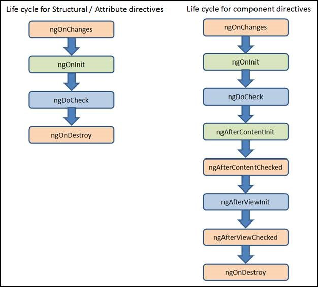

# Component Life Cycle

컴포넌트와 디렉티브는 라이프 사이클 메소드를 갖습니다. 디렉티브는 화면이 없기 때문에 화면처리와 관련된 메소드들은 존재하지 않습니다. 그래서 메소드 이름 중에 `Content`, `View` 단어가 들어가는 메소드는 컴포넌트만이 사용할 수 있습니다.



| Method                | Event | Init | Status | Description                        |
|-----------------------|:-----:|:----:|:------:|------------------------------------|
| ngOnChanges           |   V   |      |        | 외부로부터 파라미터를 받을 때      |
| ngOnInit              |       |   V  |        | 초기화 작업                        |
| ngDoCheck             |       |      |    V   | 상태변화가 있을 때 마다 호출       |
| ngAfterContentInit    |       |   V  |        | 필요한 모든 콘텐츠가 준비된 후     |
| ngAfterContentChecked |       |      |    V   | 모든 콘텐츠의 상태변화가 체크된 후 |
| ngAfterViewInit       |       |   V  |        | 필요한 모든 화면이 준비된 후       |
| ngAfterViewChecked    |       |      |    V   | 모든 화면의 상태변화가 체크된 후   |
| ngOnDestroy           |   V   |      |        | 사용한 자원 반납                   |

**1. ngOnChanges**

외부로부터 데이터를 처음 받거나 다시 받을 때 호출됩니다. 이 메소드는 `current` 및 `previous` 속성을 가진 `SimpleChanges` 객체를 받습니다. `ngOnInit()` 전에 호출되고 하나 이상의 데이터 바인딩 된 입력 속성이 변경 될 때마다 호출됩니다. `ngOnInit()` 전에 `ngOnChanges ()` 메소드가 호출되고 그 이후로 받는 상태가 변경될 때마다 여러 번 호출됩니다.

**2. ngOnInit**

`ngOnInit()`을 사용하는 주된 두 가지 이유는 다음과 같습니다.

* 생성 직후 복잡한 초기화를 수행하기 위해서
* Input 속성이 설정 된 후에 `component`를 설정하기 위해서

`component` 생성자에 원격서버로부터 데이터를 가져 오는 로직을 두지 마십시오. 생성자는 초기 로컬 변수를 단순한 값으로 설정하는 용도로만 사용하세요. 그 대신, `ngOnInit()` 메소드는 `component`가 초기 데이터를 원격서버로부터 가져 오기에 적합한 장소입니다. 시간이 오래걸리는 로직은 비동기 처리가 기본입니다. 동기적인 방식으로 데이터를 구하는 경우, 시간이 오래 걸린다면 화면이 표시되지 않아 사용자를 당황하게 만들 수 있다는 점을 기억하십시오.

또한 `directive`의 데이터 바인딩 된 입력 속성은 생성 이후까지 설정되지 않는다는 것을 기억하십시오. 이러한 속성에 기반하여 `directive`를 초기화 해야하는 경우 문제가 됩니다. 그것들은 `ngOnInit()`이 실행되기 전 설정 될 것입니다. 간단히 얘기해서 `@Input` 바인딩된 자원을 사용할 수 있음을 의미합니다. 

`Init` 단어가 들어있는 훅 메소드는 디렉티브/컴포넌트 생성 시 단 한 번만 수행됩니다. 최초 한 번만 처리하면 되는 경우 사용하십시오. 그러므로 컴포넌트가 이미 객체로 존재하는 상태에서 새로운 값을 외부로부터 받아서 처리해야 하는 로직을 배치하기에는 적합하지 않습니다.

**3. ngDoCheck**

앵귤러가 자체적으로 감지하지 못하는 변경 사항을 체크하고 조치합니다. 훅 메소드 중에 `ngOnChanges()` 및 `ngOnInit()` 바로 다음에 호출됩니다. 변경 감지 시, 모든 형제 컴포넌트의 `ngDoCheck()` 메소드가 호출된 후에야 `ngAfterContentChecked()` 메소드가 기동합니다.

`Check` 단어가 들어있는 훅 메소드는 바인딩된 엘리먼트에서 이벤트가 발생할 때마다 수행됩니다. 

**4. ngAfterContentInit**

사용하는 콘텐츠가 컴포넌트의 뷰 또는 뷰안에 있는 디렉티브에 할당된 후 호출됩니다. 형제 컴포넌트들의 콘텐츠가 모두 준비된 후 처리해야 하는 로직을 배치하십시오.

**5. ngAfterContentChecked**

디렉티브 또는 컴포넌트에 할당된 콘텐츠를 변경감지 로직이 체크한 후 호출됩니다.

**6. ngAfterViewInit**

컴포넌트의 뷰 및 자식 뷰 또는 디렉티브를 가진 뷰의 `초기화 메소드(~Init)`가 모두 호출된 다음에야 호출됩니다. 필요한 모든 뷰가 준비된 상태에서 처리해야하는 로직을 배치하기에 적합합니다. `@ViewChild`, `@ViewChildren` 데코레이터로 획득한 자식 `컴포넌트`의 자원을 사용하는 로직을 배치하십시오. 형제 컴포넌트들의 `디렉티브`가 모두 처리된 후 실행해야 하는 로직을 배치하십시오.

**7. ngAfterViewChecked**

컴포넌트의 뷰 및 자식 뷰 또는 디렉티브를 가진 뷰의 상태를 변경감지 로직이 체크한 후 호출됩니다. 

**8. ngOnDestroy**

디렉티브 또는 컴포넌트가 파괴되기전에 호출됩니다. 메모리 누수를 예방하기 위해서 Observables 구독을 취소하거나 이벤트 핸들러를 해제하는 용도의 로직을 두기에 적합합니다.

## 예제 프로젝트

```bash
$ ng new my-lifecycle
? Would you like to add Angular routing? Yes
? Which stylesheet format would you like to use? SCSS   [ http://sass-lang.com   ]
```

```bash
$ ng g c parent
$ ng g c parent/child-a
$ ng g c parent/child-b
$ ng g c solo
```

```bash
$ ng g d directive/highlight --spec=false
```

**app.module.ts**

```ts
import { BrowserModule } from '@angular/platform-browser';
import { NgModule } from '@angular/core';
import { FormsModule } from '@angular/forms';

import { AppRoutingModule } from './app-routing.module';
import { AppComponent } from './app.component';

import { ParentComponent } from './parent/parent.component';
import { ChildAComponent } from './parent/child-a/child-a.component';
import { ChildBComponent } from './parent/child-b/child-b.component';
import { SoloComponent } from './solo/solo.component';
import { HighlightDirective } from './directive/highlight.directive';

@NgModule({
  declarations: [
    AppComponent,
    ParentComponent,
    ChildAComponent,
    ChildBComponent,
    SoloComponent,
    HighlightDirective
  ],
  imports: [
    BrowserModule,
    AppRoutingModule,
    FormsModule
  ],
  providers: [],
  bootstrap: [AppComponent]
})
export class AppModule { }
```

**app-routing.module.ts**

```ts
import { NgModule } from '@angular/core';
import { Routes, RouterModule } from '@angular/router';

import { ParentComponent } from './parent/parent.component';
import { SoloComponent } from './solo/solo.component';

const routes: Routes = [
  { path: '', redirectTo: 'parent', pathMatch: 'full' },
  { path: 'parent', component: ParentComponent },
  { path: 'solo', component: SoloComponent },
];

@NgModule({
  imports: [RouterModule.forRoot(routes)],
  exports: [RouterModule]
})
export class AppRoutingModule { }
```

**app.component.scss**

```scss
nav {
  margin-top: 2rem;
  margin-bottom: 0.5rem;
}

.outlet {
  border: 1px solid silver;
  padding: 1rem;
}
```

**app.component.html**

```html
<nav>
  <a routerLink="parent">Parent</a>{{' '}}
  <a routerLink="solo">Solo</a>
</nav>

<div class="outlet">
  <router-outlet></router-outlet>
</div>
```

**highlight.directive.ts**

```ts
import {
  Directive, Input,
  OnChanges, OnInit, DoCheck, OnDestroy,
  SimpleChanges
} from '@angular/core';
import { ElementRef, Renderer2, HostListener } from '@angular/core';

@Directive({
  selector: '[highlight]'
})
export class HighlightDirective implements OnChanges, OnInit, DoCheck, OnDestroy {
  @Input('highlight') color: string;

  constructor(private elementRef: ElementRef, private renderer: Renderer2) {
    console.log("Directive 0. HighlightDirective()");
  }

  // 조건 기동: 외부로부터 파라미터를 받을 때만 기동한다.
  ngOnChanges(changes: SimpleChanges) {
    console.log("Directive 1. ngOnChanges");

    for (let propName in changes) {
      let change = changes[propName];
      let currentValue = JSON.stringify(change.currentValue);
      let previousValue = JSON.stringify(change.previousValue);
      console.log(`${propName}: currentValue = ${currentValue}, previousValue = ${previousValue}`);
    }
  }

  // 한 번만 기동한다.
  ngOnInit() {
    console.log("Directive 2. ngOnInit");
  }

  // 변화가 있을 때마다 기동한다.
  ngDoCheck() {
    console.log("Directive 3. ngDoCheck");
  }

  // 한 번만 기동한다.
  ngOnDestroy() {
    console.log("Directive 4. ngOnDestroy");
  }

  @HostListener('mouseenter')
  set() {
    this.highlight(this.color || 'yellow');
  }

  @HostListener('mouseleave')
  reset() {
    this.highlight(null);
  }

  private highlight(color: string) {
    this.renderer.setStyle(this.elementRef.nativeElement, 'background', color);
  }

}
```

**parent.component.ts**

```ts
import { Component, OnInit, ViewChild, ElementRef } from '@angular/core';
import {
  OnChanges, SimpleChanges, DoCheck,
  AfterContentInit, AfterContentChecked, AfterViewInit,
  AfterViewChecked, OnDestroy
} from '@angular/core';
import { ChildAComponent } from './child-a/child-a.component';

@Component({
  selector: 'app-parent',
  templateUrl: './parent.component.html',
  styleUrls: ['./parent.component.scss']
})
export class ParentComponent implements OnInit, OnChanges, DoCheck,
  AfterContentInit, AfterContentChecked, AfterViewInit,
  AfterViewChecked, OnDestroy {

  constructor() {
    console.log("P0. ParentComponent()");
  }

  childA: ChildAComponent;

  @ViewChild(ChildAComponent)
  set childAComponent(childAComponent: ChildAComponent) {
    console.log("@ViewChild(ChildAComponent)");
    console.log('childAComponent.key:', childAComponent.key); // undefined, 사용 불가
    this.childA = childAComponent;
    // 화면이 초기화되고 나서야 자식 컴포넌트의 자원을 사용할 수 있기 때문에
    // setTimeout() 함수를 사용하여 코드수행을 늦출 필요가 있다.
    // 또는 ngAfterViewInit() 함수에 로직을 배치하면 된다.
    setTimeout(() => { console.log('setTimeout > childAComponent.key:', childAComponent.key); }, 0);
  }

  h4: ElementRef;

  @ViewChild('title')
  set h4ElementRef(elementRef: ElementRef) {
    console.log("@ViewChild('title')");
    console.log('elementRef:', elementRef.nativeElement.innerText); // 사용 가능
    this.h4 = elementRef;
    // 컴포넌트 자료형으로 획득한 대상은 바로 사용할 수 없으나
    // 화면참조로 획득한 대상은 바로 이용할 수 있다.
  }

  // 조건 기동: 외부로부터 파라미터를 받을 때만 기동한다.
  ngOnChanges(changes: SimpleChanges) {
    console.log("P1. ngOnChanges");

    for (let propName in changes) {
      let change = changes[propName];
      let currentValue = JSON.stringify(change.currentValue);
      let previousValue = JSON.stringify(change.previousValue);
      console.log(`${propName}: currentValue = ${currentValue}, previousValue = ${previousValue}`);
    }
  }

  // 한 번만 기동한다.
  ngOnInit() {
    console.log("P2. ngOnInit");
  }

  // 변화가 있을 때마다 기동한다.
  ngDoCheck() {
    console.log("P3. ngDoCheck");
  }

  // 한 번만 기동한다.
  ngAfterContentInit() {
    console.log("P4. ngAfterContentInit");
  }

  // 변화가 있을 때마다 기동한다.
  ngAfterContentChecked() {
    console.log("P5. ngAfterContentChecked");
  }

  // 한 번만 기동한다.
  ngAfterViewInit() {
    console.log("P6. ngAfterViewInit");
    console.log('childAComponent.key:', this.childA.key); // 10, 사용 가능
  }

  // 변화가 있을 때마다 기동한다.
  ngAfterViewChecked() {
    console.log("P7. ngAfterViewChecked");
  }

  // 한 번만 기동한다.
  ngOnDestroy() {
    console.log("P8. ngOnDestroy");
  }

}
```

**parent.component.scss**

```scss
.child {
  border: 1px solid silver;
  padding: 1rem;
  margin-bottom: 1rem;
}

.child:nth-child(even) {
  background-color: #87C0D7;
}

.child:nth-child(odd) {
  background-color: #C8D6D9;
}
```

**parent.component.html**

```html
<p highlight="blue">
  parent works!
</p>

<div class="child">
  <app-child-a [key]="10" [name]="'John'"></app-child-a>
</div>

<div class="child">
  <app-child-b num="7">
    <h4 #title>부모가 자식의 자식으로 지정한 데이터 &rArr; 자식이 받아서 &lt;ng-content&gt;&lt;/ng-content&gt;로 배치</h4>
  </app-child-b>
</div>
```

**child-a.component.ts**

```ts
import { Component, OnInit, Input } from '@angular/core';
import {
  OnChanges, SimpleChanges, DoCheck,
  AfterContentInit, AfterContentChecked, AfterViewInit,
  AfterViewChecked, OnDestroy
} from '@angular/core';

@Component({
  selector: 'app-child-a',
  templateUrl: './child-a.component.html',
  styleUrls: ['./child-a.component.scss']
})
export class ChildAComponent implements OnInit, OnChanges, DoCheck,
  AfterContentInit, AfterContentChecked, AfterViewInit,
  AfterViewChecked, OnDestroy {

  constructor() {
    console.log("    A0. ChildAComponent()");
  }

  @Input('key') key: number;

  name: string;

  @Input('name')
  set $name(name: string) {
    console.log("    @Input('name')")
    console.log("    name =", name);
    this.name = name;
  }

  // 조건 기동: 외부로부터 파라미터를 받을 때만 기동한다.
  ngOnChanges(changes: SimpleChanges) {
    console.log("    A1. ngOnChanges");

    for (let propName in changes) {
      let change = changes[propName];
      let currentValue = JSON.stringify(change.currentValue);
      let previousValue = JSON.stringify(change.previousValue);
      console.log(`    ${propName}: currentValue = ${currentValue}, previousValue = ${previousValue}`);
    }
  }

  // 한 번만 기동한다.
  ngOnInit() {
    console.log("    A2. ngOnInit");
  }

  // 변화가 있을 때마다 기동한다.
  ngDoCheck() {
    console.log("    A3. ngDoCheck");
  }

  // 한 번만 기동한다.
  ngAfterContentInit() {
    console.log("    A4. ngAfterContentInit");
  }

  // 변화가 있을 때마다 기동한다.
  ngAfterContentChecked() {
    console.log("    A5. ngAfterContentChecked");
  }

  // 한 번만 기동한다.
  ngAfterViewInit() {
    console.log("    A6. ngAfterViewInit");
  }

  // 변화가 있을 때마다 기동한다.
  ngAfterViewChecked() {
    console.log("    A7. ngAfterViewChecked");
  }

  // 한 번만 기동한다.
  ngOnDestroy() {
    console.log("    A8. ngOnDestroy");
  }

}
```

**child-a.component.html**

```html
<p highlight>
  child-a works!
</p>
<p>key = {{key}}</p>
<p>name = {{name}}</p>
```

**child-b.component.ts**

```ts
import { Component, OnInit, Input, ContentChild, ElementRef } from '@angular/core';
import {
  OnChanges, SimpleChanges, DoCheck,
  AfterContentInit, AfterContentChecked, AfterViewInit,
  AfterViewChecked, OnDestroy
} from '@angular/core';

@Component({
  selector: 'app-child-b',
  templateUrl: './child-b.component.html',
  styleUrls: ['./child-b.component.scss']
})
export class ChildBComponent implements OnInit, OnChanges, DoCheck,
  AfterContentInit, AfterContentChecked, AfterViewInit,
  AfterViewChecked, OnDestroy {

  constructor() {
    console.log("    B0. ChildAComponent()");
  }

  num: number;

  @Input('num')
  set $num(num: number) {
    console.log("    @Input('num')")
    console.log("    num =", num);
    this.num = num;
  }

  h4: ElementRef;

  // 부모가 이 컴포넌트의 자식으로 지정한 엘리먼트들 중에서 화면참조 문자열로
  // 참조값을 획득할 수 있으면 대상은 네이티브 엘리먼트를 래핑한 객체다.
  @ContentChild('title')
  set h4ElementRef(elementRef: ElementRef) {
    console.log("    @ContentChild('title')");
    console.log('    elementRef:', elementRef.nativeElement.innerText); // 사용 가능
    this.h4 = elementRef;
  }

  // 조건 기동: 외부로부터 파라미터를 받을 때만 기동한다.
  ngOnChanges(changes: SimpleChanges) {
    console.log("    B1. ngOnChanges");

    for (let propName in changes) {
      let change = changes[propName];
      let currentValue = JSON.stringify(change.currentValue);
      let previousValue = JSON.stringify(change.previousValue);
      console.log(`    ${propName}: currentValue = ${currentValue}, previousValue = ${previousValue}`);
    }
  }

  // 한 번만 기동한다.
  ngOnInit() {
    console.log("    B2. ngOnInit");
  }

  // 변화가 있을 때마다 기동한다.
  ngDoCheck() {
    console.log("    B3. ngDoCheck");
  }

  // 한 번만 기동한다.
  ngAfterContentInit() {
    console.log("    B4. ngAfterContentInit");
  }

  // 변화가 있을 때마다 기동한다.
  ngAfterContentChecked() {
    console.log("    B5. ngAfterContentChecked");
  }

  // 한 번만 기동한다.
  ngAfterViewInit() {
    console.log("    B6. ngAfterViewInit");
  }

  // 변화가 있을 때마다 기동한다.
  ngAfterViewChecked() {
    console.log("    B7. ngAfterViewChecked");
  }

  // 한 번만 기동한다.
  ngOnDestroy() {
    console.log("    B8. ngOnDestroy");
  }

}
```

**child-b.component.html**

```html
<ng-content></ng-content>
<p highlight="orange">
  child-b works!
</p>
<div>
  <input type="text" name="number" [(ngModel)]="num">
</div>
<div>
  <p>num = {{num}}</p>
</div>
```

## 라이프 사이클 분석

첫 화면을 확인한다.

```bash
# 부모 컴포넌트 생성
ParentComponent()

# 부모가 사용하는 디렉티브 생성
Directive 0. HighlightDirective()

    # 자식 컴포넌트 생성
    A0. ChildAComponent()
    B0. ChildAComponent()
    
    # 자식이 사용하는 디렉티브 생성
    Directive 0. HighlightDirective()
    Directive 0. HighlightDirective()

# 부모 컴포넌트에서 자식 컴포넌트 및 엘리먼트 참조 획득  
@ViewChild(ChildAComponent)
childAComponent.key: undefined // 사용 불가
@ViewChild('title')
elementRef: 부모가 자식의 자식으로 지정한 데이터 ⇒ 자식이 받아서 <ng-content></ng-content>로 배치

    # 자식 컴포넌트에서 엘리먼트 참조 획득
    @ContentChild('title')
    elementRef: 부모가 자식의 자식으로 지정한 데이터 ⇒ 자식이 받아서 <ng-content></ng-content>로 배치    

# 부모 컴포넌트 훅 메소드 호출
P2. ngOnInit
P3. ngDoCheck
P4. ngAfterContentInit
P5. ngAfterContentChecked

# 부모가 사용하는 디렉티브 훅 메소드 호출
Directive 1. ngOnChanges
color: currentValue = "blue", previousValue = undefined
Directive 2. ngOnInit
Directive 3. ngDoCheck

    # 첫 번째 자식 컴포넌트의 입력 바인딩 처리
    @Input('name')
    name = John
    
    # 첫 번째 자식 컴포넌트 훅 메소드 호출
    A1. ngOnChanges
    key: currentValue = 10, previousValue = undefined
    name: currentValue = "John", previousValue = undefined
    A2. ngOnInit
    A3. ngDoCheck
    
    # 두 번째 자식 컴포넌트의 입력 바인딩 처리
    @Input('num')
    num = 7
    B1. ngOnChanges
    $num: currentValue = "7", previousValue = undefined

    # 두 번째 자식 컴포넌트 훅 메소드 호출
    B2. ngOnInit
    B3. ngDoCheck
    
    # 첫 번째 자식 컴포넌트 훅 메소드 호출
    # 형제 컴포넌트들의 콘텐츠가 모두 준비된 후
    A4. ngAfterContentInit
    A5. ngAfterContentChecked
    
    # 두 번째 자식 컴포넌트 훅 메소드 호출
    # 형제 컴포넌트들의 콘텐츠가 모두 준비된 후
    B4. ngAfterContentInit
    B5. ngAfterContentChecked
    
    # 첫 번째 자식이 사용하는 디렉티브 훅 메소드 호출
    Directive 1. ngOnChanges
    color: currentValue = "", previousValue = undefined
    Directive 2. ngOnInit
    Directive 3. ngDoCheck
    
    # 두 번째 자식이 사용하는 디렉티브 훅 메소드 호출
    Directive 1. ngOnChanges
    color: currentValue = "orange", previousValue = undefined
    Directive 2. ngOnInit
    Directive 3. ngDoCheck
    
    # 첫 번째 자식 컴포넌트 훅 메소드 호출
    # 형제 컴포넌트들의 디렉티브가 모두 처리된 후
    A6. ngAfterViewInit
    A7. ngAfterViewChecked
    
    # 두 번째 자식 컴포넌트 훅 메소드 호출
    # 형제 컴포넌트들의 디렉티브가 모두 처리된 후
    B6. ngAfterViewInit
    B7. ngAfterViewChecked

# 부모 컴포넌트 훅 메소드 호출    
P6. ngAfterViewInit
childAComponent.key: 10 // 자식 컴포넌트의 자원 사용 가능
P7. ngAfterViewChecked
```


입력창을 클릭해서 선택하고 해제한다. 자식 컴포넌트의 엘리먼트에 이벤트가 발생하면 부모 컴포넌트의 체크관련 훅 메소드부터 호출됩니다. 이벤트 바인딩된 자원을 클래스가 갖고 있는 경우, 최초 변경감지 로직이 작동하면서 체크를 1회 실시합니다. 일종의 do-while 로직이라 보시면 됩니다.

```bash
# 부모부터 시작 ==> 자식 시작 ==> 자식부터 완료 ==> 부모 완료

# 부모 체크 시작
P3. ngDoCheck
P5. ngAfterContentChecked

# 부모의 디렉티브 체크
Directive 3. ngDoCheck

    # 자식 체크 시작
    A3. ngDoCheck
    B3. ngDoCheck
    
    A5. ngAfterContentChecked
    B5. ngAfterContentChecked
    
    # 자식의 디렉티브 체크
    Directive 3. ngDoCheck
    Directive 3. ngDoCheck
    
    # 자식 체크 완료
    A7. ngAfterViewChecked
    B7. ngAfterViewChecked

# 부모 체크 완료
P7. ngAfterViewChecked
```

`Solo` 링크를 클릭합니다. 먼저 사용된 디렉티브들이 모두 파괴되고 자식 컴포넌트들이 파괴된 후 부모 컴포넌트가 최종적으로 파괴됩니다.

```bash
# 자식 컴포넌트가 사용하는 디렉티브 파괴
Directive 4. ngOnDestroy
Directive 4. ngOnDestroy

# 부모 컴포넌트가 사용하는 디렉티브 파괴
Directive 4. ngOnDestroy

    # 자식 컴포넌트 파괴
    A8. ngOnDestroy
    B8. ngOnDestroy

# 부모 컴포넌트 파괴
P8. ngOnDestroy
```
