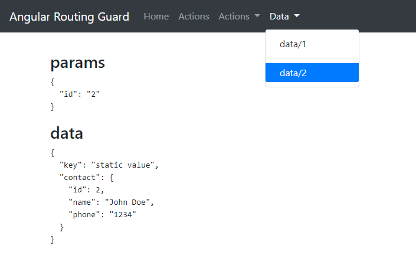

# Routing Ⅱ

## Guard

가드는 라우팅 처리 중에 작동하는 일종의 서비스입니다. 가드에는 5가지 종류가 있습니다.

**1. resolve**

다음으로 화면에 표시되는 컴포넌트가 필요한 데이터를 구해오는 역할을 수행하는 가드입니다. 다수의 컴포넌트에게 주어야 하는 데이터가 있다면 이를 구해오는 로직을 컴포넌트 마다 배치하지 말고 `resolve` 가드에 배치하면 효과적입니다. `resolve` 가드를 사용할 때 주의할 점은 가드 로직 처리시간이 오래 걸린다면 그 만큼 컴포넌트 생성이 늦어지고 화면에 아무것도 표시되지 않는 시간이 길어진다는 점입니다. 그래서 네트워크를 통해서 데이터를 구해오는 로직을 `resolve` 가드에 배치하는 것은 권장하지 않습니다.

**2. canActivate**

`canActivate` 가드는 다음으로 화면에 표시되는 컴포넌트의 생성여부를 결정하는 가드입니다. 컴포넌트는 콘텐츠를 표시하는데 때때로 사용자의 회원여부와 접근권한에 따라 조회를 제한하고 싶을 때가 있습니다. 이럴 때 이 가드를 사용합니다. 이렇게 접근권한을 체크하고 조회여부를 제어한다는 뜻에서 `AuthGuard`라고하는 클래스명을 많이 사용합니다. 

`canActivate` 가드는 `resolve` 가드보다 앞서서 작동합니다. 이 가드의 함수가 `true`를 리턴하면 새 컴포넌트가 생성되어 화면에 표시됩니다. 그렇지 않고 `false`를 리턴하면 라우팅 처리는 취소됩니다. 따라서 이전 컴포넌트가 그대로 유지됩니다.

**3. canDeactivate**

현재 화면에 표시되어 있는 컴포넌트의 종료여부를 결정하는 가드입니다. 이 가드의 함수가 `true`를 리턴하면 현재 컴포넌트를 파괴하고 라우팅 로직에 따라서 새 컴포넌트가 생성되고 `false`를 리턴하면 라우팅 처리를 취소하여 현재 컴포넌트가 그대로 유지됩니다.

이미 화면에 표시되어 있는 컴포넌트는 `canDeactivate` 가드와 `canActivate` 가드의 함수가 false를 리턴하면 그대로 유지됩니다. 그렇다면 두 가드는 무슨 차이가 있는지 궁금해 할 것 입니다. `canDeactivate` 가드는 이전 컴포넌트의 참조를 함수의 파라미터로 받아서 컴포넌트의 상태에 따라서 처리할 수 있지만 `canActivate` 가드는 그렇지 못 합니다.

`A 컴포넌트 ==> canDeactivate ==> canActivate ==> resolve ==> B 컴포넌트`

**4. canLoad**

모듈을 `Lazy Loading` 하는 경우, 모듈의 컴포넌트를 화면에 표시하기 전 작동하는 가드입니다. 이 가드로 모듈의 기동여부를 결정할 수 있습니다. 모듈이 기동한 다음부터는 다시 작동하지 않습니다. 가드는 서비스의 일종으로 싱글톤으로 사용되지만 만약 모듈이 기동되지 못했다면 이 가드부터 다시 생성되어 처리됩니다.

**5. CanActivateChild**

중첩 컴포넌트를 화면에 배치할 때, 배치되는 컴포넌트가 `<router-outlet>`을 가진 경우, 이 영역에 무슨 컴포넌트를 추가적으로 배치할 것인지 결정해야 합니다. 이렇게 배치되는 자식 컴포넌트들에게 공통적으로 적용하여 기동여부를 결정할 수 있습니다. 이 가드에서 'false'를 리턴하면 결국 자식 컴포넌트를 구성할 수 없게되고 부모의 화면도 완성할 수 없으므로 모든 라우팅 처리요청이 취소됩니다.

## Path Variable(URL Segment)

최근에는 사용자 친화적인 URL을 선호하는 추세입니다. 그에 따라서, URL 문자열의 일부를 변수화하여 이와 관련한 데이터를 구할 때 사용합니다. 

예를 들어서, `contact/1` 같은 URL 문자열을 사용하는 경우, 맨 끝에 숫자는 키 값의 역할을 수행합니다.

**Step 1. 사용 URL 패턴 결정**

`http://localhost:4200/contact/1`  
`http://localhost:4200/contact/3`  

**Step 2. 라우팅 매핑로직 설정**

라우팅 매핑로직을 설정 시 `:` 연산자로 변수의 키 값을 설정합니다.

```ts
{ path: 'contact/:id', component: ContactComponent }
```

`'contact/:id'` 중에서 `contact/` 부분은 고정으로 항상 일치해야 하지만 `:id` 부분은 가변적으로 무엇이든 있기만 하면 일치하는 것으로 판단합니다.

**Step 3. Path Variable 링크 설정**

```html
<nav>
  <ul>
    <li><a routerLink="contact/1">contact/1</a></li>
    <li><a routerLink="contact/3">contact/3</a></li>
  </ul>
</nav>
```

**Step 4. Path Variable 획득**

라우팅 매핑로직을 설정 시 `:` 연산자로 설정한 변수명을 사용하여 `params` 객체로부터 실제 사용된 값을 획득할 수 있습니다. 그 다음은 필요에 따라서 데이터를 구한 다음 화면에 표시하면 됩니다.

```ts
constructor(private route: ActivatedRoute) { }

ngDoCheck() {
  this.id = this.route.snapshot.params['id'];
}
```

# 예제 프로젝트

```bash
$ ng new my-routing-guard
? Would you like to add Angular routing? Yes
? Which stylesheet format would you like to use? SCSS
```

```bash
$ cd my-routing-guard
$ npm i jquery popper.js bootstrap
$ npm i @types/jquery --save-dev
$ npm i font-awesome
```

**angular.json**

```json
"styles": [
  "./node_modules/font-awesome/css/font-awesome.css",
  "./node_modules/bootstrap/dist/css/bootstrap.min.css",
  "src/styles.scss"
],
"scripts": [
  "./node_modules/jquery/dist/jquery.slim.min.js",
  "./node_modules/popper.js/dist/umd/popper.min.js",
  "./node_modules/bootstrap/dist/js/bootstrap.min.js"
]
```

**package.json**

```json
{
  "name": "my-routing-guard",
  "version": "0.0.0",
  "scripts": {
    "ng": "ng",
    "start": "ng serve",
    "build": "ng build",
    "test": "ng test",
    "lint": "ng lint",
    "e2e": "ng e2e"
  },
  "private": true,
  "dependencies": {
    "@angular/animations": "~7.1.0",
    "@angular/common": "~7.1.0",
    "@angular/compiler": "~7.1.0",
    "@angular/core": "~7.1.0",
    "@angular/forms": "~7.1.0",
    "@angular/platform-browser": "~7.1.0",
    "@angular/platform-browser-dynamic": "~7.1.0",
    "@angular/router": "~7.1.0",
    "bootstrap": "^4.2.1",
    "core-js": "^2.5.4",
    "font-awesome": "^4.7.0",
    "jquery": "^3.3.1",
    "popper.js": "^1.14.6",
    "rxjs": "~6.3.3",
    "tslib": "^1.9.0",
    "zone.js": "~0.8.26"
  },
  "devDependencies": {
    "@angular-devkit/build-angular": "~0.11.0",
    "@angular/cli": "~7.1.1",
    "@angular/compiler-cli": "~7.1.0",
    "@angular/language-service": "~7.1.0",
    "@types/jasmine": "~2.8.8",
    "@types/jasminewd2": "~2.0.3",
    "@types/jquery": "^3.3.29",
    "@types/node": "~8.9.4",
    "codelyzer": "~4.5.0",
    "jasmine-core": "~2.99.1",
    "jasmine-spec-reporter": "~4.2.1",
    "karma": "~3.1.1",
    "karma-chrome-launcher": "~2.2.0",
    "karma-coverage-istanbul-reporter": "~2.0.1",
    "karma-jasmine": "~1.1.2",
    "karma-jasmine-html-reporter": "^0.2.2",
    "protractor": "~5.4.0",
    "ts-node": "~7.0.0",
    "tslint": "~5.11.0",
    "typescript": "~3.1.6"
  }
}
```

```bash
$ ng g c layout/header
$ ng g c public/home
$ ng g c public/NotFound
```

**header.component.html**

```html
<nav class="navbar navbar-expand-lg navbar-dark bg-dark">
  <a class="navbar-brand" routerLink="/">Angular Routing Guard</a>
  <button class="navbar-toggler" type="button" data-toggle="collapse"
    data-target="#navbarSupportedContent" aria-controls="navbarSupportedContent"
    aria-expanded="false" aria-label="Toggle navigation">
    <span class="navbar-toggler-icon"></span>
  </button>
  <div class="collapse navbar-collapse" id="navbarSupportedContent">
    <ul class="navbar-nav mr-auto">
      <li class="nav-item" routerLinkActive="active">
        <a class="nav-link" routerLink="home">
          Home <span class="sr-only">(current)</span>
        </a>
      </li>
      <li class="nav-item" routerLinkActive="active">
        <a class="nav-link" routerLink="#">Actions</a>
      </li>
      <li class="nav-item dropdown" routerLinkActive="active">
        <a class="nav-link dropdown-toggle" href="#" id="navbarDropdown" role="button"
          data-toggle="dropdown" aria-haspopup="true" aria-expanded="false">
          Actions
        </a>
        <div class="dropdown-menu" aria-labelledby="navbarDropdown">
          <a class="dropdown-item" routerLink="#" routerLinkActive="active">Actions</a>
          <div class="dropdown-divider"></div>
          <a class="dropdown-item" routerLink="#" routerLinkActive="active">Actions</a>
        </div>
      </li>
    </ul>
  </div>
</nav>
```

**home.component.html**

```html
<div class="jumbotron bg-white">
  <h1 class="display-3">What is Angular?</h1>
  <p class="lead">
    Angular is a platform that makes it easy to build applications with the web.
  </p>
  <hr class="my-3">
  <p>
    Angular combines declarative templates, dependency injection, end to end tooling
    and integrated best practices to solve development challenges.
    Angular empowers developers to build applications that live on the web, mobile, or the desktop
  </p>
  <p class="lead">
    <a class="btn btn-primary btn-lg" routerLink="#" role="button">Not Found</a>
  </p>
</div>
```

**not-found.component.html**

```html
<div class="jumbotron bg-white">
  <h1 class="display-3">404 Not Found</h1>
  <p class="lead">The requested URL was not found on this server</p>
  <hr class="my-3">
  <p>The link is broken or the page has been moved.</p>
</div>
```

**app-routing.module.ts**

```ts
import { NgModule } from '@angular/core';
import { Routes, RouterModule } from '@angular/router';

import { HomeComponent } from './public/home/home.component';
import { NotFoundComponent } from './public/not-found/not-found.component';

const routes: Routes = [
  { path: '', redirectTo: 'home', pathMatch: 'full' },
  { path: 'home', component: HomeComponent },
  { path: '404', component: NotFoundComponent },
  { path: '**', component: NotFoundComponent },
];

@NgModule({
  imports: [RouterModule.forRoot(routes)],
  exports: [RouterModule]
})
export class AppRoutingModule { }
```

**app.component.html**

```html
<app-header></app-header>

<div class="container">
  <router-outlet></router-outlet>
</div>
```

**app.component.scss**

```scss
body,
html {
  height: 100%;
}

.container {
  margin-top: 2rem;
  margin-bottom: 2rem;
}
```

기본적인 화면구성을 완료했습니다. 브라우저로 결과를 확인하세요.

```bash
$ ng serve -o
```

## Resolve Guard

연동되는 컴포넌트는 3가지 종류의 데이터를 받을 수 있습니다.

1. Path Variable(URL Segment): URL의 일부를 변수화 한 데이터
2. Data: 라우팅 매핑으로 설정한 정적인 데이터와 `Resolve` 가드가 넘겨주는 동적인 데이터
3. Query Param: URL문자열에 `?` 기호 다음 `key=value` 형태로 전달하는 데이터

```bash
$ ng g c step1/data
$ ng g g step1/DataResolve
```

**data-resolve.gudard.ts**

```ts
import { Injectable } from '@angular/core';
import { CanActivate, ActivatedRouteSnapshot, RouterStateSnapshot } from '@angular/router';
import { Observable } from 'rxjs';

import { Resolve } from '@angular/router';
import { of, EMPTY, merge } from 'rxjs';
import { delay, mapTo } from 'rxjs/operators';

export class Contact {
  id: number;
  name: string;
  phone: string;
}

@Injectable({
  providedIn: 'root'
})
export class DataResolveGuard implements CanActivate, Resolve<Contact> {
  // 사용하지 않는다.
  canActivate(
    next: ActivatedRouteSnapshot,
    state: RouterStateSnapshot): Observable<boolean> | Promise<boolean> | boolean {
    return true;
  }

  // https://angular.io/api/router/Resolve
  resolve(
    route: ActivatedRouteSnapshot,
    state: RouterStateSnapshot): Observable<Contact> | Promise<Contact> | Contact {

    // let id = route.params['id'];
    let id = route.paramMap.get('id');

    // 가로챈 패스 문자열을 사용하여
    // 동적으로 데이터를 구하거나 가공한 다음
    // 컴포넌트에게 전달한다.
    let contact: Contact = new Contact();
    contact.id = +id;
    contact.name = 'John Doe';
    contact.phone = '1234';

    return of(contact).pipe(delay(1000));
  }
}
```

`Resolve` 인터페이스는 리턴하는 데이터의 자료형을 지네릭으로 명시하게 되어 있어서 `Resolve<Contact>` 처럼 설정합니다. 

`delay(1000)` 함수에 시간을 늘려서 테스트 해보시면 그 시간만큼 컴포넌트가 표시되지 않는 것을 알 수 있습니다. 그렇기 때문에 시간이 오래걸리는 로직을 배치하기에 적합하지 않습니다.

**app-routing.module.ts**

```ts
import { DataComponent } from './step1/data/data.component';
import { DataResolveGuard } from './step1/data-resolve.guard';

const routes: Routes = [
  {
    path: 'data/:id',
    // 정적인 데이터 = {Key:Value}
    data: { key: 'static value' }, 
    // 동적인 데이터 = {Key:함수가 리턴한 Value}
    resolve: { contact: DataResolveGuard }, 
    component: DataComponent,
  },
];
```

**header.component.html**

```html
<li class="nav-item dropdown" routerLinkActive="active">
  <a class="nav-link dropdown-toggle" href="#" id="navbarDropdown" role="button"
    data-toggle="dropdown" aria-haspopup="true" aria-expanded="false">
    Data
  </a>
  <div class="dropdown-menu" aria-labelledby="navbarDropdown">
    <a class="dropdown-item" routerLink="data/1" routerLinkActive="active">data/1</a>
    <div class="dropdown-divider"></div>
    <a class="dropdown-item" routerLink="data/2" routerLinkActive="active">data/2</a>
  </div>
</li>
```

**data.component.ts**

```ts
import { Component, OnInit, DoCheck } from '@angular/core';
import { ActivatedRoute, Params, Data } from '@angular/router';

@Component({
  selector: 'app-data',
  templateUrl: './data.component.html',
  styleUrls: ['./data.component.scss']
})
export class DataComponent implements OnInit, DoCheck {
  params: Params;
  data: Data;

  constructor(private activatedRoute: ActivatedRoute) { }

  ngOnInit() { }

  ngDoCheck() {
    this.params = this.activatedRoute.snapshot.params;
    this.data = this.activatedRoute.snapshot.data;
  }
}
```

**data.component.html**

```html
<h3>params</h3>
<pre>{{params | json}}</pre>

<h3>data</h3>
<pre>{{data | json}}</pre>
```



URL의 패스 변수는 `params` 객체에서 꺼내면 되고 라우팅 설정으로 전달하는 정적인 데이터와 리졸브 가드 함수가 리턴하는 동적인 데이터는 `data` 객체에서 꺼내서 사용하면 됩니다.

## CanDeactivate Guard

```bash
$ ng g c step2/story
$ ng g g step2/StoryCanDeactivate
```

**app-routing.module.ts**

```ts
import { StoryComponent } from './step2/story/story.component';
import { StoryCanDeactivateGuard } from './step2/story-can-deactivate.guard';

const routes: Routes = [
  { path: 'story', component: StoryComponent, canDeactivate: [StoryCanDeactivateGuard] },
];
```

`canDeactivate` 속성은 배열을 받습니다. 따라서, 다수의 `CanDeactivate` 가드를 설정할 수 있다는 뜻이 됩니다.

**header.component.html**

```html
<li class="nav-item" routerLinkActive="active">
  <a class="nav-link" routerLink="story">Story</a>
</li>
```

**story.component.ts**

```ts
import { Component, OnInit } from '@angular/core';

@Component({
  selector: 'app-story',
  templateUrl: './story.component.html',
  styleUrls: ['./story.component.scss']
})
export class StoryComponent implements OnInit {
  isSubmitted: boolean = false;
  article: string = 'A long time ago in a galaxy far, far away...';

  constructor() { }

  ngOnInit() { }

  submit() {
    // Some logic to save

    this.isSubmitted = true;

    // prevent default
    // FormsModule 모듈을 임포트 했다면 필요없다.
    return false;
  }
}
```

**story.component.html**

```html
<form class="mb-4" (submit)="submit()">
  <div class="form-group">
    <label for="exampleFormControlTextarea1">Article</label>
    <textarea class="form-control" id="exampleFormControlTextarea1" rows="3"
      (input)="article=$event.target.value">{{article}}</textarea>
  </div>
  <button type="submit" class="btn btn-primary">Submit</button>
</form>

<h3>isSubmitted</h3>
<pre>{{isSubmitted}}</pre>

<h3>article</h3>
<pre>{{article}}</pre>
```

**story-can-deactivate.guard.ts**

```ts
import { Injectable } from '@angular/core';
import { CanActivate, ActivatedRouteSnapshot, RouterStateSnapshot } from '@angular/router';
import { Observable } from 'rxjs';

import { CanDeactivate, UrlTree } from '@angular/router';
import { StoryComponent } from './story/story.component';

@Injectable({
  providedIn: 'root'
})
export class StoryCanDeactivateGuard implements CanActivate, CanDeactivate<StoryComponent> {
  canActivate(
    next: ActivatedRouteSnapshot,
    state: RouterStateSnapshot): Observable<boolean> | Promise<boolean> | boolean {
    return true;
  }

  canDeactivate(
    component: StoryComponent,
    currentRoute: ActivatedRouteSnapshot,
    currentState: RouterStateSnapshot,
    nextState?: RouterStateSnapshot)
    : Observable<boolean | UrlTree> | Promise<boolean | UrlTree> | boolean | UrlTree {
    if (!component.isSubmitted) {
      return window.confirm(
        `When switches, unsaved status is lost.\nReally want to change the path?`);
    }

    return true;
  }
}
```

사용자가 글을 작성했는데 제출하지 않았다면 `isSubmitted` 값이 `false` 입니다. 이 때, 다른 링크를 클릭한 경우, `StoryCanDeactivateGuard` 가드 로직이 기동하면서 사용자에게 작성 중인 데이터의 손실이 있을 수 있다고 알려준다는 스토리입니다.

## CanActivate Guard

```bash
$ ng g c step3/login
$ ng g s step3/MemberAuth
$ ng g c step3/MemberOnly
$ ng g g step3/MemberOnlyCanActivate
```

이번에 다룰 `CanActivate` 가드는 최대한 다음과 같은 스토리를 적용해 보겠습니다.

1. `login` 컴포넌트는 로그인 화면을 제공한다.
2. `login` 컴포넌트에서 사용자 인증정보를 받아서 `MemberAuth` 서비스에게 전달하고 인증여부를 문의한다.
3. `MemberOnly` 컴포넌트는 회원만 접근할 수 있는 콘텐츠를 제공한다.
4. `MemberOnly` 컴포넌트를 로그인 하지 않은 상태에서 접근하면 `MemberOnlyCanActivate` 가드가 이를 확인하여 코드적으로 URL을 변경하여 `login` 컴포넌트로 리다이렉트 한다.
5. 사용자의 로그인 상태정보는 브라우저가 제공하는 `Session Storage`를 이용한다.

양방향 바인딩을 위해서 루트 모듈에서 `FormsModule` 모듈을 임포트 합니다.

**app-routing.module.ts**

```ts
import { LoginComponent } from './step3/login/login.component';
import { MemberOnlyComponent } from './step3/member-only/member-only.component';
import { MemberOnlyCanActivateGuard } from './step3/member-only-can-activate.guard';

const routes: Routes = [
  { path: 'login', component: LoginComponent },
  { path: 'member-only', canActivate: [MemberOnlyCanActivateGuard], component: MemberOnlyComponent },
];
```

`canDeactivate` 속성은 배열을 받습니다. 따라서, 다수의 `CanDeactivate` 가드를 설정할 수 있다는 뜻이 됩니다.

**header.component.html**

```html
<li class="nav-item" routerLinkActive="active">
  <a class="nav-link" routerLink="login">Login</a>
</li>
<li class="nav-item" routerLinkActive="active">
  <a class="nav-link" routerLink="member-only">Member Only</a>
</li>
```

**member-auth.service.ts**

```ts
import { Injectable } from '@angular/core';

@Injectable({
  providedIn: 'root'
})
export class MemberAuthService {
  member = {
    id: 'user',
    pw: '1234'
  }

  constructor() { }

  auth(id: string, pw: string) {
    if (id === this.member.id) {
      if (pw === this.member.pw) {
        // 로그인 처리결과인 사용자 정보를 SessionStorage에 저장한다.
        sessionStorage.setItem('currentUser', JSON.stringify({id: this.member.id}));
        return true;
      }
    }
    return false;
  }
}
```

`SessionStorage`에 저장한 정보는 브라우저를 끄거나 화면 탭을 종료할 때 파괴됩니다.

**login.component.ts**

```ts
import { Component, OnInit } from '@angular/core';
import { MemberAuthService } from '../member-auth.service';
import { Router, ActivatedRoute } from '@angular/router';

export class SignIn {
  id: string;
  password: string;
}

@Component({
  selector: 'app-login',
  templateUrl: './login.component.html',
  styleUrls: ['./login.component.scss']
})
export class LoginComponent implements OnInit {
  errorMessage: string;
  returnUrl: string;
  signin: SignIn = {
    id: null,
    password: null
  };

  constructor(
    private memberAuthService: MemberAuthService,
    private route: ActivatedRoute,
    private router: Router) { }

  ngOnInit() {
    this.returnUrl = this.route.snapshot.queryParams['returnUrl'] || '/';
  }

  login() {
    this.errorMessage = null;

    let isMember = this.memberAuthService.auth(this.signin.id, this.signin.password);

    this.signin = {
      id: null,
      password: null
    };

    if (isMember) {
      // 로그인 성공 시 작업
      this.router.navigate([this.returnUrl]);
    } else {
      // 로그인 실패 시 작업
      this.errorMessage = 'ID or Password does not match.';
    }
  }
}
```

**login.component.html**

```html
<div class="row">
  <div class="col-sm-9 col-md-7 col-lg-5 mx-auto">
    <div class="card card-signin my-5">
      <div class="card-body">
        <h5 class="card-title text-center">Sign In</h5>
        <div class="alert alert-danger" role="alert" *ngIf="errorMessage">
          {{errorMessage}}
        </div>
        <form #f="ngForm" (ngSubmit)="f.valid && login()">
          <div class="form-group">
            <label for="userId">ID</label>
            <input type="text" class="form-control" id="userId" placeholder="Enter ID"
              name="id" [(ngModel)]="signin.id" #id="ngModel" required minlength="3">
            <small class="form-text text-muted" *ngIf="id.touched && id.invalid">
              <ng-template [ngIf]="id.errors.required">필수 입력항목입니다.</ng-template>
              <ng-template [ngIf]="id.errors.minlength">자릿수가 부족합니다.</ng-template>
            </small>
          </div>
          <div class="form-group mb-4">
            <label for="userPw">Password</label>
            <input type="password" class="form-control" id="userPw" placeholder="Password"
              name="password" [(ngModel)]="signin.password" #password="ngModel" required>
            <small class="form-text text-muted" *ngIf="password.touched && password.invalid">
              필수 입력항목입니다.
            </small>
          </div>
          <button type="submit" class="btn btn-primary btn-block text-uppercase">Sign In</button>
        </form>
      </div>
    </div>
  </div>
</div>

<h3>ngForm.value</h3>
<pre>{{f.value | json}}</pre>

<h3>ngForm.valid</h3>
<pre>{{f.valid}}</pre>
```

로그인 화면에서 인증처리가 잘 되는지 테스트 합니다.

다음으로 `MemberOnlyCanActivateGuard` 가드에 로직을 추가하여 비 회원의 `MemberOnlyComponent` 컴포넌트 접근을 막습니다.

**member-only-can-activate.guard.ts**

```ts
import { Injectable } from '@angular/core';
import { CanActivate, ActivatedRouteSnapshot, RouterStateSnapshot, Router } from '@angular/router';
import { Observable } from 'rxjs';

@Injectable({
  providedIn: 'root'
})
export class MemberOnlyCanActivateGuard implements CanActivate {
  constructor(private router: Router) { }

  canActivate(
    next: ActivatedRouteSnapshot,
    state: RouterStateSnapshot): Observable<boolean> | Promise<boolean> | boolean {

    console.log('MemberOnlyCanActivateGuard # canActivate()');

    // SessionStorage에 로그인 정보가 있는지 확인하여
    // 있으면 통과 시킨다.
    if (sessionStorage.getItem('currentUser')) {
      return true;
    }

    // 없으면 로그인 화면으로 리다이렉트 한다.
    this.router.navigate(['/login'], { queryParams: { returnUrl: state.url } });
    // 요청받은 컴포넌트를 연동하지 않는다.
    return false;
  }
}
```

`queryParams` 속성은 URL에서 `?` 기호 다음 붙여서 넘기는 파라미터 설정을 의미합니다. 나중에 로그인 처리가 된 후, 사용자가 원래 가고자 했던 URL을 기억했다가 보내 주기위해서 URL 정보를 로그인 컴포넌트에게 전달합니다.

## CanActivateChild Guard

```bash
$ ng g c step4/parent
$ ng g c step4/parent/child1
$ ng g c step4/parent/child2
$ ng g c step4/parent/child3
$ ng g g step4/ParentCanActivateChild
```

**app-routing.module.ts**

```ts
import { ParentComponent } from './step4/parent/parent.component';
import { Child1Component } from './step4/parent/child1/child1.component';
import { Child2Component } from './step4/parent/child2/child2.component';
import { Child3Component } from './step4/parent/child3/child3.component';
import { ParentCanActivateChildGuard } from './step4/parent-can-activate-child.guard';

const routes: Routes = [
  {
    path: 'parent',
    data: {parentKey: 'parentValue'},
    component: ParentComponent,
    canActivateChild: [ParentCanActivateChildGuard],
    children: [
      { path: '', component: Child1Component },
      { path: 'child1', component: Child1Component },
      { path: 'child2', component: Child2Component, data: {childKey: 'childValue'} },
      { path: 'child3', component: Child3Component },
      { path: 'child3/:id', component: Child3Component },
    ]
  },
];
```

`ParentCanActivateChildGuard` 가드는 `ParentComponent` 내부 `<router-outlet>` 영역에 배치되는 모든 자식 컴포넌트 보다 앞서서 작동합니다.

**header.component.html**

```html
<li class="nav-item dropdown" routerLinkActive="active">
  <a class="nav-link dropdown-toggle" href="#" id="navbarDropdown" role="button"
    data-toggle="dropdown" aria-haspopup="true" aria-expanded="false">
    Parent
  </a>
  <div class="dropdown-menu" aria-labelledby="navbarDropdown">
    <a class="dropdown-item" routerLink="parent" routerLinkActive="active"
      [routerLinkActiveOptions]="{exact:true}">parent</a>
    <div class="dropdown-divider"></div>
    <a class="dropdown-item" routerLink="parent/child1"
      routerLinkActive="active" [queryParams]="{num:7}">parent/child1</a>
    <a class="dropdown-item" routerLink="parent/child2"
      routerLinkActive="active">parent/child2</a>
    <a class="dropdown-item" routerLink="parent/child3"
      routerLinkActive="active" [routerLinkActiveOptions]="{exact:true}">parent/child3</a>
    <a class="dropdown-item" routerLink="parent/child3/20"
      routerLinkActive="active">parent/child3/20</a>
    <a class="dropdown-item" routerLink="parent/child3/30"
      routerLinkActive="active">parent/child3/30</a>
  </div>
</li>
```

연동 URL을 `parent/child1?num=7`처럼 하고 싶은 경우 `[queryParams]="{num:7}"`처럼 설정하면 됩니다. 페이징 처리 시 조회 페이지를 추가 파라미터로 전달하고는 하는데 이를 참고하셔서 설정하시기 바랍니다.

`[routerLinkActiveOptions]="{exact:true}"` 설정을 추가하지 않으면 URL의 일부로 `parent` 문자열이 있는 경우 다음과 같은 모든 경우에 `routerLinkActive="active"` 코드가 적용됩니다.

* `http://localhost:4200/parent`
* `http://localhost:4200/parent/child1?num=7`
* `http://localhost:4200/parent/child3/20`

**parent.component.html**

```html
<h3 class="mb-4">parent</h3>

<div class="alert alert-primary">
  <router-outlet></router-outlet>
</div>
```

**parent-can-activate-child.guard.ts**

```ts
import { Injectable } from '@angular/core';
import { CanActivate, ActivatedRouteSnapshot, RouterStateSnapshot } from '@angular/router';
import { Observable } from 'rxjs';

import { CanActivateChild, UrlTree } from '@angular/router';

@Injectable({
  providedIn: 'root'
})
export class ParentCanActivateChildGuard implements CanActivate, CanActivateChild {
  canActivate(
    next: ActivatedRouteSnapshot,
    state: RouterStateSnapshot): Observable<boolean> | Promise<boolean> | boolean {
    return true;
  }

  canActivateChild(
    route: ActivatedRouteSnapshot,
    state: RouterStateSnapshot)
    : Observable<boolean | UrlTree> | Promise<boolean | UrlTree> | boolean | UrlTree {

    console.log('----------------')
    console.log('URL:', state.url);
    console.log('Path Variable:', route.params);
    console.log('Data:', route.data);
    console.log('Query Param', route.queryParams);

    // URI 패스 변수가 '30'인 경우 false를 리턴하게 되면
    // 해당 자식 컴포넌트를 활성화 할 수 없으므로
    // 이를 이용하지 못하는 부모 컴포넌트의 화면을 완성하지 못하게 됩니다.
    // 결론적으로 라우팅 처리가 모두 취소됩니다.
    if (route.params && route.params.id == '30') {
      return false;
    }
    
    return true;
  }
}
```

### 링크와 라우팅 매핑설정에 따른 전달되는 데이터의 변화

**1. `http://localhost:4200/parent`**

```bash
URL: /parent
Path Variable: {}
Data: {parentKey: "parentValue"}
Query Param {}
```

**2. `http://localhost:4200/parent/child1?num=7`**

```bash
URL: /parent/child1?num=7
Path Variable: {}
Data: {}
Query Param {num: "7"}
```

**3. `http://localhost:4200/parent/child2`**

```bash
URL: /parent/child2
Path Variable: {}
Data: {childKey: "childValue"}
Query Param {}
```

**4. `http://localhost:4200/parent/child3`**

```bash
URL: /parent/child3
Path Variable: {}
Data: {}
Query Param {}
```

**5. `http://localhost:4200/parent/child3/20`**

```bash
URL: /parent/child3/20
Path Variable: {id: "20"}
Data: {}
Query Param {}
```

**6. `http://localhost:4200/parent/child3/30`**

`ParentCanActivateChildGuard`에서 `false`를 리턴하여 라우팅 작업이 취소됩니다.

## CanLoad Guard

```bash
$ ng g m step5/heavy
$ ng g c step5/heavy/heavy1 --module=heavy
$ ng g c step5/heavy/heavy2 --module=heavy
$ ng g g step5/HeavyCanLoad
```

`heavy` 모듈은 정적으로 루트 모듈이 임포트하지 않습니다. 대신 라우팅 연동으로 사용자가 요청할 때 해당 모듈을 객체로 생성합니다. 이렇게 `Lazy Loading` 처리하는 모듈이 가진 컴포넌트는 루트 모듈이 인식하지 못하므로 해당 컴포넌트를 라우팅 하는 설정은 `heavy` 모듈이 직접 갖고 있어야 합니다.

`heavy` 모듈을 생성할 때 `--routing=true` 옵션을 주면 추가적으로 라우팅 처리를 위한 모듈 파일이 생성됩니다. 이를 이용하면 편리합니다. 여기서는 연습 삼아서 `heavy` 모듈 파일에 직접 라우팅 매핑 로직을 설정해 보겠습니다.

**app-routing.module.ts**

```ts
import { HeavyCanLoadGuard } from './step5/heavy-can-load.guard';

const routes: Routes = [
  {
    path: 'heavy',
    canLoad: [HeavyCanLoadGuard],
    loadChildren: 'src/app/step5/heavy/heavy.module#HeavyModule'
  },
];
```

**header.component.html**

```html
<li class="nav-item dropdown" routerLinkActive="active">
  <a class="nav-link dropdown-toggle" href="#" id="navbarDropdown" role="button"
    data-toggle="dropdown" aria-haspopup="true" aria-expanded="false">
    Heavy
  </a>
  <div class="dropdown-menu" aria-labelledby="navbarDropdown">
    <a class="dropdown-item" routerLink="heavy"
      routerLinkActive="active" [routerLinkActiveOptions]="{exact:true}">heavy</a>
    <div class="dropdown-divider"></div>
    <a class="dropdown-item" routerLink="heavy/heavy1" routerLinkActive="active">heavy/heavy1</a>
    <a class="dropdown-item" routerLink="heavy/heavy2" routerLinkActive="active">heavy/heavy2</a>
  </div>
</li>
```

**header.module.ts**

```ts
import { NgModule } from '@angular/core';
import { CommonModule } from '@angular/common';

import { Heavy1Component } from './heavy1/heavy1.component';
import { Heavy2Component } from './heavy2/heavy2.component';

import { Routes, RouterModule } from '@angular/router';

const routes: Routes = [
  { path: '', component: Heavy1Component },
  { path: 'heavy1', component: Heavy1Component },
  { path: 'heavy2', component: Heavy2Component },
]

@NgModule({
  declarations: [Heavy1Component, Heavy2Component],
  imports: [
    CommonModule,
    RouterModule.forChild(routes)
  ]
})
export class HeavyModule {
  constructor() {
    console.log('HeavyModule()');
  }
}
```

서브 모듈이 가진 라우팅 로직은 `RouterModule.forChild(routes)` 함수를 사용해서 등록해야 합니다. `path` 속성에 설정하는 문자열은 루트 모듈에 설정한 문자열 다음부터 이어서 설정합니다.

**heavy-can-load.guard.ts**

```ts
import { Injectable } from '@angular/core';
import { CanActivate, ActivatedRouteSnapshot, RouterStateSnapshot } from '@angular/router';
import { Observable } from 'rxjs';

import { CanLoad, Route, UrlSegment } from '@angular/router';

@Injectable({
  providedIn: 'root'
})
export class HeavyCanLoadGuard implements CanActivate, CanLoad {
  canActivate(
    next: ActivatedRouteSnapshot,
    state: RouterStateSnapshot): Observable<boolean> | Promise<boolean> | boolean {
    return true;
  }

  // 모듈의 기동조건을 만족했는 지 여부를 체크하는 로직을 배치합니다.
  // 모듈이 기동한 후에는 다시 작동하지 않습니다.
  canLoad(route: Route, segments: UrlSegment[]): Observable<boolean> | Promise<boolean> | boolean {
    console.log('HeavyCanLoadGuard # canLoad()');

    console.log(route)
    // {
    //   path: "heavy",
    //   canLoad: Array(1),
    //   loadChildren: "src/app/step5/heavy/heavy.module#HeavyModule" }

    console.log(segments)
    // [
    //   {"path":"heavy","parameters":{}},
    //   {"path":"heavy2","parameters":{}} ]

    if (this.getRandomInt(1, 3) === 1) {
      alert('Unlucky! Routing cancelled.')
      return false;
    } else {
      alert('Lucky! Routing proceed.')
      return true;
    }
  }

  // min(포함)과 max(불포함) 사이의 임의 정수를 반환한다.
  getRandomInt(min, max) {
    return Math.floor(Math.random() * (max - min)) + min;
  }
}
```

50% 확률로 `heavy` 모듈을 기동하게 만들었습니다. 'Home' 화면으로 갔다가 F5(전체 화면 리프레쉬) 키를 누른 후, `heavy`로 시작하는 메뉴 링크를 선택하여 테스트를 진행합니다.

* `canLoad` 함수는 모듈이 기동할 때 한 번만 작동합니다. 모듈의 접근 권하이 있는지 체크하는 로직을 배치하는 용도로 사용하면 되겠습니다.
* 만약, `canLoad` 함수가 `false`를 리턴하여 모듈이 기동하지 못했다면 다음 요청 시 `HeavyCanLoadGuard` 가드가 다시 생성된 후 `canLoad` 함수가 다시 작동합니다.
* 모듈이 이미 생성되었다면 `HeavyCanLoadGuard` 가드는 더 이상 작동하지 않습니다.

```bash
$ ng g m step5/some
```

**some.module.ts**

```ts
import { NgModule } from '@angular/core';

@NgModule()
export class SomeModule { }

console.log('--------------------------');
console.log('proceed code what you need');
console.log('--------------------------');
```

문법적으로 `@NgModule` 데코레이터가 붙은 클래스를 요구하기 때문에 새 모듈을 만들었습니다. 이번 예제는 원하는 코드를 얼마든지 `Lazy` 하게 처리할 수 있다는 힌트가 됩니다.

**heavy.module.ts**

```ts
const routes: Routes = [
  {
    path: 'heavy2', component: Heavy2Component,
    loadChildren: 'src/app/step5/some/some.module#SomeModule'
  },
]
```
