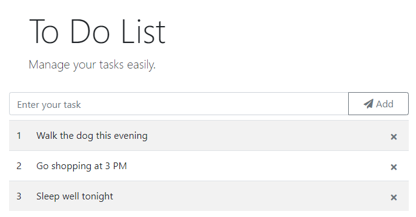
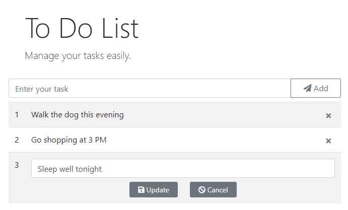
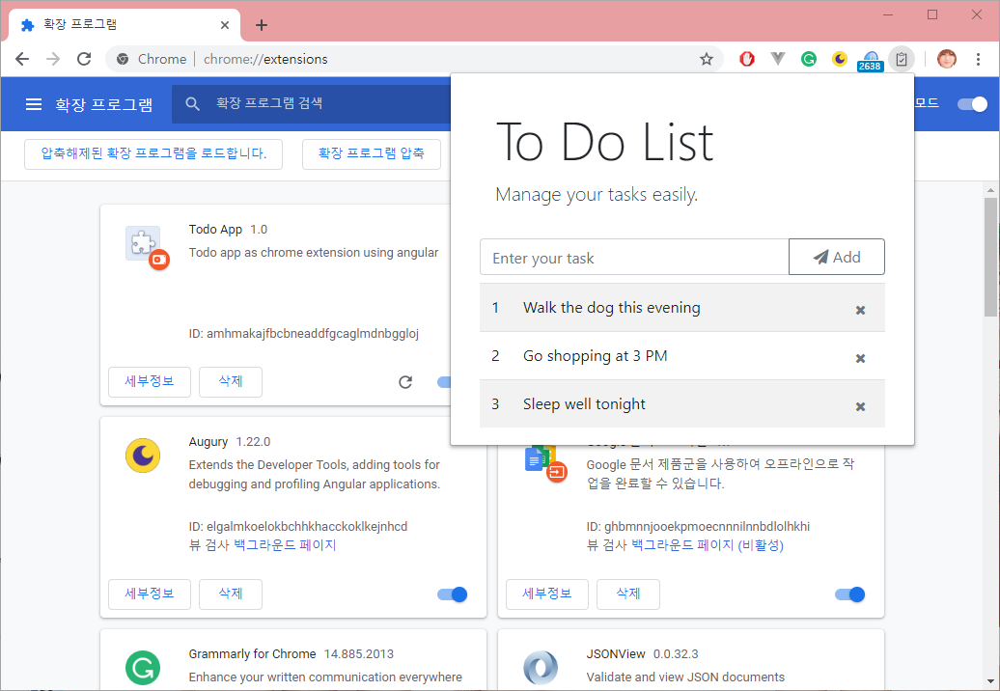

# To Do List by Angular

To Do 리스트는 새 기술을 익힐 때 처음으로 만들어 보는 대표적인 프로젝트입니다. 우리는 앵귤러로 To Do 리스트 프로젝트를 만들겠습니다. 이어서 경쟁기술인 뷰, 리액트로도 만들어 볼 예정입니다. 이를 통해서 앵귤러의 작동 방식을 더 깊게 이해할 수 있고 경쟁기술과의 비교를 통해서 장,단점을 파악할 수 있을거라고 생각합니다.

## 프로젝트 생성

새 프로젝트를 생성합니다. 라우팅은 필요없기 때문에 따로 별도의 루트 라우팅 모듈을 만들지 않도록 `No`를 선택합니다.

```bash
$ ng new ng-to-do
? Would you like to add Angular routing? No
? Which stylesheet format would you like to use? SCSS
```

## 스타일링

외부 스타일 라이브러리와 아이콘 라이브러리는 CDN 방식을 사용합니다. 이는 뒤에서 다루게 될 Vue.js와 React에서도 같은 방식을 적용하여 빠르게 초기 환경설정을 마치기 위함입니다.

**index.html**

```html
<!doctype html>
<html lang="en">
<head>
  <meta charset="utf-8">
  <title>NgToDo</title>
  <base href="/">

  <meta name="viewport" content="width=device-width, initial-scale=1">
  <link rel="icon" type="image/x-icon" href="favicon.ico">

  <link rel="stylesheet"
  href="https://use.fontawesome.com/releases/v5.6.3/css/all.css"
  integrity="sha384-UHRtZLI+pbxtHCWp1t77Bi1L4ZtiqrqD80Kn4Z8NTSRyMA2Fd33n5dQ8lWUE00s/"
  crossorigin="anonymous">
  <link rel="stylesheet"
  href="https://stackpath.bootstrapcdn.com/bootstrap/4.1.3/css/bootstrap.min.css"
  integrity="sha384-MCw98/SFnGE8fJT3GXwEOngsV7Zt27NXFoaoApmYm81iuXoPkFOJwJ8ERdknLPMO"
  crossorigin="anonymous">
</head>
<body>
  <app-root></app-root>

  <script
  src="https://code.jquery.com/jquery-3.3.1.slim.min.js"
  integrity="sha384-q8i/X+965DzO0rT7abK41JStQIAqVgRVzpbzo5smXKp4YfRvH+8abtTE1Pi6jizo"
  crossorigin="anonymous"></script>
  <script
  src="https://cdnjs.cloudflare.com/ajax/libs/popper.js/1.14.3/umd/popper.min.js"
  integrity="sha384-ZMP7rVo3mIykV+2+9J3UJ46jBk0WLaUAdn689aCwoqbBJiSnjAK/l8WvCWPIPm49"
  crossorigin="anonymous"></script>
  <script
  src="https://stackpath.bootstrapcdn.com/bootstrap/4.1.3/js/bootstrap.min.js"
  integrity="sha384-ChfqqxuZUCnJSK3+MXmPNIyE6ZbWh2IMqE241rYiqJxyMiZ6OW/JmZQ5stwEULTy"
  crossorigin="anonymous"></script>
</body>
</html>
```

## 화면 디자인

사용할 화면을 디자인합니다. 이 작업은 앵귤러와 아무런 상관이 없습니다. index.html에서 직접 작업해도 됩니다. 나중에 컴포넌트가 생성되면 잘라서 옮기면 되겠습니다.

```html
<section>
  <div class="jumbotron bg-white pb-2 mb-2">
    <h1 class="display-4">To Do List</h1>
    <p class="lead">Manage your tasks easily.</p>
  </div>
</section>

<section>
  <form>
    <div class="input-group mb-2">
      <input type="text" class="form-control" placeholder="Enter your task">
      <span class="input-group-append">
        <button class="btn btn-outline-secondary px-4" type="button">Add</button>
      </span>
    </div>
  </form>
</section>

<section>
  <table class="table table-striped table-hover">
    <colgroup>
      <col style="width: 10%">
      <col style="width: 80%">
      <col style="width: 10%">
    </colgroup>
    <tbody>
      <tr>
        <td>1</td>
        <td>Sleep</td>
        <td class="right">
          <button class="btn btn-outline-secondary btn-sm crush" type="button">
            <i class="fas fa-times"></i>
          </button>
        </td>
      </tr>
      <tr>
        <td>2</td>
        <td>Work</td>
        <td class="right">
          <button class="btn btn-outline-secondary btn-sm crush" type="button">
            <i class="fas fa-times"></i>
          </button>
        </td>
      </tr>
      <tr>
        <td>3</td>
        <td>Drinking</td>
        <td class="right">
          <button class="btn btn-outline-secondary btn-sm crush" type="button">
            <i class="fas fa-times"></i>
          </button>
        </td>
      </tr>
    </tbody>
  </table>
</section>
```

* 상단: bootstrap 4 jumbotron 디자인을 사용합니다.
* 중단: bootstrap 4 input group 디자인을 사용합니다.
* 하단: bootstrap 4 table 디자인을 사용합니다.

```css
.table td.right {
  text-align: right;
}

.table td button.crush {
  border: 0;
  padding-top: 0;
  padding-bottom: 0;
}
```

테이블 셀의 정렬 및 로우에 사용하는 버튼의 스타일을 적절하게 조정합니다.

## 컴포넌트 생성

화면은 하나지만 여러개의 컴포넌트로 나누면 작업하기도 편하고 관리하기도 좋아집니다. 더불어서 컴포넌트의 재 사용성도 확보할 수 있습니다.

* todo: 부모 컴포넌트로써 데이터를 구하고 데이터를 자식 컴포넌트에게 전달합니다. 필요한 자식 컴포넌트들을 그룹핑하는 컴포넌트입니다.
* todoHeader: 상단에 타이틀 부분을 담당하는 컴포넌트입니다.
* todoInput: 새 데이터를 입력받는 역할을 수행하는 컴포넌트입니다.
* todoList: 데이터를 출력하는 역할을 맡은 컴포넌트입니다.
* model/todo: 취급하는 데이터의 구조를 설계하는 클래스입니다.

```bash
$ ng g c page/todo
$ ng g c page/todo/todoHeader
$ ng g c page/todo/todoInput
$ ng g c page/todo/todoList
$ ng g class page/todo/model/todo
```

**src\app\page\todo\model\todo.ts**

```ts
export class Todo {
  id: string;
  task: string;
  date: Date;

  constructor(task: string = '') {
    this.id = Date.now() + ':' + Math.random().toFixed(5);
    this.task = task;
    this.date = new Date();
  }
}
```

id 값은 `"시각 값 + 난수 값"`으로 처리합니다. 편의를 위해서 파라미터를 받지 않는 생성자와 파라미터 1개를 받는 생성자를 만듭니다. 생성자가 1개 뿐인데 무슨 소리냐구요? JS는 오버로딩 개념이 없습니다. 하나의 함수가 파라미터를 다양하게 받을 수 있습니다. 그렇기 때문에 우리가 만든 하나의 생성자는 파라미터를 받지 않아도 되고 파라미터를 1개 받아도 되는 생성자의 역할을 모두 수행합니다.

**src\app\page\todo\todo.component.ts**

```ts
import { Component, OnInit } from '@angular/core';
import { Todo } from 'src/app/page/todo/model/todo';

@Component({
  selector: 'app-todo',
  templateUrl: './todo.component.html',
  styleUrls: ['./todo.component.scss']
})
export class TodoComponent implements OnInit {
  todos: Todo[] = [];

  ngOnInit() {
    // 더미 데이터
    this.todos.push(new Todo('Walk the dog this evening'));
    this.todos.push(new Todo('Go shopping at 3 PM'));
    this.todos.push(new Todo('Sleep well tonight'));
  }

  // 등록
  addTodo(todo: Todo) {
    this.todos.push(todo);
  }

  // 삭제
  removeTodo(id: string) {
    let index = this.todos.findIndex(item => item.id === id);
    this.todos.splice(index, 1);
  }

  // 수정
  updateTodo(todo: Todo) {
    let index = this.todos.findIndex(item => item.id === todo.id);
    this.todos.splice(index, 1, todo);
  }
}
```

`ngOnInit()` 훅 메소드에서 초기 화면 출력을 위한 더미데이터를 선언합니다. 이 부분은 나중에 HTTP 서비스를 통해서 데이터를 획득하는 코드로 변경이 되어야 할 부분입니다.

**src\app\page\todo\todo.component.html**

```html
<div class="container-fluid">
  <app-todo-header></app-todo-header>
  <app-todo-input (add)="addTodo($event)"></app-todo-input>
  <app-todo-list [todos]="todos" (remove)="removeTodo($event)" (update)="updateTodo($event)"></app-todo-list>
</div>

<hr>
<h5>Parent</h5>
<pre>{{todos | json}}</pre>
```

부모 컴포넌트로써,  
상단에 `<app-todo-header></app-todo-header>` 컴포넌트를 배치하고  
중단에 `<app-todo-input></app-todo-input>` 컴포넌트를 배치하고  
하단에 `<app-todo-list></app-todo-list>` 컴포넌트를 배치합니다.  

`<pre>` 마크업은 테스트를 위한 임시코드입니다.

`(add)`, `(remove)`, `(update)` 이벤트 바인딩을 사용하고 있습니다. 그에 맞게 이 템플릿을 소유한 컴포넌트 클래스안에 연동되는 함수가 필요합니다. 지금 이 상황에서 `ng serve` 하면 에러가 발생합니다. 이는 이벤트 바인딩 때문이 아니라 `[todos]` 프로퍼티 바인딩 부분과 관련한 설정이 아직 미비하기 때문입니다. 개발 서버로 확인하기 위해서는 필수적으로 app-todo-list가 가리키는 컴포넌트 클래스안에서 `todos`를 받는다는 `@Input` 설정이 되어 있어야 합니다.

에러는 보기 싫으니 에러부터 안 뜨도록 app-todo-list가 가리키는 컴포넌트부터 작업합니다. 에러를 누적시키면 `ng serve`로 작동하는 변경감지가 제대로 작동하지 못할 수 있습니다. 그래서 가끔 에러가 없음에도 제대로 반영되지 못하는 경우도 발생합니다. 에러 부분을 바로 고칠 수 없다면 주석처리라도 해 놓는 것이 좋습니다.

**src\app\page\todo\todo-list\todo-list.component.ts**

```ts
import {
  Component, OnInit,
  Input, Output, EventEmitter,
  OnChanges, SimpleChanges, ChangeDetectionStrategy
} from '@angular/core';
import { Todo } from 'src/app/page/todo/model/todo';

@Component({
  selector: 'app-todo-list',
  templateUrl: './todo-list.component.html',
  styleUrls: ['./todo-list.component.scss'],
  changeDetection: ChangeDetectionStrategy.Default
})
export class TodoListComponent implements OnInit, OnChanges {
  // 부모에게 받은 값은 shallow copy된 값이다.
  // 이를 직접 수정하면 바로 부모가 참조하는 객체의 상태가 변경되었음을 의미한다.
  @Input('todos') todos: Todo[];

  // 삭제요청 이벤트 전송자
  @Output('remove') removeEvent: EventEmitter<string> = new EventEmitter();

  // 수정요청 이벤트 전송자
  @Output('update') updateEvent: EventEmitter<Todo> = new EventEmitter();

  // null 값을 갖고 있으면 출력모드이고
  // null이 아닌 값을 갖고 있으면 수정모드이다.
  editTodoBackup: Todo = null;

  constructor() {
    console.log('TodoListComponent()');
  }

  ngOnInit() { }

  ngOnChanges(changes: SimpleChanges) {
    for (let propName in changes) {
      let change = changes[propName];
      let currentValue = JSON.stringify(change.currentValue);
      let previousValue = JSON.stringify(change.previousValue);
      console.log(`${propName}: currentValue = ${currentValue}`);
      console.log(`${propName}: previousValue = ${previousValue}`);
    }

    // 1. Pass by Reference: 부모 ==값의 참조==> 자식
    // 자식이 데이터를 변경하는 것은 부모가 가진 변수의 참조가
    // 자식과 같기 때문에 부모가 사용하는 데이터가 즉시 변경됨을 의미한다.
    // 따라서, 굳이 emit() 함수를 사용해서 부모에게 데이터를 전달하지 않아도 된다.

    // deep copy:
    // 자식 컴포넌트에서 부모가 관리하는 데이터를 직접 변경하지 않고
    // 부모 컴포넌트가 판단하여 데이터를 수정하도록 관리하고 싶을 수도 있다.
    // 이는 자식 컴포넌트는 "데이터를 화면에 표시하는 역할만 수행"하거나
    // "수정될 데이터를 받는 역할만 수행"하는 것이 데이터 처리의 흐름을
    // 파악하는데 더 좋다라는 생각에 기반한다.
    // this.todos = JSON.parse(JSON.stringify(this.todos));

    // 위에 주석을 풀면, 깊은 복사로 인해서 부모의 todos와 자식의 todos가 일치하지 않게 된다.
    // 깊은 복사를 이용하고 테스트를 수행해 보면, 부모의 todos의 상태가 변경이 되더라도
    // 자식 컴포넌트에게 다시 데이터가 전달되지 않는다.
    // 앵귤러의 Change Detection은 배열의 아이템이나 객체의 프로퍼티의 변화를 감지하지 못한다.
    // 부모 이미 자식에게 전달했고 참조가 바뀌지 않았으므로
    // Change Detection 입장에서 변경된 것은 없는 것이 된다.

    // 2. Pass by Value: 부모 ==원시 값==> 자식
    // 자식이 데이터를 변경해도 부모가 가진 데이터는 변하지 않는다.
    // 이는 마치 함수에 파라미터로 원시 값을 주면 새 변수에 복사한 다음
    // 함수 내에서 사용하는 것과 같다. 파라미터는 함수가 가진 지역변수이고
    // 이 변수의 값을 바꾸더라도 함수를 호출한 측에 값이 변경되지 않는 것과 같다.
    // 자식의 값이 변경된 후 이에 맞게 부모가 가진 값도 변경하고 싶다면
    // 명시적으로 emit() 함수를 사용해서 부모에게 전달해야 한다.

    // 부모가 자식에게 원시 값을 전달할 때 객체로 포장해서 전달하면
    // #1번 경우와 같아진다. 결국, emit() 함수를 사용하지 않아도 된다.
  }

  /**
   * 삭제요청을 부모에게 전달한다.
   * Pass by Reference 방식이라면 자식이 직접 삭제할 수도 있다.
   */
  removeTodo(id: string) {
    if (window.confirm('Are you sure to delete?')) {
      // Pass by Reference 방식이기 때문에 자식이 직접 삭제해도 됨에도 불구하고
      // 부모에게 전달함은 처리의 흐름을 파악하기 쉽도록 만들기 위함이다.
      this.removeEvent.emit(id);
    }
  }

  /**
   * 출력모드를 수정모드로 변경한다.
   */
  updateMode(id: string) {
    // 이미 다른 로우를 더블 클릭해서 해당 로우가 이미 수정모드 상태일 수 있다.
    // 이 경우, 해당 로우의 수정작업을 취소한다고 보고
    // 취소 작업을 프로그램적으로 수행한다.
    // 즉, 한 번에 하나의 로우만 수정할 수 있다.
    if (this.editTodoBackup) {
      this.updateCancel();
    }

    // 수정요청을 받은 해당 로우의 데이터를 가진 객체를
    // deep copy해서 백업 변수에 저장한다.
    // editTodoBackup 변수는 수정완료가 아니라 수정취소를 요청할 때,
    // 원래 데이터로 복원하기 위해서 원본 데이터를 취급하는 변수이면서
    // 출력모드/수정모드를 구분하는 역할도 같이 담당한다.
    this.editTodoBackup = JSON.parse(JSON.stringify(
      this.todos.find(item => item.id === id)));
  }

  /**
   * 수정요청을 부모에게 전달한다.
   * 그런 다음, 수정모드를 출력모드로 변경하기 위해서 clear() 함수를 호출한다.
   *
   * Two-way 바인딩을 설정했다면 사용자가 수정하는 즉시 자식 컴포넌트 상태에 반영돤다.
   * 더불어서, Pass by Reference 방식으로 부모-자식 사이에 같은 데이터를 참조하고 있다면
   * 굳이 자식이 부모에게 수정요청을 부모에게 전달할 필요가 없다.
   */
  updateTodo(todo: Todo) {
    // Pass by Reference 방식이기 때문에 자식이 직접 수정해도 됨에도 불구하고
    // (양 방향 바인딩 설정으로 이미 수정되었음)
    // 부모에게 전달함은 처리의 흐름을 파악하기 쉽도록 만들기 위함이다.
    this.updateEvent.emit(todo);
    // 수정작업이 완료된 후, 수정모드를 출력모드로 변경하기 위해서 clear() 함수를 호출한다.
    this.clear()
  }

  /**
   * 수정작업을 취소한다.
   */
  updateCancel() {
    // 수정모드여서 수정대상 객체의 백업 객체가 존재한다면
    if (this.editTodoBackup) {
      // 수정모드 이전에 출력모드에서 화면에 표시했던 데이터로 복원(Rollback)한다.
      let index = this.todos.findIndex(item => item.id === this.editTodoBackup.id);
      this.todos.splice(index, 1, this.editTodoBackup);
      // 수정모드를 출력모드로 변경하기 위해서 clear() 함수를 호출한다.
      this.clear()
    }
  }

  /**
   * 수정모드를 출력모드로 변경한다.
   */
  clear() {
    this.editTodoBackup = null;
  }

}
```

주석이 정말 길죠; 여러분을 위한 사랑이라고 생각해 주시면 좋겠습니다. :)

**`changeDetection: ChangeDetectionStrategy.Default`**  
`ChangeDetectionStrategy.OnPush` 설정을 하게되면 최초에 한 번만 부모가 이 컴포넌트에게 데이터를 전달합니다. 예를 들어서, TodoInputComponent 컴포넌트가 부모에게 새 데이터를 `emit()` 함수로 전달해서 부모의 상태가 변경되어도 이를 TodoListComponent 컴포넌트는 더 이상 받지 못하게 됩니다. `ChangeDetectionStrategy.Default`가 기본값으로 명시적 설정을 생략하면 이 방식을 사용하는 것이 됩니다. 초기에 데이터를 받아서 계속 같은 데이터를 표시하는 컴포넌트라면 `ChangeDetectionStrategy.OnPush` 설정을 해서 성능의 향상을 기대할 수 있습니다.

**`@Input('todos') todos: Todo[];`**  
부모 컴포넌트가 `<app-todo-list [todos]="todos"></app-todo-list>` 프로퍼티 바인딩으로 건네주는 데이터를 자식 컴포넌트로써 받기 위한 설정입니다. 경쟁기술인 리액트, 뷰는 이 부분을 자동화해서 개발자가 따로 선언하지 않아도 받아주는 객체가 존재하여 편리합니다. 앵귤러도 이 부분은 개선되지 않을까 하는 기대를 하게 되는 이유입니다. 변수명이 전달하는 키 값과 같다면 `@Input` 데코레이터에게 전달하는 문자열은 생략할 수 있습니다.

**`@Output('remove') removeEvent: EventEmitter<string> = new EventEmitter();`**  
노드의 EventEmitter와 다릅니다. 이것은 앵귤러가 따로 만든 EventEmitter입니다. `@Output` 데코레이터에게 전달하는 문자열을 생략하면 변수명을 키 값으로 사용합니다. 자식 컴포넌트가 부모 컴포넌트에게 신호를 보내는 방법입니다. 데이터를 전달하는 수단도 됩니다.

**`editTodoBackup: Todo = null;`**  
데이터를 표시하는 출력모드와 데이터를 변경할 수 있도록 수정폼을 제공하는 수정모드를 구분하는 변수입니다. null 값을 갖고 있으면 출력모드이고
객체를 갖고 있으면 해당 객체의 데이터를 사용하는 테이블 로우는 수정모드가 됩니다. 더불어서 수정작업을 취소할 때, 수정작업 시 변환 된 부분을 버리고 원래의 데이터로 복원하기 위한 해당 로우가 사용한 정보를 백업하기 위한 변수이기도 합니다.

**src\app\page\todo\todo-list\todo-list.component.scss**

```scss
.table {
  td.right {
    text-align: right;
  }

  td {
    button.crush {
      border: 0;
      padding-top: 0;
      padding-bottom: 0;
    }
  }
}
```

화면 설계 시 작성했던 CSS 코드를 SCSS 코드로 변경합니다.

**src\app\page\todo\todo-list\todo-list.component.html**

```html
<section>
  <table class="table table-striped table-hover">
    <colgroup>
      <col style="width: 5%">
      <col style="width: 80%">
      <col style="width: 15%">
    </colgroup>
    <tbody>
      <tr *ngFor="let todo of todos; let i=index">
        <td>{{i + 1}}</td>
        <ng-container *ngIf="editTodoBackup && todo.id === editTodoBackup.id">
          <td colspan="2">
            <input class="form-control" type="text" name="" [(ngModel)]="todo.task">
            <div class="text-center mt-2">
              <button class="btn btn-secondary btn-sm px-3 mr-4" type="button" (click)="updateTodo(todo)">
                <i class="fas fa-save"></i> Update
              </button>
              <button class="btn btn-secondary btn-sm px-3" type="button" (click)="updateCancel()">
                <i class="fas fa-ban"></i> Cancel
              </button>
            </div>
          </td>
        </ng-container>
        <ng-container *ngIf="todo.id !== editTodoBackup?.id">
          <td (dblclick)="updateMode(todo.id)">{{todo.task}}</td>
          <td class="right">
            <button class="btn btn-outline-secondary btn-sm crush" type="button" (click)="removeTodo(todo.id)">
              <i class="fas fa-times"></i>
            </button>
          </td>
        </ng-container>
      </tr>
    </tbody>
  </table>
</section>

<h5>Child</h5>
<pre><strong>editTodoBackup: {{editTodoBackup | json}}</strong></pre>
<pre>{{todos | json}}</pre>
```

**`<colgroup>, <col>`**  
셀의 폭을 설정하는 부분을 분리하기 위해서 사용합니다.

**`<ng-container *ngIf="editTodoBackup && todo.id === editTodoBackup.id">`**  
`<ng-template>` 대신 `<ng-container>`를 사용하면 익숙한 문법을 이용할 수 있습니다. editTodoBackup 변수를 이용하여 출력모드와 수정모드를 구분합니다. 다음 두 조건식은 결과적으로 같습니다. 이해하기 쉬운것을 사용하세요.

* `*ngIf="editTodoBackup && todo.id === editTodoBackup.id"`
* `*ngIf="todo.id === editTodoBackup?.id"`

**`<i class="fas fa-times"></i>`**  
fontawesome 아이콘을 사용합니다. 보기 좋은 떡이 먹기도 좋습니다.

**`[(ngModel)]="todo.task"`**  
양방향 바인딩입니다. 수정모드에서 사용자가 데이터를 변경하면 바로 자식 컴포넌트에 상태가 변경됩니다. 이는 매우 편리합니다. 하지만 반대 급부가 존재합니다. 사용자가 수정을 진행하다가 수정완료가 아닌 수정취소를 원하는 경우에 대한 대비책이 있어야 합니다. 따라서 수정 전 데이터의 상태를 보존해야 합니다. 이를 위해서 editTodoBackup 변수를 도입했습니다.

고려해야 할 부분이 하나 더 있습니다. 부모 컴포넌트가 자식 컴포넌트에게 데이터를 전달합니다. 이 때 데이터의 종류가 무엇인지를 구분해야 합니다. 데이터가 객체, 배열이라면 참조 값을 자식 컴포넌트가 받은 것이 되므로 자식의 상태가 바뀌는 것은 곧 부모의 상태가 바뀌는 것을 의미하게 됩니다. 지금 우리가 사용하는 todos는 배열입니다. 그러므로 자식 컴포넌트에서 todos의 상태를 변경(입력, 수정, 삭제)하면 부모 컴포넌트의 상태가 바뀌게 됩니다. 

이것이 의미하는 것은 자식 컴포넌트가 굳이 부모 컴포넌트에게 todos의 상태의 변경을 알리지 않아도 된다는 것을 의미합니다. 그렇기 때문에 사실 자식 컴포넌트는 `@Output`을 이용할 필요가 없습니다. 그런데 이렇게 사용하는 것이 좋은 걸까요? 이는 상황에 따라서 판단하는 것이 좋겠습니다. 지금처럼 컴포넌트가 몇개 없다면 문제가 될 소지가 적습니다. 그런데 만약 부모 컴포넌트가 갖고 있는 데이터를 다수의 자식 컴포넌트가 이용한다면 문제가 될 소지가 있습니다. 예를 들어서 테이블을 사용하여 리스트형태로 출력하는 대신 카드형태로 출력형식을 바꾸고 싶다면 이에 따라 컴포넌트가 추가될 것니다. 각각의 컴포넌트가 직접 데이터를 가공하는 형태로 개발했다고 칩시다. 나중에 부모 컴포넌트의 데이터 구조를 바꾸고 싶은 경우, 이에 따라 다수의 컴포넌트를 고쳐야 됩니다. 이는 중복의 형태로 볼 수 있습니다.

정리해 보죠. 한 개의 자식 컴포넌트만이 데이터를 가공한다면 자식 컴포넌트가 직접 데이터를 가공해도 괜찮다고 볼 수 있습니다. 복수의 컴포넌트가 데이터를 가공하는 것은 데이터 가공과 관련한 로직의 중복을 의미합니다. 그러므로 이럴 때는 부모만이 데이터를 가공하고 자식들은 부모에게 요청하여 데이터를 가공하도록 연동하는 것이 좋겠습니다. 그에 더해서 자식 컴포넌트가 부모에게 받은 데이터를 직접 건드리지 않는 것이 유지보수 과정에서 발생할 수 있는 버그를 예방하는 조치가 되겠습니다.

자식 컴포넌트가 부모에게 받은 데이터를 직접 건드리지 않도록 만들고 싶다면 받은 원본 데이터를 사용하면 안 됩니다. 복사본을 만들어서 사용하다가 부모에게 이벤트를 전송하여 부모의 데이터를 갱신하도록 하는 편이 더 좋습니다. 이러한 생각을 정리하다보면 리액트가 주창하는 단 방향 데이터 흐름과 일맥상통하게 됩니다. 요는 어는 것이 좋다라고 단정하는 것이 아니라 컴포넌트가 데이터를 취급하는 복잡도에 따라서 양방향 바인딩의 초기 편리함을 버리고 관리성을 극대화하기 위해서 단방향 바인딩으로 전환할 필요도 있다 하겠습니다. 규모가 큰 프로젝트에서 수 많은 개발자가 협업을 하는 경우에는 적용해 볼만 하다고 생각됩니다.

**`<td (dblclick)="updateMode(todo.id)">{{todo.task}}</td>`**  
위 설정으로 해당 셀을 더블클릭하면 출력모드가 수정모드로 변경됩니다.

**src\app\page\todo\todo-header\todo-header.component.html**

```html
<section>
  <div class="jumbotron bg-white pb-2 mb-2 bg">
    <h1 class="display-4">To Do List</h1>
    <p class="lead">Manage your tasks easily.</p>
  </div>
</section>
```

타이틀 컴포넌트는 별도의 클래스 코드를 건드릴 필요가 없고 템플릿만 구성하면 됩니다.

**src\app\page\todo\todo-input\todo-input.component.ts**

```ts
import { Component, OnInit, Output, EventEmitter } from '@angular/core';
import { Todo } from 'src/app/page/todo/model/todo';

@Component({
  selector: 'app-todo-input',
  templateUrl: './todo-input.component.html',
  styleUrls: ['./todo-input.component.scss']
})
export class TodoInputComponent implements OnInit {
  newTodo: Todo = new Todo();
  @Output('add') addEvent: EventEmitter<Todo> = new EventEmitter();

  constructor() { }

  ngOnInit() {
    console.log(this.newTodo)
  }

  addTodo() {
    let task = this.newTodo.task.trim();
    if (!task) {
      alert('Enter new task!');
      return false;
    }
    // 생성날짜를 최신으로 기록하기 위해서 객체를 새로 만들어서 사용한다.
    this.addEvent.emit(new Todo(task));
    // 입력창 초기화를 위해서 새 객체를 할당한다.
    this.newTodo = new Todo();
  }
}
```

**src\app\page\todo\todo-input\todo-input.component.html**

```html
<section>
  <form>
    <div class="input-group mb-2">
      <input type="text" class="form-control" placeholder="Enter your task" name="task" [(ngModel)]="newTodo.task">
      <span class="input-group-append">
        <button class="btn btn-outline-secondary px-4" type="button" (click)="addTodo()">
          <i class="fas fa-paper-plane"></i> Add
        </button>
      </span>
    </div>
  </form>
</section>
```

화면을 확인합니다.



출력화면입니다.



로우의 문자열 부분을 더블클릭하면 수정모드 화면으로 전환됩니다.


# Angular Application to Chrome Extension

다음 사이트를 참고하였습니다.  
* https://developer.chrome.com/apps/about_apps
* https://medium.com/@PardeepJain/build-your-own-chrome-extension-using-angular-4-ecedbd7404cc

Chrome App은 HTML, CSS 및 Javascript를 사용하여 제작된 자바스크립트 애플리케이션입니다.

## CSP 정책을 위한 변경작업

Content Security Policy 정책에 따라 CDN 방식을 이용할 수 없습니다. 자세한 내용은 다음 사이트를 참고하세요.  
* https://developer.chrome.com/extensions/contentSecurityPolicy
* https://developers.google.com/web/fundamentals/security/csp/?hl=ko

```bash
$ npm i jquery popper.js bootstrap
$ npm i font-awesome
```

버전을 명시하지 않으면 이용 가능한 최신 버전을 설치합니다. font-awesome은 4.7.0 버전이 설치됩니다. 5.6.3 버전은 아직 NPM으로 설치할 수 없습니다. 그렇기 때문에 기존 아이콘 코드를 다운그레이드해야 합니다. todo-input.component.html, todo-list.component.html 파일에서 fas를 fa로 변경합니다.

**angular.json**

```json
"styles": [
  "./node_modules/font-awesome/css/font-awesome.css",
  "./node_modules/bootstrap/dist/css/bootstrap.min.css",
  "src/styles.scss"
],
"scripts": [
  "./node_modules/jquery/dist/jquery.slim.min.js",
  "./node_modules/popper.js/dist/umd/popper.min.js",
  "./node_modules/bootstrap/dist/js/bootstrap.min.js"
]
```

**index.html**

CDN 관련코드를 모두 제거합니다.

```html
<!doctype html>
<html lang="en">
<head>
  <meta charset="utf-8">
  <title>NgToDo</title>
  <base href="/">

  <meta name="viewport" content="width=device-width, initial-scale=1">
  <link rel="icon" type="image/x-icon" href="favicon.ico">
</head>
<body>
  <app-root></app-root>
</body>
</html>
```

테스트 서버를 재 시작하고 결과를 확인합니다. 스타일이 유지되어야 하고 아이콘이 모두 잘 표시되어야 합니다.

## 화면 사이즈

추가적인 작업으로 화면 가로 길이의 최소사이즈를 설정합니다. min-width 설정을 주지 않으면 화면의 폭이 너무 작게 됩니다. Chrome Extension의 기본 값이 적용되기 때문이라 여겨집니다.

**styles.scss**

```scss
body,
html {
  height: 100%;
  min-width: 30rem;
}
```

## 등록작업

**manifest.json**

```json
{
  "name": "Todo App",
  "description": "Todo app as chrome extension using angular",
  "version": "1.0",
  "manifest_version": 2,
  "browser_action": {
    "default_icon": "icon.png",
    "default_popup": "index.html"
  },
  "permissions": [],
  "content_security_policy": "script-src 'self'; object-src 'self'",
  "web_accessible_resources": [
    "assets/img/*",
    "assets/fonts/*"
  ]
}
```

**icon.png**

브라우저 우 상단에 표시될 아이콘이 하나 필요합니다. 

### 등록순서

요리에 필요한 모든 재료가 준비되었으니 본격적으로 Chrome Extension으로 우리가 만든 앵귤러 프로그램을 등록해 보겠습니다.

1. manifest.json, icon.png 파일을 assets 폴더에 배치합니다. 나중에 유지보수를 고려한다면 이러한 파일들도 백업대상이어야 합니다. 간단하게 assets 폴더에 배치하는 것이 좋겠습니다. assets 폴더 밑에 파일들은 빌드 시 dist 폴덤 밑으로 복사되기 때문입니다.

2. `ng build --prod` 명령으로 앵귤러 애플리케이션을 빌드합니다.

3. dist/ng-to-do/assets 폴더 밑에 있는 manifest.json, icon.png 파일을 dist/ng-to-do/ 폴더 밑으로 옮깁니다. 이 두 파일은 원래 루트에 배치해야 하는 파일입니다.

4. 크롬 브라우저 &rArr; More 아이콘 &rArr; `도구 더보기` &rArr; `확장 프로그램` &rArr; `압축해제된 확장 프로그램을 로드합니다` 순서로 메뉴를 이동합니다. 그런 다음 `ng-to-do\dist\ng-to-do` 폴더를 선택하고 `확인` 버튼을 클릭합니다.

5. 우 상단에 아이콘이 추가되어 있는지 보시고 클릭합니다.



dist 폴더밑에 프로젝트가 삭제되면 서비스되지 못합니다. 그것이 싫다면  웹스토어에 올리면 되는데 크롬 웹스토어 올리기 위해서는 비용을 지불해야 합니다. 계정을 확인하고 프로그램을 게시하기 위해 일회성 개발자 등록 수수료 US$5.00가 필요합니다. 소개 이미지도 필수적으로 준비해야 합니다.

* 스크린샷 이미지 - 1280x800 
* 작은 타일 - 440x280

자세한 내용은 다음 사이트의 안내를 참고하세요.  
https://chrome.google.com/webstore/developer/dashboard?hl=ko

다음은 예제 사이트입니다.  
* https://developer.chrome.com/extensions/samples
